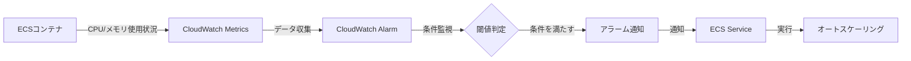
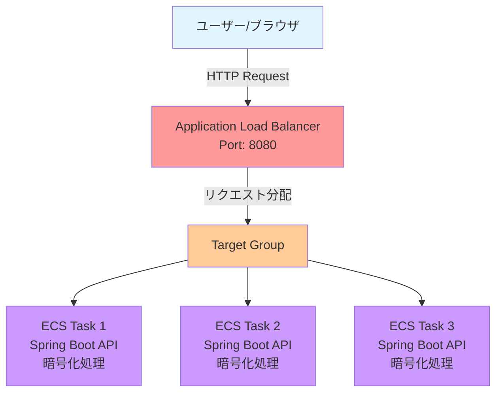
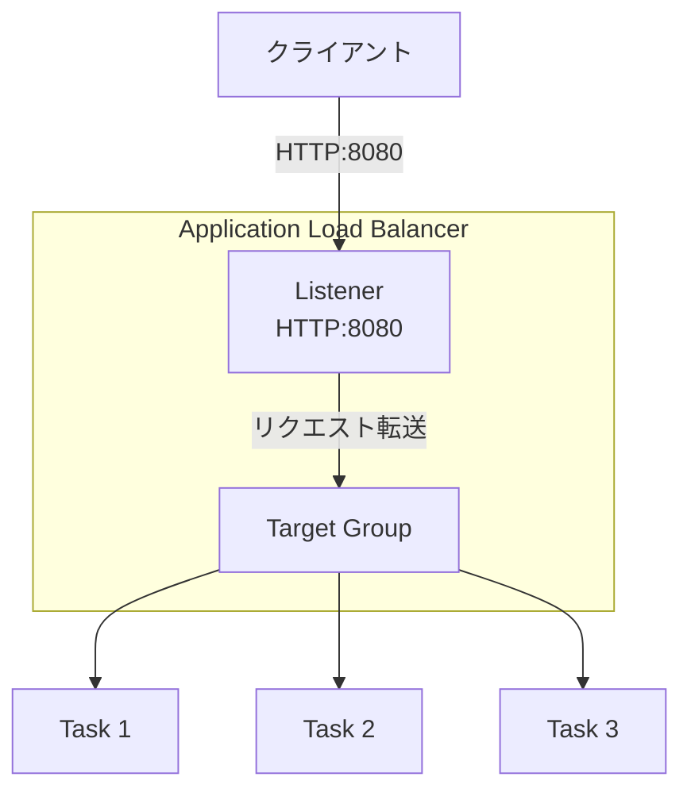
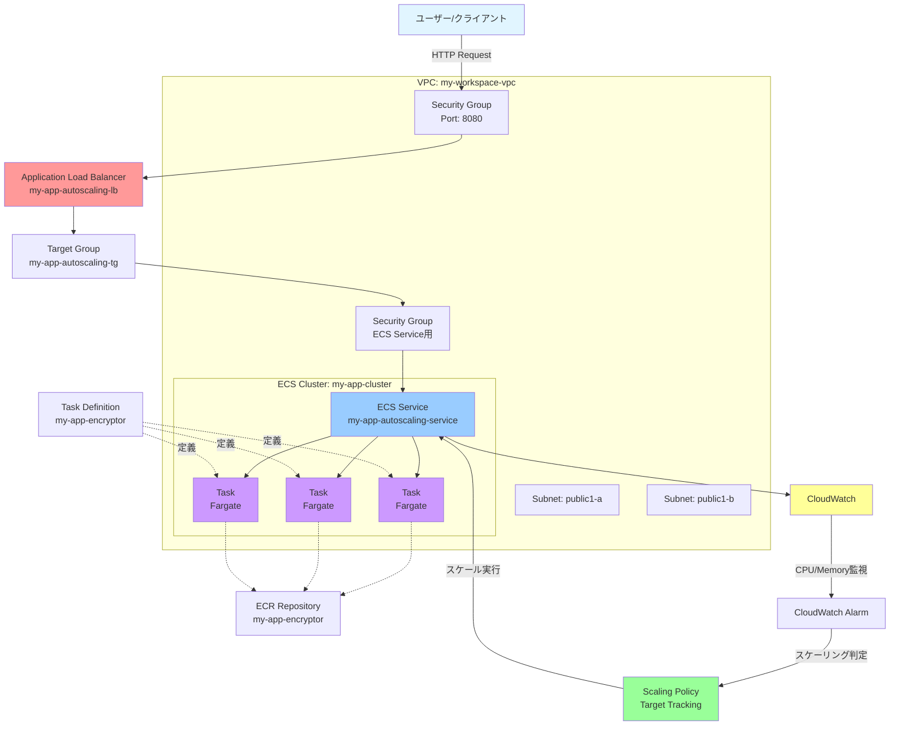

# ECS オートスケーリング設定手順書

## 1. オートスケーリングの概要

### 1.1 オートスケーリングのフロー

ECSにおけるオートスケーリングは、以下のような流れで実行されます。



**フローの詳細:**
1. ECSコンテナのCPU・メモリ使用状況がデータとして収集される
2. 収集されたデータはCloudWatch Metricsに保存される
3. CloudWatch Alarmが設定された条件に基づいてメトリクスを監視
4. 一定の条件(閾値)を満たした場合、アラームが通知を送信
5. ECSサービスが通知を受け取り、オートスケーリングを実行

> **Note:** ステップスケーリングもターゲット追跡スケーリングも、基本的に同じフローで動作します。違いはCloudWatch Alarmの条件設定部分にあります。

---

## 2. アプリケーション構成

### 2.1 システム構成図



**構成要素:**
- **ユーザー/クライアント**: ブラウザからAPIを呼び出し
- **Application Load Balancer**: 複数のコンテナにリクエストを分配
- **Target Group**: オートスケールされたタスクを登録・管理
- **ECS Task**: Spring Bootで作成されたWeb APIを提供
  - 暗号化処理により意図的にCPU負荷を発生させる

### 2.2 ロードバランサーの内部構成



---

## 3. 全体アーキテクチャ

### 3.1 詳細構成図



---

## 4. 必要なAWSリソース一覧

### 4.1 ECSリソース

| リソース | 名称 | 備考 |
|---------|------|------|
| ECS Cluster | `my-app-cluster` | 既存のクラスターを使用 |
| ECS Service | `my-app-autoscaling-service` | **新規作成** |
| Task Definition | `my-app-encryptor` | **新規作成** |
| ECR Repository | `my-app-encryptor` | **新規作成** |

### 4.2 CloudWatch

| リソース | 名称 | 備考 |
|---------|------|------|
| Scaling Policy | `my-app-autoscaling-policy` | **新規作成**<br/>Target Tracking Scaling Policy<br/>CPU/メモリの閾値を設定 |

### 4.3 ネットワークリソース

| リソース | 名称 | 備考 |
|---------|------|------|
| VPC | `my-workspace-vpc` | 既存のVPCを使用 |
| Subnet (AZ-a) | `my-workspace-subnet-app-public1-a` | 既存のパブリックサブネットを使用 |
| Subnet (AZ-b) | `my-workspace-subnet-app-public1-b` | 既存のパブリックサブネットを使用 |
| Security Group (ALB用) | `my-app-autoscaling-lb-sg` | **新規作成**<br/>Port 8080を許可 |
| Security Group (Service用) | `my-app-autoscaling-service-sg` | **新規作成**<br/>ALBからの通信を許可 |

### 4.4 IAMロール

| リソース | 名称 | 備考 |
|---------|------|------|
| Task Execution Role | `ecsTaskExecutionRole` | 既存のロールを使用 |

### 4.5 ロードバランサー

| リソース | 名称 | 備考 |
|---------|------|------|
| Application Load Balancer | `my-app-autoscaling-alb` | **新規作成** |
| Target Group | `my-app-autoscaling-tg` | **新規作成** |
| Listener | HTTP:8080 | ALB作成時に設定 |

---

## 5. 作業の流れ

### 5.1 各ステップの概要

1. **ECRリポジトリ作成**
   - Dockerイメージを保存するリポジトリを作成

2. **Dockerイメージビルド・プッシュ**
   - Spring Bootアプリケーションをコンテナ化
   - ECRにプッシュ

3. **Security Group作成**
   - ALB用: Port 8080を許可
   - ECS Service用: ALBからの通信を許可

4. **Target Group作成**
   - ヘルスチェック設定を含む

5. **Application Load Balancer作成**
   - リスナー設定(HTTP:8080)
   - Target Groupとの紐付け

6. **Task Definition作成**
   - コンテナ定義
   - リソース設定(CPU/Memory)

7. **ECS Service作成**
   - Desired count設定
   - ネットワーク設定
   - Load Balancerとの統合

8. **Auto Scaling設定**
   - Target Tracking Scaling Policyの設定
   - CPU使用率の閾値設定

9. **動作確認**
   - 負荷テストツールでリクエスト送信
   - スケールアウト/インの確認

---

## 6. Web APIサーバーの準備

### 6.1 概要

負荷テスト用のWeb APIサーバーを作成します。このサーバーは、ECSタスクとして動作するSpring BootアプリケーションでAPIエンドポイントを提供します。

**アプリケーションの特徴:**
- **言語**: Java + Spring Boot
- **機能**: 文字列の暗号化処理（10万回のループ）
- **目的**: 意図的にCPU負荷を発生させてオートスケーリングを検証
- **エンドポイント**: `GET /api/encryptor`

### 6.2 ソースコードの取得

#### 6.2.1 GitHubリポジトリ

ソースコードは以下のGitHubリポジトリで公開されています：

```
https://github.com/kentny/ecs-learning-course
```

#### 6.2.2 クローン/ダウンロード方法

```bash
git clone https://github.com/kentny/ecs-learning-course.git
cd ecs-learning-course
```

> **Note:** ブランチは `main` を使用してください。

### 6.3 ディレクトリ構造の確認

クローン後、`autoscaling-section` ディレクトリに移動します：

```bash
cd autoscaling-section
ls -la
```

**ディレクトリ構成:**
```
autoscaling-section/
├── docker-compose.yml      # Docker Compose設定ファイル
├── encryptor/              # Spring Bootアプリケーション
│   ├── src/
│   ├── Dockerfile
│   ├── build.gradle
│   └── ...
└── k6/                     # 負荷テストツール（後述）
    └── LoadTest.js
```

### 6.4 ソースコードの確認

#### 6.4.1 VS Code でプロジェクトを開く

```bash
code encryptor/
```

または、VS Codeのメニューから：
1. `File` → `Open`
2. `autoscaling-section/encryptor/` を選択
3. 信頼確認ダイアログで「Yes」を選択

#### 6.4.2 API コントローラーの確認

[src/main/java/com/example/encryptor/EncryptorController.java](ecs-learning-course/autoscaling-section/encryptor/src/main/java/com/example/encryptor/controller/EncryptorController.java) を開きます。

**主要なコード:**

```java

@RestController
@RequestMapping("/api/encryptor")
public class EncryptorController {
    @GetMapping
    String get() throws NoSuchAlgorithmException, NoSuchPaddingException, InvalidKeyException, IllegalBlockSizeException, BadPaddingException {
        SecretKey key = KeyGenerator.getInstance("AES").generateKey();
        Cipher cipher = Cipher.getInstance("AES");

        for (int i=0; i<100000; i++) {
            byte[] data = new byte[256];
            cipher.init(Cipher.ENCRYPT_MODE, key);
            cipher.doFinal(data);
        }

        return "Finish!";
    }
}
```

**処理の説明:**
- **エンドポイント**: `/api/encryptor`
- **メソッド**: GET
- **処理内容**: 暗号化処理を10万回ループ実行（意図的にCPU負荷を高める）
- **レスポンス**: "Finish!" という文字列を返却

### 6.5 Dockerfile の確認

[encryptor/Dockerfile](ecs-learning-course/autoscaling-section/encryptor/Dockerfile) を開いて内容を確認します。

**Dockerfile（マルチステージビルド）:**

```dockerfile
FROM gradle:jdk21 AS build
WORKDIR /app
COPY . /app
RUN chmod +x ./gradlew && \
    ./gradlew build


FROM openjdk:21
COPY --from=build /app/build/libs/encryptor-0.0.1-SNAPSHOT.jar ./encryptor.jar
CMD [ "java", "-jar", "encryptor.jar" ]
```

**ポイント:**
1. **ビルドステージ**: Gradleを使用してJavaアプリケーションをビルド
2. **実行ステージ**: ビルドされたJARファイルを実行環境にコピーして起動
3. **chmod +x**: Gradlewに実行権限を付与（環境によってはPermission Errorが発生するため）

### 6.6 Docker Compose の確認

`autoscaling-section` ディレクトリに戻り、[docker-compose.yml](ecs-learning-course/autoscaling-section/docker-compose.yml) を確認します。

**docker-compose.yml:**

```yaml
version: '3.9'
services:
  encryptor:
    container_name: encryptor
    build: ./encryptor
    ports:
      - '8080:8080'
    healthcheck:
      test: ["CMD-SHELL", "curl -f http://localhost:8080/actuator/health || exit 1"]
      start_period: 3s
      interval: 2s
      timeout: 3s
      retries: 10

  k6:
    container_name: k6
    image: grafana/k6
    entrypoint: k6 run
    command: LoadTest.js
    working_dir: /workspace
    volumes:
      - ./k6:/workspace
    depends_on:
      encryptor:
        condition: service_healthy
```

**設定内容:**

**encryptorサービス:**
- **container_name**: コンテナ名を `encryptor` に設定
- **build**: `./encryptor` ディレクトリのDockerfileを使用してビルド
- **ports**: ホストの8080番ポートとコンテナの8080番ポートをマッピング
- **healthcheck**: ヘルスチェック設定
  - Spring Boot Actuatorの `/actuator/health` エンドポイントを使用
  - `start_period: 3s` - 起動後3秒待機してからチェック開始
  - `interval: 2s` - 2秒ごとにヘルスチェックを実行
  - `timeout: 3s` - タイムアウト3秒
  - `retries: 10` - 10回リトライ

**k6サービス（負荷テスト用）:**
- **container_name**: コンテナ名を `k6` に設定
- **image**: Grafanaの公式k6イメージを使用
- **command**: `LoadTest.js` スクリプトを実行
- **volumes**: ローカルの `./k6` ディレクトリをマウント
- **depends_on**: `encryptor` サービスがhealthyになってから起動

### 6.7 ローカル環境での動作確認

#### 6.7.1 アプリケーションの起動

`autoscaling-section` ディレクトリで以下のコマンドを実行します：

```bash
docker compose up encryptor
```

**起動確認:**
- Springのロゴが表示されれば起動成功
- 初回起動時はビルドに時間がかかります

**出力例:**
```
  .   ____          _            __ _ _
 /\\ / ___'_ __ _ _(_)_ __  __ _ \ \ \ \
( ( )\___ | '_ | '_| | '_ \/ _` | \ \ \ \
 \\/  ___)| |_)| | | | | || (_| |  ) ) ) )
  '  |____| .__|_| |_|_| |_\__, | / / / /
 =========|_|==============|___/=/_/_/_/
 :: Spring Boot ::                (v3.x.x)

... Started EncryptorApplication in X.XXX seconds
```

#### 6.7.2 API の動作確認

ブラウザまたはcurlで以下のURLにアクセスします：

```
http://localhost:8080/api/encryptor
```

**curlコマンドの場合:**

```bash
curl http://localhost:8080/api/encryptor
```

**期待されるレスポンス:**

```
Finish!
```

このレスポンスが返ってくれば、Web APIの動作確認は完了です。

#### 6.7.3 アプリケーションの停止

ターミナルで `Ctrl + C` を押してアプリケーションを停止します。

または、別のターミナルで：

```bash
docker compose down
```

---

## 7. 次のステップ

この手順書の続きとして、以下の詳細な作業手順を記載していきます:

- [ ] ECRリポジトリの作成手順
- [ ] Dockerイメージのビルドとプッシュ手順
- [ ] Security Groupの詳細設定
- [ ] ALBとTarget Groupの作成手順
- [ ] Task DefinitionとServiceの作成手順
- [ ] Auto Scalingポリシーの設定手順
- [ ] 負荷テストと動作確認手順

---

## 補足事項

### Spring Bootアプリケーションについて

- **処理内容**: 文字列の暗号化処理を実行
- **目的**: 意図的にCPU負荷を発生させてオートスケーリングを検証
- **言語**: Java + Spring Boot
- **提供コード**: 事前に用意されたコードを使用

### オートスケーリングの検証方法

1. 負荷テストツールから高頻度でAPIを呼び出し
2. CPU使用率が閾値を超えることを確認
3. CloudWatch Alarmがトリガーされることを確認
4. ECS Taskが自動的に増加することを確認
5. 負荷を下げてTask数が減少することを確認

---

**作成日**: 2025年12月13日
