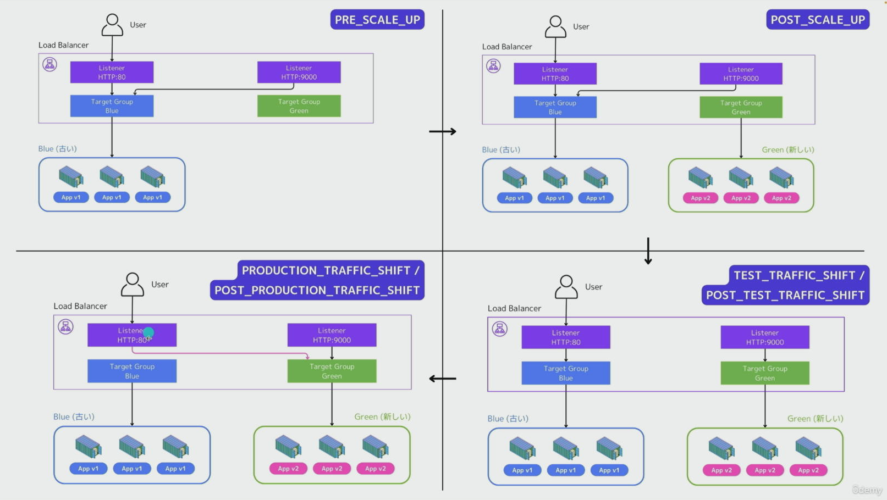

# AWS VPC・サブネット・ルートテーブル・インターネットゲートウェイ作成手順書

## 概要
本手順書では、AWSマネジメントコンソールからVPC、サブネット、ルートテーブル、インターネットゲートウェイを作成し、ネットワーク環境を構築する手順を説明します。

## 前提条件
- AWSアカウントにログイン済みであること
- リージョン: **US West 2 (オレゴン)** を使用

## ネットワーク設計

### VPC CIDR
- **VPC CIDR**: `10.0.0.0/20`

### サブネット CIDR
| サブネット名 | CIDR | 利用可能IP数 | 用途 |
|------------|------|------------|------|
| my-workspace-subnet-private1-a | `10.0.0.0/24` | 256 | プライベート |
| my-workspace-subnet-public1-a | `10.0.1.0/24` | 256 | パブリック |

> **注意**: CIDR設計は後から変更が困難なため、柔軟性と余裕を持たせた設計を推奨します。

---

## 手順1: リージョンの確認・変更

1. AWSマネジメントコンソールにログイン
2. 画面右上のリージョン選択メニューをクリック
3. **US West (Oregon) us-west-2** を選択

---

## 手順2: VPCの作成

### 2-1. VPCサービスへの移動
1. 画面上部の検索ボックスに「**VPC**」と入力
2. 表示された「**VPC**」をクリック

### 2-2. VPC作成画面へ
1. 左側メニューから「**VPC**」をクリック
2. 画面右上の「**VPCを作成**」ボタンをクリック

> **参考**: 初期状態では、デフォルトVPCが1つ存在します。これはそのまま残しておいて問題ありません。

### 2-3. VPC設定

| 項目 | 設定値 |
|------|--------|
| 作成するリソース | **VPCのみ** |
| 名前タグ | `my-workspace-vpc` |
| IPv4 CIDRブロック | **手動入力** |
| IPv4 CIDR | `10.0.0.0/20` |
| IPv6 CIDRブロック | **IPv6 CIDRブロックなし** |
| テナンシー | **デフォルト** |

### 2-4. VPC作成の実行
1. 設定内容を確認
2. 「**VPCを作成**」ボタンをクリック
3. 作成完了を確認

---

## 手順3: サブネットの作成

### 3-1. サブネット作成画面へ
1. 左側メニューから「**サブネット**」をクリック
2. 画面右上の「**サブネットを作成**」ボタンをクリック

### 3-2. プライベートサブネットの作成

#### VPC選択
- **VPC ID**: `my-workspace-vpc` (先ほど作成したVPC) を選択

#### サブネット設定1

| 項目 | 設定値 |
|------|--------|
| サブネット名 | `my-workspace-subnet-private1-a` |
| アベイラビリティーゾーン | **us-west-2a** (末尾がAのもの) |
| IPv4 VPC CIDRブロック | `10.0.0.0/20` (自動表示) |
| IPv4 サブネットCIDRブロック | `10.0.0.0/24` |

> **確認**: 「256 IPs」と表示されることを確認してください。

#### サブネット作成の実行
1. 設定内容を確認
2. 「**サブネットを作成**」ボタンをクリック

### 3-3. パブリックサブネットの作成

1. 再度「**サブネットを作成**」ボタンをクリック
2. **VPC ID**: `my-workspace-vpc` を選択

#### サブネット設定2

| 項目 | 設定値 |
|------|--------|
| サブネット名 | `my-workspace-subnet-public1-a` |
| アベイラビリティーゾーン | **us-west-2a** (末尾がAのもの) |
| IPv4 VPC CIDRブロック | `10.0.0.0/20` (自動表示) |
| IPv4 サブネットCIDRブロック | `10.0.1.0/24` |

> **確認**: 「256 IPs」と表示されることを確認してください。  
> IPアドレス範囲: `10.0.1.0` ～ `10.0.1.255`

#### サブネット作成の実行
1. 設定内容を確認
2. 「**サブネットを作成**」ボタンをクリック

---

## 手順4: サブネット作成の確認

### サブネット一覧の確認
1. サブネット一覧画面で、フィルターが適用されている場合は「✕」をクリックして解除
2. 以下の2つのサブネットが表示されていることを確認:
   - `my-workspace-subnet-private1-a`
   - `my-workspace-subnet-public1-a`

---

## 手順5: ルートテーブルの作成

### 5-1. プライベートサブネット用ルートテーブルの作成

#### ルートテーブル作成画面へ
1. VPCダッシュボードの左側メニューから「**ルートテーブル**」をクリック
2. 画面右上の「**ルートテーブルを作成**」ボタンをクリック

> **注意**: 既存のルートテーブルが表示されている場合がありますが、無視して新規作成してください。

#### プライベート用ルートテーブル設定

| 項目 | 設定値 |
|------|--------|
| 名前 | `my-workspace-rtb-private1-a` |
| VPC | `my-workspace-vpc` |

> **rtb**: Route Table (ルートテーブル) の略称

3. 「**ルートテーブルを作成**」ボタンをクリック

### 5-2. パブリックサブネット用ルートテーブルの作成

1. 再度「**ルートテーブルを作成**」ボタンをクリック

#### パブリック用ルートテーブル設定

| 項目 | 設定値 |
|------|--------|
| 名前 | `my-workspace-rtb-public1-a` |
| VPC | `my-workspace-vpc` |

2. 「**ルートテーブルを作成**」ボタンをクリック

---

## 手順6: インターネットゲートウェイの作成

### 6-1. インターネットゲートウェイ作成画面へ
1. 左側メニューから「**インターネットゲートウェイ**」をクリック
2. 「**インターネットゲートウェイの作成**」ボタンをクリック

### 6-2. インターネットゲートウェイ設定

| 項目 | 設定値 |
|------|--------|
| 名前タグ | `my-workspace-igw` |

> **igw**: Internet Gateway (インターネットゲートウェイ) の略称

3. 「**インターネットゲートウェイを作成**」ボタンをクリック

### 6-3. VPCへのアタッチ

1. 作成した `my-workspace-igw` にチェックを入れる
2. 画面上部の「**アクション**」メニューをクリック
3. 「**VPCにアタッチ**」を選択

#### アタッチ設定

| 項目 | 設定値 |
|------|--------|
| 使用可能なVPC | `my-workspace-vpc` |

4. 「**インターネットゲートウェイのアタッチ**」ボタンをクリック

---

## 手順7: パブリックルートテーブルへのルート追加

### 7-1. ルートテーブル選択
1. 左側メニューから「**ルートテーブル**」をクリック
2. `my-workspace-rtb-public1-a` を選択

### 7-2. ルートの編集
1. 下部の「**ルート**」タブをクリック
2. 「**ルートを編集**」ボタンをクリック

> **確認**: デフォルトでは、ターゲットが「local」のルートが1つ存在します。

### 7-3. インターネットゲートウェイへのルート追加

1. 「**ルートを追加**」ボタンをクリック

#### ルート設定

| 項目 | 設定値 |
|------|--------|
| 送信先 | `0.0.0.0/0` |
| ターゲット | インターネットゲートウェイ → `my-workspace-igw` |

> **0.0.0.0/0**: すべての送信先を表すCIDR表記

2. ターゲット欄をクリックし、「**インターネットゲートウェイ**」を選択
3. 候補から `my-workspace-igw` を選択
4. 「**変更を保存**」ボタンをクリック

> **重要**: プライベートルートテーブル (`my-workspace-rtb-private1-a`) にはインターネットゲートウェイを追加しません。

---

## 手順8: サブネットへのルートテーブル関連付け

### 8-1. プライベートサブネットへの関連付け

#### サブネット選択
1. 左側メニューから「**サブネット**」をクリック
2. `my-workspace-subnet-private1-a` にチェックを入れる

#### ルートテーブルの関連付け
1. 下部の「**ルートテーブル**」タブをクリック
2. 「**ルートテーブルの関連付けを編集**」ボタンをクリック

#### ルートテーブル選択

| 項目 | 設定値 |
|------|--------|
| ルートテーブルID | `my-workspace-rtb-private1-a` |

3. 「**保存**」ボタンをクリック

### 8-2. パブリックサブネットへの関連付け

#### サブネット選択
1. `my-workspace-subnet-public1-a` にチェックを入れる

#### ルートテーブルの関連付け
1. 下部の「**ルートテーブル**」タブをクリック
2. 「**ルートテーブルの関連付けを編集**」ボタンをクリック

#### ルートテーブル選択

| 項目 | 設定値 |
|------|--------|
| ルートテーブルID | `my-workspace-rtb-public1-a` |

3. 「**保存**」ボタンをクリック

---

## 構成完了後の状態

### パブリックサブネット
- **サブネット**: `my-workspace-subnet-public1-a`
- **ルートテーブル**: `my-workspace-rtb-public1-a`
- **ルート**:
  - `10.0.0.0/20` → local (VPC内通信)
  - `0.0.0.0/0` → `my-workspace-igw` (インターネット通信)

### プライベートサブネット
- **サブネット**: `my-workspace-subnet-private1-a`
- **ルートテーブル**: `my-workspace-rtb-private1-a`
- **ルート**:
  - `10.0.0.0/20` → local (VPC内通信のみ)

---

## 手順9: ECSクラスターの作成

### 9-1. ECSサービスへの移動
1. AWSマネジメントコンソール画面上部の検索ボックスに「**ECS**」と入力
2. 表示された「**Elastic Container Service**」をクリック

### 9-2. リージョンの確認
1. 画面右上のリージョンが **US West (Oregon) us-west-2** になっていることを確認

> **重要**: 前の手順でVPCをオレゴンリージョンに作成しているため、ECSも同じリージョンで作成する必要があります。

### 9-3. クラスター作成画面へ
1. 「**クラスターの作成**」ボタンをクリック

### 9-4. クラスター設定

#### 基本設定

| 項目 | 設定値 |
|------|--------|
| クラスター名 | `my-app-cluster` |
| デフォルトの名前空間 | そのまま（デフォルト） |

#### インフラストラクチャー設定

| 項目 | 設定値 |
|------|--------|
| インフラストラクチャー | **AWS Fargate (サーバーレス)** にチェック |

> **注意**: 
> - **Fargate**: サーバーレスでコンテナを実行（推奨）
> - **EC2インスタンス**: EC2インスタンスを管理してコンテナを実行
> - **ECS Anywhereを使用した外部インスタンス**: オンプレミス環境で使用

今回はFargateを使用するため、Fargateのみにチェックを入れてください。

### 9-5. クラスター作成の実行
1. 設定内容を確認
2. 「**作成**」ボタンをクリック
3. 1〜2分程度でクラスター作成が完了します

### 9-6. 作成確認
1. クラスター一覧画面に `my-app-cluster` が表示されていることを確認
2. クラスター名をクリックして詳細画面を開く
3. 以下の状態を確認:
   - **サービス**: 0個
   - **タスク**: 0個

> **確認**: この時点ではクラスターのみが作成された状態で、サービスやタスクはまだ存在しません。

---

## 手順10: タスク定義の作成

### 10-1. タスク定義画面への移動
1. ECSダッシュボードの左側メニューから「**タスク定義**」をクリック
2. タスク定義の一覧が表示される（初期状態では何も表示されません）

### 10-2. 新しいタスク定義の作成
1. 「**新しいタスク定義の作成**」ボタンをクリック

> **参考**: タスク定義はJSONから作成することも、UI上で作成することも可能です。今回はUIから作成します。

### 10-3. タスク定義ファミリー設定

| 項目 | 設定値 |
|------|--------|
| タスク定義ファミリー | `my-app-frontend` |

> **タスク定義ファミリー**: タスク定義の名前です。

### 10-4. インフラストラクチャー要件の設定

#### 起動タイプ

| 項目 | 設定値 |
|------|--------|
| 起動タイプ | **AWS Fargate (サーバーレス)** |

#### オペレーティングシステム/アーキテクチャ

| 項目 | 設定値 |
|------|--------|
| オペレーティングシステム/アーキテクチャ | **Linux/X86_64** |

> **選択肢**:
> - Linux/X86_64: Intel/AMD系CPU
> - Linux/ARM64: ARM系CPU
> - Windows: Windowsコンテナ

#### タスクサイズ

| 項目 | 設定値 | 備考 |
|------|--------|------|
| CPU | **0.25 vCPU** | 最小構成（デモアプリに十分） |
| メモリ | **0.5 GB** | 最小構成（デモアプリに十分） |

> **重要**: タスクサイズは料金に直結します。
> - CPUは1時間あたりのvCPU単位で課金
> - メモリは1時間あたりのGB単位で課金
> - アプリケーションの用途に応じて**必要最小限**のサイズを選択することでコスト削減が可能
> 
> 参考: [AWS Fargate料金](https://aws.amazon.com/jp/fargate/pricing/)

#### タスクロールとタスク実行ロール

| 項目 | 設定値 | 説明 |
|------|--------|------|
| タスクロール | **なし** | コンテナからAWSサービスにアクセスする際の権限（今回は不要） |
| タスク実行ロール | **新しいロールの作成** | ECRからイメージをプルする等の実行時に必要な権限 |

> **タスクロールとタスク実行ロールの違い**:
> - **タスクロール**: コンテナ内のアプリケーションがAWSサービス（S3など）にアクセスする際に必要
> - **タスク実行ロール**: ECSがタスクを起動する際（ECRからのプル、CloudWatchへのログ送信など）に必要

### 10-5. コンテナの設定

#### コンテナ-1の基本設定

| 項目 | 設定値 |
|------|--------|
| 名前 | `frontend` |
| イメージURI | `public.ecr.aws/nginx/nginx:stable-perl` |
| 必須コンテナ | **はい** |

#### イメージURIの取得方法

1. ブラウザで「**AWS ECR Public**」または「**Amazon ECR Public Gallery**」を検索
2. [Amazon ECR Public Gallery](https://gallery.ecr.aws/) を開く
3. 検索ボックスで「**nginx**」を検索、または「Popular registries」から「**nginx**」を選択
4. 「**nginx/nginx**」を選択
5. イメージタグ（例: `stable-perl`）の隣にあるコピーアイコンをクリック
6. イメージURI（`public.ecr.aws/nginx/nginx:stable-perl`）をコピー
7. タスク定義画面の「イメージURI」フィールドにペースト

#### ポートマッピング

| 項目 | 設定値 |
|------|--------|
| コンテナポート | **80** |
| プロトコル | **TCP** |
| アプリケーションプロトコル | **HTTP** |

> **説明**: コンテナポート80は、NGINXのデフォルトHTTPポートです。

#### 環境変数
- 特に設定不要（デフォルトのまま）

### 10-6. ログ収集の設定

| 項目 | 設定値 |
|------|--------|
| ログ収集の使用 | **チェックを入れる** |
| ログドライバー | **awslogs** (デフォルト) |
| その他のオプション | デフォルトのまま |

> **重要**: Amazon CloudWatchによるログ収集を有効化します。
> - 若干のコストはかかりますが、トラブルシューティングに非常に有用
> - コスト削減が最優先の場合はチェックを外すことも可能ですが、推奨しません

### 10-7. その他の設定
- **ストレージ**: デフォルトのまま
- **その他の設定**: デフォルトのまま

### 10-8. タスク定義の作成実行
1. すべての設定を確認
2. 「**作成**」ボタンをクリック
3. 「`my-app-frontend:1` が正常に作成されました」というメッセージを確認

### 10-9. タスク定義の確認

1. タスク定義一覧画面に戻る
2. `my-app-frontend` が一覧に表示されていることを確認
3. タスク定義名をクリックして詳細を確認

#### タスク定義のリビジョン（バージョン）について

タスク定義名の後ろに `:1` というリビジョン番号が付いています。

**リビジョンの意味**:
- タスク定義のバージョン番号を表します
- 初回作成時は `:1` からスタート
- タスク定義を更新するたびに `:2`、`:3`... とインクリメントされます

**リビジョンが必要な理由**:
- アプリケーションのアップデート時、新しいコンテナイメージを使用する必要がある
- 環境変数やリソース設定の変更が必要になる場合がある
- これらの変更はタスク定義の更新によって実現される

**新しいリビジョンの作成方法**:
1. タスク定義を選択
2. 「**新しいリビジョンの作成**」ボタンをクリック
3. 必要な変更を加えて作成

> **ベストプラクティス**: タスク定義は頻繁にバージョンアップされるのが一般的です。各リビジョンは履歴として保持されるため、必要に応じて以前のバージョンにロールバックすることも可能です。

---

## 手順11: タスクの実行とデプロイ

### 11-1. クラスター画面への移動
1. ECSダッシュボードの左側メニューから「**クラスター**」をクリック
2. 作成済みの `my-app-cluster` を選択

### 11-2. タスク実行画面への移動
1. クラスター詳細画面で、デフォルトで「**サービス**」タブが選択されている
2. その横の「**タスク**」タブをクリック
3. 「**新しいタスクの実行**」ボタンをクリック

> **注意**: 今回はサービスではなく、タスクを直接実行します。

### 11-3. コンピューティング設定

| 項目 | 設定値 |
|------|--------|
| コンピューティング設定 | **起動タイプ** |
| 起動タイプ | **Fargate** |
| プラットフォームバージョン | **LATEST** |

> **プラットフォームバージョン**: Fargateのバージョンです。基本的に「LATEST」（最新）を選択します。

### 11-4. デプロイ設定

| 項目 | 設定値 |
|------|--------|
| アプリケーションのタイプ | **タスク** |
| タスク定義 - ファミリー | `my-app-frontend` |
| タスク定義 - リビジョン | **1** (最新) |
| 必要なタスクの数 | **1** |
| タスクグループ | 空欄（設定不要） |

> **タスクの数**: 
> - 複数のタスクを起動することも可能（例: 3、4、10など）
> - タスク数が増えるとその分コストも増加
> - 今回のデモでは1つで十分

### 11-5. ネットワーク設定

#### ネットワーキングセクションを展開
「**ネットワーキング**」セクションをクリックして展開

#### VPCとサブネットの設定

| 項目 | 設定値 |
|------|--------|
| VPC | `my-workspace-vpc` |
| サブネット | `my-workspace-subnet-public1-a` のみ選択 |

> **重要**: 
> - デフォルトでプライベートサブネットとパブリックサブネットの両方が選択されている場合があります
> - **プライベートサブネット (`my-workspace-subnet-private1-a`) のチェックを外してください**
> - パブリックサブネットのみを使用します

#### セキュリティグループの設定

| 項目 | 設定値 |
|------|--------|
| セキュリティグループ | **新しいセキュリティグループを作成** |
| セキュリティグループ名 | `my-app-frontend-sg` |
| セキュリティグループの説明 | `Security group for frontend task` |

> **注意**: 説明文には日本語は使用できません。英数字で記入してください。

#### インバウンドルールの設定

| 項目 | 設定値 |
|------|--------|
| タイプ | **HTTP** |
| ポート | **80** (自動設定) |
| ソース | **Anywhere** (`0.0.0.0/0`) |

> **ソースの選択肢**:
> - **Anywhere**: すべてのIPアドレスからのアクセスを許可（今回はこれを選択）
> - **カスタム**: 特定のIPアドレス範囲を指定してアクセスを制限（よりセキュア）
> 
> **注意**: 本番環境では、アクセス元IPを適切に制限することを推奨します。

#### パブリックIP設定

| 項目 | 設定値 |
|------|--------|
| パブリックIP | **オン** |

> **重要**: パブリックIPを有効にすることで、インターネットから直接アクセス可能になります。

### 11-6. タスクの作成
1. 「**タスクの上書き**」など他の設定は変更不要（デフォルトのまま）
2. すべての設定を確認
3. 「**作成**」ボタンをクリック

### 11-7. タスク起動の確認

#### タスクステータスの確認
1. タスク一覧画面で、新しいタスクのステータスが「**PROVISIONING**」と表示される
2. タスクIDをクリックして詳細画面を開く
3. 下部の「ステータス」セクションで「**PENDING**」から「**RUNNING**」に変わるまで待つ（1〜2分程度）
4. ステータスが変わらない場合は、画面上部の更新ボタン（🔄）をクリック

#### NGINXへのアクセス確認
1. タスクが「**RUNNING**」ステータスになったことを確認
2. タスク詳細画面上部の「**パブリックIP**」欄に表示されているIPアドレスを確認
3. 「**オープンアドレス**」リンクをクリック、または表示されているIPアドレスをブラウザのアドレスバーに入力
4. NGINXのウェルカムページが表示されることを確認

> **トラブルシューティング**: 
> NGINXページが表示されない場合、以下を確認してください：
> - セキュリティグループの設定が正しいか
> - パブリックIPが有効になっているか
> - サブネットがパブリックサブネットになっているか

### 11-8. セキュリティグループ設定の確認

#### セキュリティグループへのアクセス
1. タスク詳細画面で「**ネットワーキング**」タブをクリック
2. 「セキュリティグループ」セクションに表示されているセキュリティグループIDをクリック

#### インバウンドルールの確認

以下のルールが設定されていることを確認してください：

| タイプ | プロトコル | ポート範囲 | ソース | 説明 |
|------|----------|----------|--------|------|
| HTTP | TCP | 80 | 0.0.0.0/0 | IPv4からのHTTPアクセス許可 |
| HTTP | TCP | 80 | ::/0 | IPv6からのHTTPアクセス許可 |

#### アウトバウンドルールの確認

デフォルト設定（すべてのトラフィックを許可）になっていることを確認：

| タイプ | プロトコル | ポート範囲 | 送信先 |
|------|----------|----------|--------|
| すべてのトラフィック | すべて | すべて | 0.0.0.0/0 |

### 11-9. タスクの停止

動作確認が完了したら、コスト削減のためタスクを停止します。

> **重要**: タスクは実行時間に応じて課金されるため、不要な場合は必ず停止してください。

#### タスク停止手順
1. タスク一覧画面に戻る
2. 停止したいタスクにチェックを入れる
3. 「**停止**」ボタンをクリック
4. 確認ダイアログで「**停止**」をクリック

#### 停止確認
1. タスクのステータスが変化するまで待つ
2. デフォルトでは「実行中」のフィルターが適用されているため、停止後はタスク一覧から消える
3. フィルターを変更することで、停止済みタスクも確認可能

> **確認**: タスク一覧で実行中のタスクが0個になっていることを確認してください。

---

## 手順12: ロードバランサー用セキュリティグループの作成

### 12-1. セキュリティグループの概要

ブルー/グリーンデプロイメントを実現するために、ロードバランサーとそれに関連するセキュリティグループを設定します。

#### セキュリティグループのルール設計

今回、ロードバランサー用に**2つのインバウンドルール**を設定します：

| ポート | プロトコル | 用途 | アクセス元 |
|--------|----------|------|----------|
| 80 | HTTP | 本番環境（一般ユーザー向け） | すべて (0.0.0.0/0) |
| 9000 | TCP | テスト環境（開発者向け・グリーン環境の確認用） | 開発者のIPアドレスのみ |

> **重要なポイント**:
> - **ポート80**: 一般ユーザーが本番環境（ブルー）にアクセスするため、すべてのIPアドレスに対してオープン
> - **ポート9000**: グリーン環境の動作確認用。まだ本番公開前のため、開発者のみがアクセスできるように制限

### 12-2. EC2サービスへの移動
1. AWSマネジメントコンソール画面上部の検索ボックスに「**EC2**」と入力
2. 表示された「**EC2**」をクリック

### 12-3. セキュリティグループ画面への移動
1. EC2ダッシュボードの左側メニューから「**セキュリティグループ**」をクリック
2. リージョンが **US West (Oregon) us-west-2** になっていることを確認
3. 以前作成したセキュリティグループ（`my-app-frontend-sg`）が一覧に表示されていることを確認

### 12-4. 新しいセキュリティグループの作成
1. 「**セキュリティグループを作成**」ボタンをクリック

### 12-5. セキュリティグループの基本設定

| 項目 | 設定値 |
|------|--------|
| セキュリティグループ名 | `my-app-lb-sg` |
| 説明 | `Security group for load balancer` |
| VPC | `my-workspace-vpc` |

> **略称**:
> - **lb**: Load Balancer (ロードバランサー) の略称
> - **sg**: Security Group (セキュリティグループ) の略称
> 
> **注意**: 説明欄は必須項目です。日本語は使用できないため、英数字で記入してください。

### 12-6. インバウンドルールの設定

#### ルール1: 一般ユーザー向けHTTPアクセス（ポート80）

1. 「**ルールを追加**」ボタンをクリック

| 項目 | 設定値 |
|------|--------|
| タイプ | **HTTP** |
| プロトコル | **TCP** (自動設定) |
| ポート範囲 | **80** (自動設定) |
| ソース | **Anywhere-IPv4** (`0.0.0.0/0`) |

> **警告表示について**: 
> 「すべてのIPアドレスに対してオープンになっている」という警告が表示されますが、一般ユーザー向けのアプリケーションとして公開するため、この設定は意図的なものです。無視して進めてください。

#### ルール2: 開発者向けテストアクセス（ポート9000）

1. 「**ルールを追加**」ボタンをクリック

| 項目 | 設定値 |
|------|--------|
| タイプ | **カスタムTCP** |
| プロトコル | **TCP** |
| ポート範囲 | **9000** |
| ソース | **カスタム** (自分のIPアドレス) |

#### 自分のIPアドレスの調べ方

1. ブラウザで新しいタブを開く
2. Googleで「**IPアドレス**」または「**IP確認**」と検索
3. 「**使用中のIPアドレスを確認**」というページをクリック
4. 表示されたIPアドレス（例: `123.45.67.89`）をコピー

#### IPアドレスの設定方法

1. セキュリティグループ設定画面のポート9000のルールの「ソース」欄に戻る
2. コピーしたIPアドレスを入力し、**必ず末尾に `/32` を付ける**
   - 例: `123.45.67.89/32`

> **CIDR表記の説明**:
> - `/32` は32ビット全体をネットワーク部として扱う指定
> - これにより、指定したIPアドレスに**完全一致するデバイスからのみ**アクセス可能になります
> - つまり、あなたのパソコンからのみポート9000にアクセスできる状態になります

**インバウンドルール設定例**:

| タイプ | プロトコル | ポート範囲 | ソース | 説明 |
|------|----------|----------|--------|------|
| HTTP | TCP | 80 | 0.0.0.0/0 | 一般ユーザー向けHTTPアクセス |
| カスタムTCP | TCP | 9000 | 123.45.67.89/32 | 開発者向けテストアクセス（グリーン環境確認用） |

### 12-7. アウトバウンドルールの確認

デフォルトで以下の設定になっていることを確認してください（変更不要）：

| タイプ | プロトコル | ポート範囲 | 送信先 |
|------|----------|----------|--------|
| すべてのトラフィック | すべて | すべて | 0.0.0.0/0 |

### 12-8. セキュリティグループの作成実行
1. すべての設定を確認
2. 「**セキュリティグループを作成**」ボタンをクリック
3. 作成完了メッセージを確認

### 12-9. 作成確認
1. セキュリティグループ一覧画面で `my-app-lb-sg` が表示されていることを確認
2. セキュリティグループをクリックして詳細を確認
3. インバウンドルールが正しく設定されていることを確認

---

## 手順13: 追加パブリックサブネットの作成

### 13-1. 追加サブネットが必要な理由

Application Load Balancer (ALB) を作成するには、**最低2つのアベイラビリティーゾーン (AZ)** にサブネットが必要です。

#### 現在のネットワーク構成

| リソース | 名前 | CIDR | AZ | 備考 |
|---------|------|------|----|----|
| VPC | `my-workspace-vpc` | `10.0.0.0/20` | - | 4096個のIPアドレス |
| サブネット | `my-workspace-subnet-private1-a` | `10.0.0.0/24` | us-west-2a | プライベート |
| サブネット | `my-workspace-subnet-public1-a` | `10.0.1.0/24` | us-west-2a | パブリック（IGW接続） |

現時点では、パブリックサブネットが1つ（AZ: us-west-2a）しか存在しないため、もう1つのAZにパブリックサブネットを追加する必要があります。

#### 追加するサブネット

| リソース | 名前 | CIDR | AZ | 備考 |
|---------|------|------|----|----|
| サブネット | `my-workspace-subnet-public1-b` | `10.0.2.0/24` | us-west-2b | パブリック（IGW接続予定） |

> **重要**: ロードバランサーはインターネットからアクセスを受けるため、**パブリックサブネット**に配置する必要があります。

### 13-2. サブネット作成画面への移動

1. AWSコンソール画面上部のAWSロゴを右クリック → 「**新しいタブで開く**」
2. 検索ボックスに「**VPC**」と入力してVPCサービスを開く
3. 左側メニューから「**サブネット**」をクリック
4. リージョンが **US West (Oregon) us-west-2** になっていることを確認
5. 現在のサブネット（プライベート1つ、パブリック1つ）を確認

### 13-3. サブネットの作成

1. 「**サブネットを作成**」ボタンをクリック

#### VPC選択

| 項目 | 設定値 |
|------|--------|
| VPC ID | `my-workspace-vpc` |

#### サブネット設定

| 項目 | 設定値 |
|------|--------|
| サブネット名 | `my-workspace-subnet-public1-b` |
| アベイラビリティーゾーン | **us-west-2b** (末尾がBのもの) |
| IPv4 VPC CIDRブロック | `10.0.0.0/20` (自動表示) |
| IPv4 サブネットCIDRブロック | `10.0.2.0/24` |

> **CIDR設計**:
> - `10.0.0.0/24`: プライベート1a（既存）
> - `10.0.1.0/24`: パブリック1a（既存）
> - `10.0.2.0/24`: パブリック1b（新規） ← 重複なし

2. 「**サブネットを作成**」ボタンをクリック

### 13-4. 作成確認

1. サブネット一覧画面でフィルターを解除
2. 以下の3つのサブネットが表示されていることを確認:
   - `my-workspace-subnet-private1-a` (10.0.0.0/24, us-west-2a)
   - `my-workspace-subnet-public1-a` (10.0.1.0/24, us-west-2a)
   - `my-workspace-subnet-public1-b` (10.0.2.0/24, us-west-2b)

---

## 手順14: Application Load Balancerの作成

### 14-1. ロードバランサー作成画面への移動

1. EC2ダッシュボードに戻る（セキュリティグループ設定完了後の画面）
2. 左側メニューの「**ロードバランシング**」セクションから「**ロードバランサー**」をクリック
3. リージョンが **US West (Oregon) us-west-2** になっていることを確認

### 14-2. ロードバランサータイプの選択

1. 「**ロードバランサーの作成**」ボタンをクリック
2. **Application Load Balancer** の「**作成**」ボタンをクリック

> **ロードバランサーの種類**:
> - **Application Load Balancer (ALB)**: HTTP/HTTPSレイヤー（レイヤー7）でのルーティングに最適
> - **Network Load Balancer (NLB)**: TCP/UDPレイヤー（レイヤー4）での高性能ルーティング
> - **Gateway Load Balancer**: サードパーティの仮想アプライアンス向け
> 
> 今回はHTTP/HTTPSプロトコルを使用するため、ALBを選択します。

### 14-3. 基本設定

| 項目 | 設定値 |
|------|--------|
| ロードバランサー名 | `my-app-alb` |
| スキーム | **インターネット向け** |
| IPアドレスタイプ | **IPv4** |

> **スキーム**:
> - **インターネット向け**: インターネットから直接アクセス可能
> - **内部**: VPC内部からのみアクセス可能
> 
> **IPアドレスタイプ**:
> - **IPv4**: IPv4アドレスのみ
> - **デュアルスタック**: IPv4とIPv6の両方に対応

### 14-4. ネットワークマッピング

#### VPC選択

| 項目 | 設定値 |
|------|--------|
| VPC | `my-workspace-vpc` |

#### アベイラビリティーゾーンとサブネットの選択

以下の2つのAZにチェックを入れ、それぞれパブリックサブネットを選択します：

| アベイラビリティーゾーン | サブネット |
|----------------------|----------|
| **us-west-2a** | `my-workspace-subnet-public1-a` (10.0.1.0/24) |
| **us-west-2b** | `my-workspace-subnet-public1-b` (10.0.2.0/24) |

> **警告表示について**: 
> us-west-2bのサブネットで「インターネットゲートウェイへのルーティングがありません」という警告が表示されますが、後の手順で設定するため、現時点では無視してください。

### 14-5. セキュリティグループの設定

1. セキュリティグループ選択欄をクリック
2. `my-app-lb-sg` を選択
3. **default のセキュリティグループのチェックを外す**
4. `my-app-lb-sg` のみが選択された状態にする

### 14-6. リスナーとルーティングの設定

#### リスナー1の設定

| 項目 | 設定値 |
|------|--------|
| プロトコル | **HTTP** |
| ポート | **80** |
| ターゲットグループ | 後で設定（まず作成が必要） |

---

## 手順15: ターゲットグループの作成（ブルー環境用）

### 15-1. ターゲットグループ作成画面への移動

1. リスナー設定の「**ターゲットグループの作成**」リンクをクリック
2. 新しいタブでターゲットグループ作成画面が開く

### 15-2. ターゲットタイプの選択

| 項目 | 設定値 |
|------|--------|
| ターゲットタイプ | **IPアドレス** |

> **ターゲットタイプの説明**:
> - **インスタンス**: EC2インスタンスを直接ターゲットにする
> - **IPアドレス**: IPアドレスでターゲットを指定（**ECS Fargateの場合はこれを選択**）
> - **Lambda関数**: AWS Lambda関数をターゲットにする
> - **Application Load Balancer**: 別のALBをターゲットにする

### 15-3. ターゲットグループの基本設定

| 項目 | 設定値 |
|------|--------|
| ターゲットグループ名 | `my-app-frontend-tg-1` |
| プロトコル | **HTTP** |
| ポート | **80** |
| IPアドレスタイプ | **IPv4** |
| VPC | `my-workspace-vpc` |
| プロトコルバージョン | **HTTP1** |

> **命名規則**: 
> - `tg-1` (Target Group 1): ブルー環境用のターゲットグループ
> - 後でグリーン環境用に `tg-2` を作成します

### 15-4. ヘルスチェックの設定

ヘルスチェックは、ターゲット（コンテナ）が正常に動作しているかを定期的に確認する機能です。

| 項目 | 設定値 |
|------|--------|
| ヘルスチェックプロトコル | **HTTP** |
| ヘルスチェックパス | `/` |

#### 詳細設定（デフォルトのまま）

| 項目 | デフォルト値 | 説明 |
|------|------------|------|
| 正常のしきい値 | 5 | 連続で成功したらHealthyと判断 |
| 非正常のしきい値 | 2 | 連続で失敗したらUnhealthyと判断 |
| タイムアウト | 5秒 | レスポンス待機時間 |
| 間隔 | 30秒 | ヘルスチェックの実行間隔 |
| 成功コード | **200** | HTTPステータスコード200（OK）を正常と判断 |

> **成功コードについて**:
> - `200`: HTTP OK（最も一般的）
> - `200-299`: 200番台すべて（成功系全般）
> - `301`: リダイレクト（必要に応じて）
> 
> 今回はNGINXのデフォルトページにアクセスするため、`200` を指定します。

### 15-5. ターゲットの登録

1. 「**次へ**」をクリック
2. 「ターゲットの登録」画面が表示される

> **重要**: 
> - 現時点ではターゲット（コンテナ）はまだ存在しません
> - ブルー/グリーンデプロイの過程で自動的にターゲットが登録されます
> - **何も登録せずに進めてください**
(10.0.0.　のようにVPCサブネットからのIPv4アドレスの入力が書いてたら「**削除**」ボタンをクリック)
3. ネットワーク欄が `my-workspace-vpc` になっていることを確認
4. ポートが **80** になっていることを確認
5. ターゲット一覧に何も表示されていないことを確認
6. 「**ターゲットグループの作成**」ボタンをクリック

### 15-6. 作成確認

1. 「ターゲットグループが正常に作成されました」というメッセージを確認
2. ターゲットグループ一覧で `my-app-frontend-tg-1` が表示されていることを確認

---

## 手順16: ロードバランサー作成の完了

### 16-1. リスナー設定の完了

1. ロードバランサー作成画面のタブに戻る
2. ターゲットグループ選択欄の「**🔄 更新**」アイコンをクリック
3. ドロップダウンから `my-app-frontend-tg-1` を選択

### 16-2. その他の設定

- **リスナータグの追加**: 設定不要（デフォルトのまま）
- **その他の設定**: 設定不要（デフォルトのまま）

### 16-3. ロードバランサーの作成実行

1. すべての設定を確認
2. 「**ロードバランサーの作成**」ボタンをクリック
3. 「ロードバランサーが正常に作成されました」というメッセージを確認

### 16-4. ロードバランサーのプロビジョニング確認

1. ロードバランサー一覧画面に移動
2. `my-app-alb` のステータスが「**プロビジョニング中**」と表示される
3. 1〜2分待つ
4. ステータスが「**アクティブ**」に変わることを確認（必要に応じて更新ボタンをクリック）

### 16-5. リスナーとルールの確認

1. `my-app-alb` を選択
2. 「**リスナーとルール**」タブをクリック
3. 以下の設定が確認できます:

| プロトコル | ポート | デフォルトアクション | ターゲットグループ | トラフィック配分 |
|-----------|--------|------------------|------------------|----------------|
| HTTP | 80 | Forward to | `my-app-frontend-tg-1` | 100% |

### 16-6. 現在の構成状態

現時点で完成している構成は以下の通りです：

```
一般ユーザー (インターネット)
    ↓ (HTTP, ポート80)
Application Load Balancer (my-app-alb)
    ↓ (100%のトラフィック)
ターゲットグループ1 (my-app-frontend-tg-1) [ブルー環境用]
    ↓ (未接続)
[コンテナ - まだ未作成]
```

---

## 手順17: ターゲットグループの追加作成（グリーン環境用）

### 17-1. ターゲットグループ作成画面への移動

1. EC2ダッシュボードの左側メニュー「**ロードバランシング**」セクションから「**ターゲットグループ**」をクリック
2. 「**ターゲットグループの作成**」ボタンをクリック

### 17-2. ターゲットグループの設定

#### ターゲットタイプの選択

| 項目 | 設定値 |
|------|--------|
| ターゲットタイプ | **IPアドレス** |

#### 基本設定

| 項目 | 設定値 |
|------|--------|
| ターゲットグループ名 | `my-app-frontend-tg-2` |
| プロトコル | **HTTP** |
| ポート | **80** |
| IPアドレスタイプ | **IPv4** |
| VPC | `my-workspace-vpc` |
| プロトコルバージョン | **HTTP1** |

> **命名規則**: `tg-2` (Target Group 2) はグリーン環境用のターゲットグループです。

### 17-3. ヘルスチェックの設定

前回と同じ設定を使用します：

| 項目 | 設定値 |
|------|--------|
| ヘルスチェックプロトコル | **HTTP** |
| ヘルスチェックパス | `/` |
| 詳細設定 | デフォルトのまま |

### 17-4. ターゲットの登録

1. 「**次へ**」をクリック
2. ターゲット登録画面で何も登録せず、そのまま進む
3. ネットワークが `my-workspace-vpc` であることを確認
4. ポートが **80** であることを確認
5. 「**ターゲットグループの作成**」ボタンをクリック

### 17-5. 作成確認

1. 「ターゲットグループが正常に作成されました」というメッセージを確認
2. ターゲットグループ一覧で `my-app-frontend-tg-2` が表示されていることを確認

---

## 手順18: リスナーの追加（ポート9000 - グリーン環境用）

### 18-1. ロードバランサー詳細画面への移動

1. 左側メニューの「**ロードバランサー**」をクリック
2. `my-app-alb` を選択
3. 「**リスナーとルール**」タブをクリック
4. 現在はHTTP:80のリスナーが1つだけ表示されている

### 18-2. リスナーの追加

1. 「**リスナーの追加**」ボタンをクリック

#### リスナー設定

| 項目 | 設定値 |
|------|--------|
| プロトコル | **HTTP** |
| ポート | **9000** |
| デフォルトアクション | Forward to |
| ターゲットグループ | `my-app-frontend-tg-2` |

> **重要**: ポート9000は開発者がグリーン環境の動作確認を行うためのポートです。

2. 「**リスナーの追加**」ボタンをクリック

### 18-3. リスナー追加の確認

「**リスナーとルール**」タブで以下の2つのリスナーが表示されていることを確認：

| プロトコル | ポート | デフォルトアクション | ターゲットグループ | 用途 |
|-----------|--------|------------------|------------------|------|
| HTTP | 80 | Forward to | `my-app-frontend-tg-1` | 本番環境（ブルー） |
| HTTP | 9000 | Forward to | `my-app-frontend-tg-2` | テスト環境（グリーン） |

---

## 手順19: ポート80リスナーへのターゲットグループ2の追加

### 19-1. ターゲットグループ追加が必要な理由

ブルー/グリーンデプロイメントをECSで実行する際の要件として、**本番用リスナー（ポート80）に両方のターゲットグループを登録**しておく必要があります。

これにより、デプロイ時にトラフィックの切り替え（ブルー→グリーン）が可能になります。

### 19-2. ルール編集画面への移動

1. 「**リスナーとルール**」タブで、**HTTP:80** のリスナーを選択（チェックボックスにチェック）
2. 「**ルールの管理**」ドロップダウンから「**ルールの編集**」を選択


### 19-3. デフォルトルールの編集

1. ルール一覧で、一番上のデフォルトルール（**最後（デフォルト）**）にチェックを入れる
2. 「**アクション**」ドロップダウンから「**ルールの編集**」を選択

### 19-4. ターゲットグループの追加

#### デフォルトアクション設定

現在、以下のように表示されているはずです：

| ターゲットグループ | 重み |
|------------------|------|
| `my-app-frontend-tg-1` | 100 |

#### ターゲットグループを追加

1. 「**ターゲットグループの追加**」ボタンをクリック
2. 2番目のターゲットグループとして `my-app-frontend-tg-2` を選択

#### 重みの設定

| ターゲットグループ | 重み | トラフィック配分 |
|------------------|------|----------------|
| `my-app-frontend-tg-1` | **100** | 99.01% |
| `my-app-frontend-tg-2` | **1** | 0.99% → **0%** に変更 |

> **重みの説明**:
> - **重み100:1**: デフォルトでは99.01%と0.99%の割合でトラフィックが分散
> - **重み100:0**: すべてのトラフィック（100%）がtg-1に流れる
> 
> **現在の想定**:
> - tg-1 (ブルー環境): 本番稼働中 → 100%のトラフィック
> - tg-2 (グリーン環境): まだ未稼働 → 0%のトラフィック（トラフィックを流さない）

3. `my-app-frontend-tg-2` の重みを **0** に変更
4. 「**変更内容の保存**」ボタンをクリック

### 19-5. 設定確認

1. ルール一覧画面に戻る
2. デフォルトルールのアクション列に以下のように表示されていることを確認：
   - Forward to: `my-app-frontend-tg-1` (100) and `my-app-frontend-tg-2` (0)

---

## 手順21: ECS用IAMロールの作成（ロードバランサー操作権限）

### 21-1. IAMロールが必要な理由

ブルー/グリーンデプロイメントでは、ECSがロードバランサーのターゲットグループやリスナーを操作して、トラフィックをブルー環境からグリーン環境に切り替えます。

このため、**ECSにロードバランサーを操作する権限**を付与する必要があります。これをIAMロール経由で実現します。

### 21-2. 参考ドキュメント

AWS公式ドキュメント：[**Amazon ECS infrastructure IAM role for load balancers**](https://docs.aws.amazon.com/AmazonECS/latest/developerguide/AmazonECSInfrastructureRolePolicyForLoadBalancers.html)

このドキュメントに記載されている手順に従って、AWS CLIを使用してIAMロールを作成します。

> **参考**: コンソール画面から手動で作成することも可能ですが、今回はAWS CLIを使用します。

### 21-3. AWS CloudShellの起動

AWS CLIを簡単に使用する方法として、AWS CloudShellを利用します。

1. AWSマネジメントコンソール画面右上の「**ターミナルアイコン**」（>_）をクリック
2. CloudShellが画面下部に表示される（初回は起動に少し時間がかかる場合があります）
3. プロンプトが表示されたら準備完了

#### CloudShellの動作確認

```bash
aws --version
```

AWS CLIのバージョン情報が表示されれば正常に動作しています。

> **CloudShellの利点**:
> - AWS CLIがプリインストール済み
> - 認証設定が不要（現在ログイン中のユーザー権限で実行）
> - ブラウザ上で直接操作可能

---

## 手順22: 信頼ポリシーJSONファイルの作成

### 22-1. 信頼ポリシーとは

信頼ポリシーは、「このロールを誰が使えるか」を定義するポリシーです。今回は「ECSサービスがこのロールを使用できる」ことを許可します。

### 22-2. JSONファイルの作成

CloudShell上でJSONファイルを作成します。

#### 方法1: catコマンドを使用（推奨）

1. CloudShellで以下のコマンドを入力：

```bash
cat << 'EOF' > ecs-infrastructure-trust-policy.json
{
  "Version": "2012-10-17",
  "Statement": [
    {
      "Sid": "AllowAccessToECSForInfrastructureManagement",
      "Effect": "Allow",
      "Principal": {
        "Service": "ecs.amazonaws.com"
      },
      "Action": "sts:AssumeRole"
    }
  ]
}
EOF
```

2. Enterキーを押してファイルを作成

> **警告が表示された場合**: 「複数行のテキストを貼り付けようとしています」という警告が表示されたら、「**貼り付け**」をクリック

#### 方法2: ローカルでファイルを作成してアップロード

1. ローカルPCで上記JSONの内容を `ecs-infrastructure-trust-policy.json` として保存
2. CloudShellで「**アクション**」→「**ファイルのアップロード**」を選択
3. 作成したファイルをアップロード

### 22-3. ファイル作成の確認

```bash
cat ecs-infrastructure-trust-policy.json
```

以下のような内容が表示されれば成功です：

```json
{
  "Version": "2012-10-17",
  "Statement": [
    {
      "Effect": "Allow",
      "Principal": {
        "Service": "ecs.amazonaws.com"
      },
      "Action": "sts:AssumeRole"
    }
  ]
}
```

### 22-4. 信頼ポリシーの内容説明

このポリシーの重要な部分を解説します：

#### STS (Security Token Service) とは

AWS STSは、一時的な認証情報（アクセスキー）を発行するサービスです。

#### sts:AssumeRole の意味

- **STS**: Security Token Service（一時的な認証情報を発行するサービス）
- **AssumeRole**: 発行した認証情報を「引き受ける」（使用する）権限

#### このポリシーの意味

| 項目 | 内容 | 説明 |
|------|------|------|
| Principal | `ecs.amazonaws.com` | ECSサービスが対象 |
| Action | `sts:AssumeRole` | STSが発行した認証情報を使用できる |
| Effect | `Allow` | 許可する |

つまり、「**ECSサービスがこのロールを引き受けて（AssumeRole）、ロールに付与された権限を使用することを許可する**」という意味です。

---

## 手順23: IAMロールの作成

### 23-1. ロールの作成コマンド

CloudShellで以下のコマンドを実行します：

```bash
aws iam create-role \
  --role-name ecsInfrastructureRoleForLoadBalancers \
  --assume-role-policy-document file://ecs-infrastructure-trust-policy.json
```

> **注意**: ロール名は複数形の `ecsInfrastructureRoleForLoadBalancers` です（AWS公式ドキュメント準拠）。ファイル名も一致していることを確認してください。

#### コマンドの説明

| オプション | 値 | 説明 |
|-----------|---|------|
| `--role-name` | `ecsInfrastructureRoleForLoadBalancers` | 作成するロールの名前（複数形） |
| `--assume-role-policy-document` | `file://ecs-infrastructure-trust-policy.json` | 信頼ポリシーのJSONファイルを指定 |

### 23-2. 実行結果の確認

成功すると、以下のようなJSON形式のレスポンスが返されます：

```json
{
    "Role": {
        "Path": "/",
        "RoleName": "ecsInfrastructureRoleForLoadBalancers",
        "RoleId": "AROA...",
        "Arn": "arn:aws:iam::123456789012:role/ecsInfrastructureRoleForLoadBalancers",
        "CreateDate": "2025-12-09T...",
        "AssumeRolePolicyDocument": {...}
    }
}
```

### 23-3. IAMコンソールでの確認

1. AWSコンソール画面上部の検索ボックスに「**IAM**」と入力
2. IAMダッシュボードを開く（CloudShellは最小化しておく）
3. 左側メニューから「**ロール**」をクリック
4. 検索ボックスに「**ecsInfrastructureRoleForLoadBalancers**」と入力
5. 作成したロールが一覧に表示されていることを確認
6. ロール名をクリックして詳細画面を開く

#### 確認ポイント

- 「**許可**」タブ: 現時点では何もポリシーがアタッチされていない（空）
- 「**信頼関係**」タブ: 先ほど設定した信頼ポリシーが表示される

```json
{
  "Version": "2012-10-17",
  "Statement": [
    {
      "Sid": "AllowAccessToECSForInfrastructureManagement",
      "Effect": "Allow",
      "Principal": {
        "Service": "ecs.amazonaws.com"
      },
      "Action": "sts:AssumeRole"
    }
  ]
}
```

---

## 手順24: IAMロールへのポリシーのアタッチ

### 24-1. 管理ポリシーのアタッチ

作成したロールに、AWSが提供する管理ポリシー（ロードバランサー操作権限）をアタッチします。

CloudShellで以下のコマンドを実行：

```bash
aws iam attach-role-policy \
  --role-name ecsInfrastructureRoleForLoadBalancers \
  --policy-arn arn:aws:iam::aws:policy/AmazonECSInfrastructureRolePolicyForLoadBalancers
```

#### コマンドの説明

| オプション | 値 | 説明 |
|-----------|---|------|
| `--role-name` | `ecsInfrastructureRoleForLoadBalancers` | ポリシーをアタッチするロールの名前（複数形） |
| `--policy-arn` | `arn:aws:iam::aws:policy/AmazonECSInfrastructureRolePolicyForLoadBalancers` | AWSマネージド管理ポリシーのARN（完全形） |

> **管理ポリシーとは**: AWSが事前に用意している、特定の用途に必要な権限をまとめたポリシーパッケージです。

### 24-2. 実行結果

成功した場合、特にレスポンスは返されません（エラーが表示されなければ成功）。

### 24-3. ポリシーアタッチの確認

1. IAMコンソールのロール詳細画面に戻る
2. 「**許可**」タブをクリック
3. 🔄 更新ボタンをクリック
4. 以下のポリシーがアタッチされていることを確認：
   - **AmazonECSInfrastructureRolePolicyForLoadBalancer**

### 24-4. ポリシーの内容確認

1. ポリシー名の横の「**+**」（展開）ボタンをクリック
2. 「**{} JSON**」タブをクリック
3. ポリシーの詳細が表示される

#### 主要な許可アクション（抜粋）

```json
{
  "Effect": "Allow",
  "Action": [
    "elasticloadbalancing:DescribeLoadBalancers",
    "elasticloadbalancing:DescribeListeners",
    "elasticloadbalancing:DescribeTargetGroups",
    "elasticloadbalancing:DescribeTargetHealth",
    "elasticloadbalancing:ModifyListener",
    "elasticloadbalancing:ModifyRule",
    "elasticloadbalancing:RegisterTargets",
    "elasticloadbalancing:DeregisterTargets"
  ],
  "Resource": "*"
}
```

> **ポリシーの意味**:
> - ロードバランサーの情報取得（Describe系）
> - リスナーやルールの変更（Modify系）
> - ターゲットの登録・解除（Register/Deregister）
> 
> これらの権限により、ECSがブルー/グリーンデプロイ時にロードバランサーを操作できるようになります。

---

## 手順25: IAMロール作成完了の確認

### 25-1. 作成したロールのまとめ

| 項目 | 内容 |
|------|------|
| ロール名 | `ecsInfrastructureRoleForLoadBalancers` |
| 信頼関係 | ECSサービスがこのロールを使用可能 (`ecs.amazonaws.com`) |
| 許可ポリシー | `AmazonECSInfrastructureRolePolicyForLoadBalancers` |
| 権限内容 | Elastic Load Balancingの操作権限 |

### 25-2. 次のステップ

このロールは、次の手順でECSサービスを作成する際に使用します。ECSサービスの設定で、このロールを指定することで、ブルー/グリーンデプロイメントが可能になります。

### 25-3. CloudShellの終了

作業が完了したら、CloudShellを閉じても問題ありません。次回使用時も同じ環境が保持されます。

---

## 手順26: ECSサービス定義ファイルの作成

### 26-1. 参考ドキュメント

AWS公式ドキュメント：[Create an Amazon ECS blue/green deployment](https://docs.aws.amazon.com/AmazonECS/latest/developerguide/deploy-blue-green-service.html)

このドキュメントのCLIセクションに従って、ECSサービスをブルー/グリーンデプロイ設定で作成します。

> **注意**: 設定項目が非常に多いため、今回はAWS CLIを使用してサービスを作成します。CLIに慣れることもAWS学習において重要です。

### 26-2. サービス定義JSONファイルのテンプレート取得

1. 上記の参考ドキュメントを開く
2. 「**CLI**」タブをクリック
3. 「Step 1: Create a file named `service-definition.json`」のJSONをコピー

**AWS公式ドキュメントに記載されているJSONテンプレート（原文）**:

以下は、AWS公式ドキュメントから引用したブルー/グリーンデプロイ用のservice-definition.jsonの例です。

```json
{
  "serviceName": "myBlueGreenService",
  "cluster": "arn:aws:ecs:us-west-2:123456789012:cluster/sample-fargate-cluster",
  "taskDefinition": "sample-fargate:1",
  "desiredCount": 5,
  "launchType": "FARGATE",
  "networkConfiguration": {
    "awsvpcConfiguration": {
      "subnets": [
        "subnet-09ce6e74c116a2299",
        "subnet-00bb3bd7a73526788",
        "subnet-0048a611aaec65477"
      ],
      "securityGroups": [
        "sg-09d45005497daa123"
      ],
      "assignPublicIp": "ENABLED"
    }
  },
  "deploymentController": {
    "type": "ECS"
  },
  "deploymentConfiguration": {
    "strategy": "BLUE_GREEN",
    "maximumPercent": 200,
    "minimumHealthyPercent": 100,
    "bakeTimeInMinutes": 2,
    "alarms": {
      "alarmNames": [
        "myAlarm"
      ],
      "rollback": true,
      "enable": true
    },
    "lifecycleHooks": [
      {
        "hookTargetArn": "arn:aws:lambda:us-west-2:7123456789012:function:checkExample",
        "roleArn": "arn:aws:iam::123456789012:role/ECSLifecycleHookInvoke",
        "lifecycleStages": [
          "PRE_SCALE_UP"
        ]
      }
    ]
  },
  "loadBalancers": [
    {
      "targetGroupArn": "arn:aws:elasticloadbalancing:us-west-2:123456789012:targetgroup/blue-target-group/54402ff563af1197",
      "containerName": "fargate-app",
      "containerPort": 80,
      "advancedConfiguration": {
        "alternateTargetGroupArn": "arn:aws:elasticloadbalancing:us-west-2:123456789012:targetgroup/green-target-group/cad10a56f5843199",
        "productionListenerRule": "arn:aws:elasticloadbalancing:us-west-2:123456789012:listener-rule/app/my-blue-green-demo/32e0e4f946c3c05b/9cfa8c482e204f7d/831dbaf72edb911",
        "roleArn": "arn:aws:iam::123456789012:role/LoadBalancerManagementforECS"
      }
    }
  ]
}
```

> **注**: 上記のJSONは公式ドキュメントの例です。実際の環境に合わせて以下の項目を編集する必要があります。

### 26-3. ローカル環境でのファイル編集

JSONファイルは設定項目が多いため、以下の手順で作業します：

1. 上記のJSONテンプレートをお好みのテキストエディタにコピー
2. 自分の環境に合わせて必要な項目を編集（詳細は手順27で説明）
3. 完成したファイルを `service-definition.json` として保存
4. CloudShellにアップロード

> **ファイル名**: `service-definition.json`（公式ドキュメント準拠）

---

## 手順27: サービス定義JSONファイルの編集

> **この手順について**: 上記のAWS公式テンプレートを、今回作成したリソース（VPC、サブネット、セキュリティグループ、ロードバランサーなど）に合わせて編集します。

### 27-1. 基本設定

#### serviceName（サービス名）

```json
"serviceName": "my-app-frontend-service"
```

#### cluster（クラスターARN）

クラスターのARNを指定します。

1. ECSコンソールを開く
2. `my-app-cluster` をクリック
3. 「クラスターの概要」セクションに表示されている「**ARN**」をコピー
4. JSONファイルの `cluster` 欄にペースト
（例）
```json
"cluster": "arn:aws:ecs:us-west-2:123456789012:cluster/my-app-cluster"
```

#### taskDefinition（タスク定義）

```json
"taskDefinition": "my-app-frontend:1"
```

> **形式**: `タスク定義ファミリー名:リビジョン番号`  
> リビジョン `:1` は最初のバージョンを指定します。

#### desiredCount（必要なタスク数）

```json
"desiredCount": 1
```

> **説明**: 起動するコンテナ（タスク）の数。コスト削減のため `1` を指定します。

#### launchType（起動タイプ）

```json
"launchType": "FARGATE"
```

---

### 27-2. ネットワーク設定

#### networkConfiguration

**subnets（サブネット）**

パブリックサブネット2つのIDを指定します。

1. VPCコンソールを開く（新しいタブで）
2. 左側メニューから「**サブネット**」をクリック
3. 検索ボックスに「**my-workspace**」と入力
4. `my-workspace-subnet-public1-a` のサブネットIDをコピー
5. `my-workspace-subnet-public1-b` のサブネットIDをコピー

```json
"networkConfiguration": {
  "awsvpcConfiguration": {
    "subnets": [
      "subnet-0123456789abcdef0",
      "subnet-0123456789abcdef1"
    ],
```

> **重要**: パブリックサブネットのみを指定してください（プライベートサブネットは含めない）。

**securityGroups（セキュリティグループ）**

1. EC2コンソールを開く（新しいタブで）
2. 左側メニューから「**セキュリティグループ**」をクリック
3. 検索ボックスに「**frontend**」と入力
4. `my-app-frontend-sg` のセキュリティグループIDをコピー
（例）
```json
    "securityGroups": [
      "sg-0123456789abcdef0"
    ],
```

**assignPublicIp（パブリックIP割り当て）**

```json
    "assignPublicIp": "ENABLED"
  }
}
```

---

### 27-3. デプロイ設定

#### [deploymentController（デプロイコントローラー）](https://docs.aws.amazon.com/AmazonECS/latest/APIReference/API_DeploymentController.html)

```json
"deploymentController": {　　　　　　　　　　　　　　　　　　　　　　　　　　　　　　　　　　　　　　　　　　　　
  "type": "ECS"
}
```

> **デプロイコントローラーの種類**:
> - **ECS**: ローリングアップデートまたはブルー/グリーンデプロイ（今回使用）
> - **CODE_DEPLOY**: AWS CodeDeployを使用したブルー/グリーンデプロイ
> - **EXTERNAL**: サードパーティのデプロイシステムを使用

#### deploymentConfiguration

> **注**: AWS公式テンプレートでは `"strategy": "BLUE_GREEN"` と記載されていますが、最新のAPI仕様では `"deploymentStrategy": "BLUE_GREEN"` も使用できます。両方とも有効です。今回は`"strategy": "BLUE_GREEN"`にする。

**deploymentCircuitBreaker（デプロイサーキットブレーカー）**

```json
"deploymentConfiguration": {
  "strategy": "BLUE_GREEN",
  "maximumPercent": 200,
  "minimumHealthyPercent": 100,
  "bakeTimeInMinutes": 2,
  "alarms": {
    "alarmNames": [
      "myAlarm"
    ],
    "rollback": true,
    "enable": true
  },
```


> **maximumPercent / minimumHealthyPercent**:
> これらのパラメータは主にローリングアップデートで使用されますが、ブルー/グリーンデプロイでも設定します。
> - `maximumPercent: 200`: 最大でタスク数の200%まで起動可能
> - `minimumHealthyPercent: 100`: 最低でもタスク数の100%を維持

**deploymentStrategy（デプロイ戦略）**

```json
  "deploymentStrategy": "BLUE_GREEN",
```

> **deploymentStrategy**: `BLUE_GREEN`を指定することで、ブルー/グリーンデプロイメントが有効になります。
> 
> **AWS公式テンプレートでの記載**: `"strategy": "BLUE_GREEN"`（どちらも有効）

**blueGreenDeployment（ブルー/グリーン設定）**

```json
  "blueGreenDeployment": {
    "terminationWaitTimeInMinutes": 2,
```

> **terminationWaitTimeInMinutes（ベイク時間/Bake Time)**:
> グリーン環境(新バージョン)へトラフィックを切り替えた後、ブルー環境(旧バージョン)を何分間保持するかを指定します。
> 
> **AWS公式テンプレートでの記載**: `"bakeTimeInMinutes": 2`（フィールド名の違いに注意）
> - AWS CLIでは `terminationWaitTimeInMinutes` を使用
> - コンソールでは「Bake time」と表示
> - 両方とも同じ機能を指します
> 
> **ベイク時間の動作**:
> 1. グリーン環境(新バージョン)が起動
> 2. 本番トラフィックがグリーン環境に切り替わる
> 3. ベイク時間中、両環境が稼働(ブルーとグリーンの両方)
> 4. 問題が発生した場合、手動でロールバック可能
> 5. ベイク時間経過後、ブルー環境(旧バージョン)が自動的に削除される
> 
> 今回は検証用として `2` 分を指定しています（AWS公式テンプレートと同じ値）。本番環境では5〜15分程度が推奨されます。

**alarms（アラーム）**

> **説明**: CloudWatchアラームを設定できますが、今回は使用しないため削除します。
> 
> **AWS公式テンプレートでの記載例**:
> ```json
> "alarms": {
>   "alarmNames": ["myAlarm"],
>   "rollback": true,
>   "enable": true
> }
> ```
> 本番環境では、デプロイ失敗時に自動ロールバックするためのアラームを設定することが推奨されます。

**lifecycleHooks（ライフサイクルフック）**

```json
    "lifecycleHooks": []
  }
}
```

> **説明**: デプロイのライフサイクル中に実行するカスタムアクションを設定できますが、今回は使用しないため空配列を指定します。
> 
> **AWS公式テンプレートでの記載例**:
> ```json
> "lifecycleHooks": [
>   {
>     "hookTargetArn": "arn:aws:lambda:us-west-2:123456789012:function:checkExample",
>     "roleArn": "arn:aws:iam::123456789012:role/ECSLifecycleHookInvoke",
>     "lifecycleStages": ["PRE_SCALE_UP"]
>   }
> ]
> ```
> Lambda関数を使用して、デプロイの各段階（PRE_SCALE_UP、AFTER_SCALE_UP、TEST_TRAFFIC_SHIFTなど）でカスタムチェックを実行できます。

---

### 27-4. ロードバランサー設定

#### loadBalancers配列

**targetGroupArn（ターゲットグループARN - ブルー環境）**

最初に使用するターゲットグループ（tg-1）のARNを指定します。

1. EC2コンソールの左側メニューから「**ターゲットグループ**」をクリック
2. `my-app-frontend-tg-1` をクリック
3. ARNをコピー

```json
"loadBalancers": [
  {
    "targetGroupArn": "arn:aws:elasticloadbalancing:us-west-2:123456789012:targetgroup/my-app-frontend-tg-1/...",
    "containerName": "frontend",
    "containerPort": 80,
```

**containerName / containerPort**

- `containerName`: タスク定義で定義したコンテナ名 (`frontend`)
- `containerPort`: コンテナがリッスンするポート (`80`)

**advancedConfiguration（詳細設定 - ブルー/グリーンデプロイ用）**

> **重要**: ブルー/グリーンデプロイメントを使用する場合、`advancedConfiguration`セクションが必須です。このセクションには以下の4つの必須項目があります。

**alternateTargetGroupArn（代替ターゲットグループ - グリーン環境）**

新しく作成するグリーン環境用のターゲットグループ(tg-2)のARNを指定します。

1. ターゲットグループ一覧で `my-app-frontend-tg-2` をクリック
2. ARNをコピー

```json
    "advancedConfiguration": {
      "alternateTargetGroupArn": "arn:aws:elasticloadbalancing:us-west-2:123456789012:targetgroup/my-app-frontend-tg-2/...",
```

> **解説**: 
> - `targetGroupArn`がブルー環境(現行バージョン)で使用するターゲットグループ
> - `alternateTargetGroupArn`がグリーン環境(新バージョン)で使用するターゲットグループ
> - デプロイ時に自動的に切り替わります

**productionListenerRuleArn（本番リスナールールARN）**

ポート80のリスナールールのARNを指定します。

1. EC2コンソールの「**ロードバランサー**」から `my-app-alb` をクリック
2. 「**リスナーとルール**」タブをクリック
3. **HTTP:80** の「**ルール**」列の「**1のルール**」をクリック
4. 表示されたルール一覧で「**最後(デフォルト)**」のルールをクリック
5. 「**ルールARN**」をコピーして **productionListenerRule**の値にペースト

```json
    "productionListenerRule": "arn:aws:elasticloadbalancing:us-west-2:123456789012:listener-rule/app/my-blue-green-demo/32e0e4f946c3c05b/9cfa8c482e204f7d/831dbaf72edb911",
```

**testListenerRuleArn（テストリスナールールARN）**

ポート9000のリスナールールのARNを指定します。

1. 「**リスナーとルール**」タブに戻る
2. **HTTP:9000** の「**ルール**」列の「**1 ルール**」をクリック
3. 表示されたルール一覧で「**default**」のルールをクリック
4. 「**ルールARN**」をコピー

```json
      "testListenerRuleArn": "arn:aws:elasticloadbalancing:us-west-2:123456789012:listener-rule/app/my-app-alb/...",
```

**roleArn（IAMロールARN）**

手順21〜25で作成したECS用IAMロールのARNを指定します。このロールにより、ECSがロードバランサーを操作する権限が付与されます。

**IAMロールARNの取得手順**:

1. **IAMコンソールを開く**
   - 新しいタブでAWSマネジメントコンソールを開く
   - サービス検索で「IAM」と入力して移動

2. **ロールを検索**
   - 左側メニューから「**ロール**」をクリック
   - 検索ボックスに「**ecsinfra**」と入力（または「**ecsInfrastructure**」）
   - 以前設定した `ecsInfrastructureRoleForLoadBalancers` が表示されます

3. **ARNをコピー**
   - `ecsInfrastructureRoleForLoadBalancers` をクリック
   - ロールの詳細ページが開きます
   - 上部に表示されている「**ARN**」をコピー
   - 形式: `arn:aws:iam::123456789012:role/ecsInfrastructureRoleForLoadBalancers`

4. **JSONファイルにペースト**
   - コピーしたARNをJSONファイルの `roleArn` フィールドにペースト

```json
      "roleArn": "arn:aws:iam::123456789012:role/ecsInfrastructureRoleForLoadBalancers"
    }
  }
]
```

> **重要**: このIAMロールは、ECSサービスがブルー/グリーンデプロイ時にロードバランサーのターゲットグループを切り替えるために必要です。手順25で作成したロールを必ず指定してください。

---

### 27-5. 完成したJSONファイルの例

以下は、AWS公式テンプレートを今回の環境に合わせて編集した完成例です。**実際の値(ARN、IDなど)は、自分の環境の値に置き換えてください。**

#### AWS公式テンプレートとの主な違い

| 項目 | AWS公式テンプレート | 本手順書での設定 | 理由 |
|------|---------------------|------------------|------|
| `serviceName` | `myBlueGreenService` | `my-app-frontend-service` | 今回作成するサービス名 |
| `cluster` | `sample-fargate-cluster` | `my-app-cluster` | 手順9で作成したクラスター |
| `taskDefinition` | `sample-fargate:1` | `my-app-frontend:1` | 手順10で作成したタスク定義 |
| `desiredCount` | `5` | `1` | コスト削減のため最小構成 |
| `containerName` | `fargate-app` | `frontend` | タスク定義で指定したコンテナ名 |
| `alarms` | 有効化（オブジェクト） | 無効化（空配列） | 今回はアラームを使用しない |
| `lifecycleHooks` | Lambda関数指定あり | 空配列 | 今回はライフサイクルフックを使用しない |
| `productionListenerRule` | `productionListenerRule` | `productionListenerRuleArn` | フィールド名の違い（両方有効） |

#### 完成JSON（今回の環境用）

```json
{
  "serviceName": "my-app-frontend-service",
  "cluster": "arn:aws:ecs:us-west-2:123456789012:cluster/my-app-cluster",
  "taskDefinition": "my-app-frontend:1",
  "desiredCount": 1,
  "launchType": "FARGATE",
  "networkConfiguration": {
    "awsvpcConfiguration": {
      "subnets": [
        "subnet-0a1b2c3d4e5f6g7h8",
        "subnet-9i0j1k2l3m4n5o6p7"
      ],
      "securityGroups": [
        "sg-0123456789abcdef0"
      ],
      "assignPublicIp": "ENABLED"
    }
  },
  "deploymentController": {
    "type": "ECS"
  },
  "deploymentConfiguration": {
    "deploymentCircuitBreaker": {
      "enable": false,
      "rollback": false
    },
    "maximumPercent": 200,
    "minimumHealthyPercent": 100,
    "deploymentStrategy": "BLUE_GREEN",
    "blueGreenDeployment": {
      "terminationWaitTimeInMinutes": 2,
      "alarms": [],
      "lifecycleHooks": []
    }
  },
  "loadBalancers": [
    {
      "targetGroupArn": "arn:aws:elasticloadbalancing:us-west-2:123456789012:targetgroup/my-app-frontend-tg-1/1234567890abcdef",
      "containerName": "frontend",
      "containerPort": 80,
      "advancedConfiguration": {
        "alternateTargetGroupArn": "arn:aws:elasticloadbalancing:us-west-2:123456789012:targetgroup/my-app-frontend-tg-2/abcdef1234567890",
        "productionListenerRuleArn": "arn:aws:elasticloadbalancing:us-west-2:123456789012:listener-rule/app/my-app-alb/1a2b3c4d5e6f7g8h/9i0j1k2l3m4n5o6p/1234567890abcdef",
        "testListenerRuleArn": "arn:aws:elasticloadbalancing:us-west-2:123456789012:listener-rule/app/my-app-alb/1a2b3c4d5e6f7g8h/abcdef1234567890/fedcba0987654321",
        "roleArn": "arn:aws:iam::123456789012:role/ecsInfrastructureRoleForLoadBalancers"
      }
    }
  ]
}
```

> **参考**: AWS公式テンプレート（手順26-2に記載）と比較することで、ブルー/グリーンデプロイの設定項目の理解が深まります。

> **チェックリスト**: 以下の項目が正しく設定されているか確認してください:
> 
> - [ ] `serviceName`: サービス名を入力
> - [ ] `cluster`: ECSクラスターのARN
> - [ ] `taskDefinition`: タスク定義(ファミリー名:リビジョン)
> - [ ] `subnets`: パブリックサブネット2つのID
> - [ ] `securityGroups`: フロントエンド用セキュリティグループID
> - [ ] `targetGroupArn`: ターゲットグループ1(ブルー環境)のARN
> - [ ] `alternateTargetGroupArn`: ターゲットグループ2(グリーン環境)のARN
> - [ ] `productionListenerRuleArn`: ポート80リスナールールのARN
> - [ ] `testListenerRuleArn`: ポート9000リスナールールのARN
> - [ ] `roleArn`: ECS Infrastructure RoleのARN

---

### 27-6. ファイルの保存

1. 編集が完了したら、ファイルを保存します
2. ファイル名: `service-definition.json`
3. 保存場所: わかりやすい場所（デスクトップやドキュメントフォルダなど）

> **次のステップ**: このJSONファイルをCloudShellにアップロードし、AWS CLIを使用してECSサービスを作成します。

---

## 手順28: CloudShellへのファイルアップロードとサービス作成

### 28-1. 参考ドキュメントの確認

AWS公式ドキュメント：[Create an Amazon ECS blue/green deployment](https://docs.aws.amazon.com/AmazonECS/latest/developerguide/deploy-blue-green-service.html)

今回は、上記ドキュメントの「**CLI**」タブにある「**Step 2: Run the create-service command**」に従ってサービスを作成します。

### 28-2. CloudShellの起動

1. AWSマネジメントコンソールの任意のページを開く
2. 画面右上の検索バーの横にある「**CloudShell**」アイコン（ターミナルのアイコン）をクリック
3. CloudShellが起動するまで待つ（初回は数秒かかります）

> **CloudShellについて**: AWS CLIがプリインストールされており、認証情報も自動設定されているため、すぐにAWS CLIコマンドを実行できます。

### 28-3. JSONファイルのアップロード

1. CloudShellウィンドウの右上にある「**アクション**」メニューをクリック
2. 「**ファイルをアップロード**」を選択
3. ファイル選択ダイアログが開くので、前回の手順で作成した `service-definition.json` ファイルを選択
4. ローカル環境の保存した場所から見つけて「**開く**」をクリック
5. アップロード完了のメッセージが表示されるまで待つ

### 28-4. アップロードの確認

CloudShellで以下のコマンドを実行し、ファイルが正しくアップロードされたか確認します：

```bash
ls
```

**期待される出力**:
```
service-definition.json
```

> **注**: 以前作成した他のJSONファイル（例：`ecs-infrastructure-trust-policy.json`）も表示される場合があります。

### 28-5. JSONファイルの内容確認（オプション）

念のため、アップロードされたファイルの中身を確認します：

```bash
cat service-definition.json
```

JSON形式でファイルの内容が表示されることを確認してください。設定値が正しいか最終チェックを行います。

### 28-6. ECSサービスの作成

AWS公式ドキュメントに記載されているコマンドを使用してサービスを作成します。

**実行するコマンド**:

```bash
aws ecs create-service --cli-input-json file://service-definition.json
```

> **コマンドの説明**:
> - `aws ecs create-service`: ECSサービスを作成するAWS CLIコマンド
> - `--cli-input-json file://service-definition.json`: JSONファイルから設定を読み込む
> - `file://` プレフィックスは必須です（ローカルファイルを指定するため）

**コマンドの実行手順**:

1. 上記のコマンドをコピー
2. CloudShellにペースト
3. 警告が表示される場合がありますが、そのまま「ペースト」を選択
4. Enterキーを押してコマンドを実行

### 28-7. コマンド実行結果の確認

コマンドが成功すると、作成されたサービスの詳細情報がJSON形式で大量に表示されます。

**表示される主な情報**:
- `serviceName`: 作成されたサービス名
- `status`: サービスのステータス（`ACTIVE`であることを確認）
- `desiredCount`: 必要なタスク数（`1`を指定した場合は`1`）
- `deploymentConfiguration`: デプロイ設定（`BLUE_GREEN`が含まれていることを確認）
- `loadBalancers`: ロードバランサー設定

**出力の終了方法**:

JSONの出力が長い場合、ページャー（`less`コマンド）で表示されます：
- キーボードの `q` キーを押すと出力を終了できます
- スペースキーで次のページに進めます

> **成功の確認**: JSONが表示され、エラーメッセージが出ていなければ、サービスの作成は成功です。

---

## 手順29: サービス作成後の確認

### 29-1. ECSコンソールでサービスの確認

CLIの実行が完了したら、ECSコンソールでサービスが正しく作成されたか確認します。

1. ECSコンソールを開く（新しいタブで）
2. 左側メニューから「**クラスター**」をクリック
3. `my-app-cluster` をクリック
4. 「**サービス**」タブをクリック
5. `my-app-frontend-service` という新しいサービスが表示されることを確認

**確認項目**:
- **サービス名**: `my-app-frontend-service`
- **ステータス**: `ACTIVE`
- **必要なタスク数**: `1`
- **実行中のタスク数**: 起動直後は`0`、数分後に`1`になる

> **注**: このサービスが先ほどのCLIコマンドによって作成されたサービスです。

### 29-2. タスクの確認

1. サービス `my-app-frontend-service` をクリック
2. 「**タスク**」タブをクリック
3. 1つのタスクが表示されることを確認

> **タスク数について**: JSONファイルの`desiredCount`を`1`に設定したため、1つのタスクが作成されます。この値を増やせば、それだけ多くのタスクが起動します。

### 29-3. タスクの詳細確認

1. 表示されているタスクをクリック
2. タスクの詳細ページが開く
3. 下にスクロールして「**ネットワーク**」セクションを確認

**確認項目**:
- **プライベートIPアドレス**: 例 `10.0.2.248`
- **パブリックIPアドレス**: 例 `54.123.45.67`（パブリックIPが割り当てられていることを確認）

### 29-4. パブリックIPでの直接アクセス確認

1. タスク詳細ページで「**パブリックIPアドレス**」の横にある「**開く**」リンクをクリック（またはIPアドレスをコピーしてブラウザで開く）
2. 新しいタブで `http://[パブリックIPアドレス]` が開く
3. **Welcome to nginx!** のページが表示されることを確認

> **確認できたこと**: タスク（コンテナ）が正しく起動し、NGINXが動作していることが確認できました。

### 29-5. ポート9000での直接アクセステスト（失敗例）

次に、ポート9000で直接アクセスを試してみます。

1. ブラウザのアドレスバーで、パブリックIPアドレスの末尾に `:9000` を追加
   - 例: `http://54.123.45.67:9000`
2. Enterキーを押す

**結果**: ページが読み込まれず、タイムアウトします（ずっとぐるぐる回ってアクセスできない）

**なぜアクセスできないのか**:

以前の手順で、ロードバランサー用のセキュリティグループ（`my-app-lb-sg`）に対して9000番ポートを開放しましたが、これはあくまで**ロードバランサーに対する設定**です。

今回、パブリックIPアドレスを使って直接アクセスした場合：
- **ロードバランサーを経由していない**
- **コンテナ（タスク）に直接アクセスしようとしている**
- コンテナのセキュリティグループ（`my-app-frontend-sg`）では80番ポートしか開放していない
- 9000番ポートは開いていないため、アクセスが拒否される

> **重要な学び**: ポート9000にアクセスするには、必ず**ロードバランサーを経由**する必要があります。

---

## 手順30: ロードバランサー経由でのアクセス確認

### 30-1. ロードバランサーの状態確認

1. ECSコンソールのサービス詳細ページに戻る（`my-app-frontend-service`）
2. 「**正常性とメトリクス**」タブをクリック
3. 「**ロードバランサーの正常性**」セクションに `my-app-alb` が表示されていることを確認
4. ロードバランサー名 `my-app-alb` をクリック

### 30-2. リスナーとターゲットグループの確認

ロードバランサーの詳細ページで、現在の設定を確認します。

1. 「**リスナーとルール**」タブをクリック
2. 2つのリスナーが表示されることを確認：

**HTTP:9000（テスト用リスナー）**:
- デフォルトアクション: 2つのターゲットグループが紐付いている
- トラフィックの分配: ターゲットグループ2に**100%**のトラフィックが流れている

**HTTP:80（本番用リスナー）**:
- デフォルトアクション: 2つのターゲットグループが紐付いている
- トラフィックの分配: ターゲットグループ2に**100%**のトラフィックが流れている

> **現在の状態**: 2つのターゲットグループが紐付いていますが、すべてのトラフィックは**ターゲットグループ2**（`my-app-frontend-tg-2`）にルーティングされています。

### 30-3. ターゲットグループの中身を確認

ターゲットグループ2に何が登録されているか確認します。

1. EC2コンソールを開く（新しいタブで）
2. 左側メニューから「**ターゲットグループ**」をクリック
3. `my-app-frontend-tg-2` をクリック
4. 「**ターゲット**」タブをクリック

**確認できること**:
- **登録済みのターゲット**: 1つのIPアドレスが登録されている
- **IPアドレス**: 例 `10.0.2.248`（プライベートIPアドレス）
- **ポート**: `80`
- **ヘルスステータス**: `healthy`（数分後に正常になる）

### 30-4. IPアドレスの照合

このIPアドレスが、先ほど確認したタスクのプライベートIPアドレスと一致することを確認します。

1. ECSコンソールのタスク詳細ページに戻る
2. 「**ネットワーク**」セクションの「**プライベートIPアドレス**」を確認
   - 例: `10.0.2.248`
3. ターゲットグループに登録されているIPアドレスと一致することを確認

> **確認できたこと**: ターゲットグループ2に、今回デプロイしたタスクが紐づいています。

### 30-5. 現在の構成図

現在、以下のような状態になっています：

```
[インターネット]
    ↓
[Application Load Balancer (my-app-alb)]
    ↓
    ├─ リスナー HTTP:80 → ターゲットグループ2 (100%) → タスク (10.0.2.248)
    └─ リスナー HTTP:9000 → ターゲットグループ2 (100%) → タスク (10.0.2.248)
```

**重要なポイント**:
- ECSサービスを0から新しく作成したため、元々ブルー環境（古いコンテナ）は存在しない
- それでも、リスナーはターゲットグループ2にルーティングし、新しく起動したタスクと紐づいている
- ターゲットグループ1（`my-app-frontend-tg-1`）には、まだ何も登録されていない

### 30-6. プライベートIPアドレスが使われる理由

**質問**: なぜパブリックIPアドレスではなく、プライベートIPアドレスがターゲットグループで使われているのか？

**答え**:
- ロードバランサーとECSタスクは**同じVPC内**にデプロイされている
- 同じVPC内では、プライベートIPアドレスを使ってお互いに通信できる
- プライベートIPアドレスの方が安全で効率的
- パブリックIPアドレスは外部からの直接アクセス用

> **AWS推奨**: VPC内の通信にはプライベートIPアドレスを使用することが推奨されます。

---

## 手順31: ロードバランサー経由でのポート9000アクセス

### 31-1. ロードバランサーのDNS名を取得

1. EC2コンソールのロードバランサー一覧に移動
2. `my-app-alb` を選択
3. 下部の詳細パネルで「**DNS名**」をコピー
   - 例: `my-app-alb-1234567890.us-west-2.elb.amazonaws.com`

### 31-2. ポート9000でのアクセステスト

1. 新しいブラウザタブを開く
2. アドレスバーに以下の形式で入力：
   ```
   http://[ロードバランサーのDNS名]:9000
   ```
   - 例: `http://my-app-alb-1234567890.us-west-2.elb.amazonaws.com:9000`
3. Enterキーを押す

**結果**: **Welcome to nginx!** のページが表示される

> **成功！**: 今度はロードバランサーを経由してアクセスできました。

### 31-3. アクセス経路の確認

今回のアクセスは以下の経路をたどりました：

```
[あなたのブラウザ]
    ↓ HTTP リクエスト (ポート9000)
[ロードバランサー my-app-alb] (DNS名でアクセス)
    ↓ リスナー HTTP:9000
[ターゲットグループ my-app-frontend-tg-2]
    ↓ プライベートIPアドレス (10.0.2.248:80)
[ECSタスク (NGINXコンテナ)]
    ↓ レスポンス
[ブラウザにNGINXページが表示]
```

**ポイント**:
1. ロードバランサーは9000番ポートでリクエストを受け取る
2. ターゲットグループを通じてタスクの80番ポートに転送
3. NGINXからレスポンスが返される
4. ロードバランサーを経由してブラウザに表示

### 31-4. セキュリティ設定の確認

**9000番ポートへのアクセス制限**:

手順12で設定したロードバランサーのセキュリティグループ（`my-app-lb-sg`）では：
- 9000番ポートは**特定のIPアドレス**（開発者のIPアドレス）からのみ許可
- 一般のユーザーはアクセスできない

> **セキュリティのポイント**: テスト用の9000番ポートは、許可された特定のIPアドレスしかアクセスできないため、外部の無関係な人間がアクセスすることはできません。

### 31-5. ポート80での確認（オプション）

念のため、本番用のポート80でもアクセスできることを確認します。

1. ブラウザのアドレスバーで、`:9000` を削除
   ```
   http://my-app-alb-1234567890.us-west-2.elb.amazonaws.com
   ```
2. Enterキーを押す

**結果**: 同じように**Welcome to nginx!**のページが表示される

> **確認完了**: ポート80（本番用）とポート9000（テスト用）の両方でアクセスできることが確認できました。

---

## 手順32: サービス作成完了の確認

### 32-1. 作成完了チェックリスト

以下がすべて確認できれば、ECSサービスの作成とブルー/グリーンデプロイ設定は成功です：

- [x] CloudShellでAWS CLIコマンドが正常に実行された
- [x] ECSコンソールで `my-app-frontend-service` が表示される
- [x] サービスのステータスが `ACTIVE`
- [x] タスクが1つ起動し、ステータスが `RUNNING`
- [x] タスクにパブリックIPアドレスとプライベートIPアドレスが割り当てられている
- [x] パブリックIPアドレスで直接NGINXページにアクセスできる（ポート80のみ）
- [x] ターゲットグループ2にタスクのプライベートIPが登録されている
- [x] ターゲットグループのヘルスステータスが `healthy`
- [x] ロードバランサー経由でポート80にアクセスできる
- [x] ロードバランサー経由でポート9000にアクセスできる

### 32-2. 現在の環境の理解

**今回作成した構成**:
- ECSサービス: ブルー/グリーンデプロイ対応
- タスク: NGINX コンテナが1つ稼働
- ロードバランサー: 2つのリスナー（ポート80と9000）
- ターゲットグループ: 2つ（tg-1とtg-2）
- 現在のトラフィック: すべてターゲットグループ2に流れている

**ブルー/グリーン環境について**:
- 今回は新規作成のため、古いバージョン（ブルー環境）は存在しない
- 新しく作成したタスクが自動的にグリーン環境として起動
- 次回のデプロイ時に、ブルー/グリーンの切り替えが発生する

---

# 参考: ブルー/グリーンデプロイのライフサイクルフック

## 概要

ライフサイクルフック（Lifecycle Hooks）は、**ECSが提供するブルー/グリーンデプロイ専用の機能**です。

> **重要**: この機能はCodeDeployのブルー/グリーンデプロイには存在せず、**ECSネイティブのブルー/グリーンデプロイメントコントローラーでのみ利用可能**です。

ライフサイクルフックを使用することで、デプロイメントの各ステージでLambda関数を実行し、以下のようなカスタム処理が可能になります：

- 自動テストの実行
- 手動承認フローの実装
- 外部監視システムとの連携
- カスタムヘルスチェック

**参考ドキュメント**: [Lifecycle hooks for Amazon ECS service deployments](https://docs.aws.amazon.com/AmazonECS/latest/developerguide/deployment-lifecycle-hooks.html)

---

## ブルー/グリーンデプロイのライフサイクル全体像

以下の図は、ブルー/グリーンデプロイメントのライフサイクルステージの全体像を示しています。



この図では、デプロイメントが進行する際の各ステージ（PRE_SCALE_UP、POST_SCALE_UP、TEST_TRAFFIC_SHIFT、POST_TEST_TRAFFIC_SHIFT、PRODUCTION_TRAFFIC_SHIFT、POST_PRODUCTION_TRAFFIC_SHIFT）と、それぞれのステージでのトラフィックの流れやコンテナの状態が視覚的に表現されています。

---

## ライフサイクルフック可能なイベント

ブルー/グリーンデプロイは複数のステージで構成されており、それぞれのステージでLambda関数をフック（呼び出し）することができます。

> **💡 ポイント**: 上の図の左から右へ進む流れが、デプロイメントの進行を表しています。各ステージでLambda関数を実行し、`SUCCEEDED`を返すことで次のステージに進みます。

### 1. PRE_SCALE_UP（プレスケールアップ）

**図の位置**: 上部図の**一番左**の状態

**タイミング**: ブルー/グリーンデプロイが開始された直後、グリーン環境（新しいコンテナ）がまだ作成されていない段階

**この段階で何が起きているか**:
- ✅ ブルー環境（旧バージョン）のコンテナが稼働中
- ✅ すべての本番トラフィック（ポート80）がブルー環境に流れている
- ❌ グリーン環境はまだ存在しない
- ❌ テストトラフィック（ポート9000）もまだルーティングされていない

**Lambda関数でできること**:
- デプロイ開始前の準備作業（ログ記録、通知送信など）
- デプロイ可否の判定（メンテナンス時間帯のチェックなど）

**期待される状態**（AWS公式ドキュメントより）:
- グリーン環境のタスクはスケール0%
- トラフィックルーティングなし

---

### 2. POST_SCALE_UP（ポストスケールアップ）

**図の位置**: 上部図の**左から2番目**の状態

**タイミング**: グリーン環境（新しいコンテナ）の作成とヘルスチェックが**完了**した段階

**この段階で何が起きているか**:
- ✅ ブルー環境（旧バージョン v1）のコンテナが稼働中
- ✅ グリーン環境（新バージョン v2）のコンテナが起動し、ヘルスチェックもパス
- ✅ すべての本番トラフィック（ポート80）は**まだブルー環境**に流れている
- ❌ グリーン環境にはトラフィックが一切流れていない（ポート9000も含む）

**重要なポイント**:
- この段階では、グリーン環境は「起動完了＆健全」だが「トラフィックなし」の状態
- 図の下部に「**テストトラフィックは未ルーティング**」と明記されている通り、ポート9000もまだ接続されていない

**Lambda関数でできること**:
- グリーン環境のコンテナが正常に起動したかの追加確認
- 内部ヘルスチェック（データベース接続、外部API疎通など）
- ログやメトリクスの初期チェック

**期待される状態**（AWS公式ドキュメントより）:
- グリーン環境のタスクはスケール100%
- グリーン環境のタスクはすべてヘルシー
- テスト用リスナー（ポート9000）からもまだルーティングされていない

---

### 3. TEST_TRAFFIC_SHIFT（テストトラフィックシフト）

**図の位置**: 上部図の**中央**の状態（矢印が動いている最中）

**タイミング**: テスト用リスナー（ポート9000）からグリーン環境へのトラフィックルーティングが**開始**された段階

**この段階で何が起きているか**:
- ✅ ブルー環境（v1）: 本番トラフィック（ポート80）を100%受信中
- ✅ グリーン環境（v2）: テストトラフィック（ポート9000）のルーティングが**進行中**
- ⚠️ テストトラフィックの一部がグリーンに流れ始めているが、まだ100%ではない可能性

**重要なポイント**:
- 図の下部に「**テストトラフィックルーティング中**」と記載されている通り、移行の「途中」段階
- 本番ユーザー（ポート80）には影響なし
- このステージは**繰り返し呼び出される可能性がある**（ロールバック時など）

**Lambda関数でできること**:
- テストトラフィックの流量を監視
- エラー率やレスポンスタイムの初期チェック

**期待される状態**（AWS公式ドキュメントより）:
- テストトラフィックがグリーン環境へ移行中
- まだ全てのコンテナにルーティングされているとは限らない

---

### 4. POST_TEST_TRAFFIC_SHIFT（ポストテストトラフィックシフト）

**図の位置**: 上部図の**中央右**の状態（テストトラフィックの矢印がグリーンに向いている）

**タイミング**: テスト用リスナー（ポート9000）からグリーン環境へのトラフィックルーティングが**完了**した段階

**この段階で何が起きているか**:
- ✅ ブルー環境（v1）: 本番トラフィック（ポート80）を100%受信中
- ✅ グリーン環境（v2）: テストトラフィック（ポート9000）を**100%受信中**
- ✅ グリーン環境への疎通が完全に確立され、動作確認が可能な状態
- ❌ 本番トラフィック（ポート80）はまだブルー環境のまま

**重要なポイント**:
- 図の下部に「**テストトラフィック完全ルーティング**」と記載されている
- この段階が**最も重要な検証ポイント**：
  - 🔍 運用担当者がポート9000経由で新バージョンを目視確認
  - 🤖 Lambda関数で自動テストを実行
  - 📊 メトリクスやログを詳細にチェック
- ここで`FAILED`を返すと、本番影響なしでロールバック可能

**Lambda関数でできること**:
- **人間による手動承認待ち**（`IN_PROGRESS`を返し続ける）
- グリーン環境への総合的な自動テスト実行
- 外部監視システムとの連携確認
- パフォーマンステスト

**期待される状態**（AWS公式ドキュメントより）:
- テストトラフィックの100%がグリーン環境へ移行完了
- 全てのグリーン環境のコンテナにポート9000からアクセス可能

**💡 実践的なユースケース**: 
```
1. Lambda関数が「IN_PROGRESS」を返す
2. 運用担当者に通知メール送信
3. 担当者がブラウザでポート9000にアクセス
4. 新バージョンの動作を目視確認
5. 確認OKなら、DynamoDBに「承認フラグ」を設定
6. Lambda関数が30秒後に再実行され、フラグを確認
7. Lambda関数が「SUCCEEDED」を返す
8. 次のステージ（本番トラフィック切替）へ進む
```

---

### 5. PRODUCTION_TRAFFIC_SHIFT（プロダクショントラフィックシフト）

**図の位置**: 上部図の**右から2番目**の状態（本番トラフィックの矢印が動いている最中）

**タイミング**: 本番用リスナー（ポート80）からグリーン環境へのトラフィックルーティングが**開始**された段階

**この段階で何が起きているか**:
- ⚠️ 本番トラフィック（ポート80）が**ブルー環境からグリーン環境へ移行中**
- ⚠️ 一般ユーザーの一部が新バージョン（v2）にアクセスし始める
- ⚠️ ブルー環境とグリーン環境の両方がトラフィックを受信している可能性
- ✅ テストトラフィック（ポート9000）は引き続きグリーン環境へ

**重要なポイント**:
- 図の下部に「**本番トラフィックルーティング中**」と記載されている
- **実際のユーザーに影響が出始める**重要なステージ
- このステージも**繰り返し呼び出される可能性がある**（ロールバック時など）
- カナリアリリース（段階的なトラフィック移行）を実装している場合、複数回このステージを通過

**Lambda関数でできること**:
- リアルタイムでエラー率を監視
- 本番トラフィックのレスポンスタイムをチェック
- 異常検知時に`FAILED`を返してロールバック

**期待される状態**（AWS公式ドキュメントより）:
- 本番トラフィックがグリーン環境へ移行中
- まだ全てのトラフィックがグリーン環境にルーティングされているとは限らない

---

### 6. POST_PRODUCTION_TRAFFIC_SHIFT（ポストプロダクショントラフィックシフト）

**図の位置**: 上部図の**一番右**の状態（すべてのトラフィックがグリーンへ）

**タイミング**: 本番用リスナー（ポート80）からグリーン環境へのトラフィックルーティングが**完了**した段階

**この段階で何が起きているか**:
- ✅ グリーン環境（v2）: 本番トラフィック（ポート80）を**100%受信中**
- ✅ 全ての一般ユーザーが新バージョンにアクセスしている
- ⏳ ブルー環境（v1）: トラフィックなし、**Bake Time経過後に終了予定**
- ✅ デプロイメントは実質的に完了

**重要なポイント**:
- 図の下部に「**本番トラフィック完全ルーティング**」と記載されている
- **ブルー/グリーン切り替えが完了**した状態
- Bake Time（デフォルト0分）中はブルー環境も起動したまま：
  - 問題が発生した場合、即座にロールバック可能
  - Bake Time経過後、ブルー環境のコンテナは自動終了

**Lambda関数でできること**:
- デプロイ完了通知の送信
- 最終的なヘルスチェック
- 監視システムへのデプロイ完了報告
- ログやメトリクスの最終確認

**期待される状態**（AWS公式ドキュメントより）:
- 本番トラフィックの100%がグリーン環境へ移行完了
- ブルー環境はBake Time（デフォルト0分）経過後に終了

**💡 Bake Timeとは**:
```
デプロイメント完了後、旧バージョン（ブルー環境）を
一定時間保持しておく猶予期間。

例: bakeTimeInMinutes = 5 の場合
→ 本番トラフィック切替後、5分間はブルー環境も起動
→ 問題があれば手動ロールバック可能
→ 5分経過後、ブルー環境は自動削除
```

---

### 7. RECONCILE_SERVICE（リコンサイルサービス）

**図の位置**: 上部図には表示されていない（内部処理ステージ）

**タイミング**: デプロイメントプロセスの最初に、サービスが調整される段階

**この段階で何が起きているか**:
- ECS内部でサービスの状態を調整・準備
- 通常、ユーザーが意識する必要はない内部処理

**期待される状態**（AWS公式ドキュメントより）:
- プライマリタスクセットは0%スケール

> **注意**: このステージは通常、デプロイメント開始時の内部調整に使用されます。図の主要なフローには含まれていません。

---

## Lambda関数からの応答（hookStatus）

ライフサイクルフックで呼び出されたLambda関数は、**必ず`hookStatus`を返す必要があります**。

> **重要**: `hookStatus`が返されない場合、またはLambda関数が失敗した場合、デプロイメントは自動的にロールバックされます。

### hookStatus の値と動作

| hookStatus | 動作 | 説明 |
|-----------|------|------|
| `SUCCEEDED` | デプロイメント続行 | 次のライフサイクルステージに進む |
| `FAILED` | ロールバック | 最後に成功したデプロイメントに戻る |
| `IN_PROGRESS` | 再実行待機 | 短時間後に同じLambda関数を再実行 |

### 1. SUCCEEDED（成功）

**意味**: Lambda関数の処理が成功し、次のステージに進んでよい

**JSONレスポンス例**:
```json
{
  "hookStatus": "SUCCEEDED"
}
```

**動作**: ECSはブルー/グリーンデプロイを次のライフサイクルステージに進めます

---

### 2. FAILED（失敗）

**意味**: Lambda関数の処理が失敗し、デプロイメントを中断すべき

**JSONレスポンス例**:
```json
{
  "hookStatus": "FAILED"
}
```

**動作**: 
- ブルー/グリーンデプロイが中断される
- 最後に成功したデプロイメント（通常は現在のブルー環境）にロールバックされる
- グリーン環境のタスクは終了される

**ユースケース例**:
```
POST_TEST_TRAFFIC_SHIFT ステージでLambda関数が呼ばれる
  ↓
Lambda関数がグリーン環境に対して自動テストを実行
  ↓
テストが期待した結果にならない
  ↓
Lambda関数が {"hookStatus": "FAILED"} を返す
  ↓
デプロイメント中断 → ブルー環境に戻る
```

---

### 3. IN_PROGRESS（処理中）

**意味**: Lambda関数がまだ成功とも失敗とも判断できない状態

**JSONレスポンス例**:
```json
{
  "hookStatus": "IN_PROGRESS"
}
```

**動作**:
- ECSは**デフォルトで30秒後**に同じLambda関数を再度呼び出す
- `IN_PROGRESS`が返される限り、デプロイメントはそのステージで停止し続ける
- `SUCCEEDED`または`FAILED`が返されるまで再実行を繰り返す

**カスタム待機時間の指定**:
```json
{
  "hookStatus": "IN_PROGRESS",
  "callBackDelay": 60
}
```
> この例では、デフォルトの30秒ではなく60秒後に再実行されます

---

## IN_PROGRESSのユースケース

### ユースケース1: 人間による手動承認

**シナリオ**: POST_TEST_TRAFFIC_SHIFTステージで、運用担当者が新しいバージョンを目視確認してから本番トラフィックを切り替えたい

**実装方法**:

1. Lambda関数は最初に`IN_PROGRESS`を返す
2. 運用担当者がポート9000経由でグリーン環境にアクセスし、動作確認を実施
3. 確認完了後、運用担当者がDynamoDBやS3などに「承認完了」フラグを設定
4. Lambda関数は30秒ごとに再実行され、フラグをチェック
5. フラグが「承認完了」になったら`SUCCEEDED`を返す
6. デプロイメントが次のステージ（PRODUCTION_TRAFFIC_SHIFT）に進む

**メリット**: 完全自動化されたデプロイメントではなく、重要なタイミングで人間の判断を挟むことができる

---

### ユースケース2: 外部システムとの連携

**シナリオ**: 外部の監視システムやテストツールが非同期で動作しており、結果が出るまで時間がかかる

**実装方法**:

1. Lambda関数がPOST_TEST_TRAFFIC_SHIFTで呼ばれる
2. Lambda関数は外部テストシステムにテスト実行をリクエスト
3. 最初は`IN_PROGRESS`を返す
4. Lambda関数は30秒ごとに再実行され、外部システムに結果を問い合わせる
5. テストが完了したら:
   - テスト成功 → `SUCCEEDED`を返す
   - テスト失敗 → `FAILED`を返す（ロールバック）

---

### ユースケース3: 段階的なヘルスチェック

**シナリオ**: 複数の観点からヘルスチェックを行い、すべてが成功するまで待機したい

**実装方法**:

1. Lambda関数がPOST_SCALE_UPで呼ばれる
2. 以下のチェックを段階的に実施:
   - データベース接続テスト
   - 外部APIとの疎通確認
   - メモリ使用量の確認
   - ログ出力の確認
3. すべてのチェックが完了するまで`IN_PROGRESS`を返す
4. すべて成功したら`SUCCEEDED`を返す

---

## 注意事項

### 1. IN_PROGRESSの待機時間上限

AWS公式ドキュメントには明確な上限時間の記載はありませんが、**数時間は待機可能**とされています。

> **推奨**: 無期限に`IN_PROGRESS`を返し続けることは避け、適切なタイミングで`SUCCEEDED`または`FAILED`を返すべきです。理由は以下の通り:
> - デプロイメントが停止したまま、リソースコストが発生し続ける
> - 運用上、状態が不明確になる

---

### 2. ロールバック時のライフサイクルフック

`FAILED`が返されてロールバックが発生した場合、以下のステージのライフサイクルフックが**再度実行**されます（AWS公式ドキュメントより）:

- `PRODUCTION_TRAFFIC_SHIFT`
- `TEST_TRAFFIC_SHIFT`

> **注意**: ロールバック時のLambda関数では、通常のデプロイとは逆方向（グリーン→ブルー）のトラフィックシフトが行われることを考慮する必要があります

---

### 3. ライフサイクルステージのカテゴリ

AWS公式ドキュメントによると、ライフサイクルステージは以下の2つのカテゴリに分類されます:

#### 単一呼び出しステージ（Single invocation stages）
デプロイメント中に**1回だけ**呼び出されるステージ:
- `PRE_SCALE_UP`
- `POST_SCALE_UP`
- `POST_TEST_TRAFFIC_SHIFT`
- `POST_PRODUCTION_TRAFFIC_SHIFT`

#### 繰り返し呼び出しステージ（Recurring invocation stages）
ロールバック時などに**複数回呼び出される可能性がある**ステージ:
- `TEST_TRAFFIC_SHIFT`
- `PRODUCTION_TRAFFIC_SHIFT`

---

### 4. Lambda関数の実行時間制限

Lambda関数の最大実行時間は**15分**です。

> **推奨**: 時間のかかる処理は以下のいずれかで対応:
> - `IN_PROGRESS`を返して、後続の実行で状態をチェック
> - Step FunctionsやSQSなどの非同期処理を組み合わせる

---

### 5. デプロイメント中のステータス

ライフサイクルフックが実行されている間、デプロイメントステータスは**すべてのステージで`IN_PROGRESS`**になります（AWS公式ドキュメントより）

| ライフサイクルステージ | デプロイメントステータス |
|---------------------|---------------------|
| RECONCILE_SERVICE | IN_PROGRESS |
| PRE_SCALE_UP | IN_PROGRESS |
| POST_SCALE_UP | IN_PROGRESS |
| TEST_TRAFFIC_SHIFT | IN_PROGRESS |
| POST_TEST_TRAFFIC_SHIFT | IN_PROGRESS |
| PRODUCTION_TRAFFIC_SHIFT | IN_PROGRESS |
| POST_PRODUCTION_TRAFFIC_SHIFT | IN_PROGRESS |

---

### 6. ペイロード構造

各ライフサイクルステージのLambda関数には、以下の共通フィールドを含むJSONペイロードが渡されます（AWS公式ドキュメントより）:

```json
{
  "serviceArn": "サービスのARN",
  "targetServiceRevisionArn": "デプロイ対象のサービスリビジョンARN",
  "testTrafficWeights": {
    "サービスリビジョンARN": 100,
    "旧サービスリビジョンARN": 0
  },
  "productionTrafficWeights": {
    "サービスリビジョンARN": 0,
    "旧サービスリビジョンARN": 100
  }
}
```

**トラフィックウェイト**:
- `testTrafficWeights`: テストリスナー（ポート9000）のトラフィック配分
- `productionTrafficWeights`: 本番リスナー（ポート80）のトラフィック配分

---

### 7. Lambda関数のIAM権限

ライフサイクルフックで使用するLambda関数には、以下の権限が必要です:

**必須権限**:
- ECSへの応答権限（`ecs:SubmitTaskStateChange`など）

**オプション権限**（ユースケースに応じて）:
- DynamoDB（承認フラグの読み書き）
- CloudWatch Logs（ログ出力）
- 外部システムへのアクセス権限

---

## まとめ

ライフサイクルフックを活用することで、ECSブルー/グリーンデプロイメントに以下のような高度な機能を追加できます:

✅ **自動テストの統合**: 新しいバージョンのコンテナに対して自動テストを実行し、失敗時は自動ロールバック

✅ **手動承認フロー**: 重要なデプロイメントでは、運用担当者の承認を得てから本番トラフィックを切り替え

✅ **外部システム連携**: 監視システムやテストツールと連携し、総合的な品質チェックを実施

✅ **段階的検証**: 複数の観点から段階的にヘルスチェックを行い、安全性を確保

**次のステップ**: 実際にライフサイクルフックを設定したECSサービスを作成し、Lambda関数と連携させることで、より高度なブルー/グリーンデプロイメントの仕組みを体験できます。

---

**参考ドキュメント**:
- [Lifecycle hooks for Amazon ECS service deployments](https://docs.aws.amazon.com/AmazonECS/latest/developerguide/deployment-lifecycle-hooks.html) - AWS公式ドキュメント


