# EC2 スポットインスタンスの起動と管理

## 概要

このラボでは、EC2 スポットインスタンスを起動および管理し、スポット価格の仕組みを理解し、コスト削減のためにインスタンスの最大価格を設定する方法を学習します。

**対象者**: Cloud Developer, Cloud Administrator  
**カテゴリ**: Compute

---

## タスク 1: AWS Management Console へのサインイン

1. **コンソールを開く** ボタンをクリックし、新しいブラウザタブで AWS コンソールにリダイレクトされます。

2. AWS サインインページで以下を実施します:

   - **アカウント ID** はデフォルトのままにします。AWS コンソールに表示されている 12 桁のアカウント ID を編集または削除しないでください。編集すると、ラボを進めることができなくなります。
   - Lab Console から**ユーザー名**と**パスワード**をコピーし、AWS コンソールの**IAM ユーザー名**と**パスワード**に貼り付けて、**サインイン**ボタンをクリックします。

3. AWS Management Console にサインインしたら、デフォルトの AWS リージョンを**US East (N. Virginia) us-east-1**に設定します。

---

## タスク 2: EC2 インスタンスの起動

このタスクでは、EC2 スポットインスタンスを起動および管理し、スポット価格の仕組みを理解し、コスト削減のためにインスタンスの最大価格を設定する方法を学習します。

1. **US East (N. Virginia) us-east-1**リージョンにいることを確認します。

2. 上部の**サービス**メニューをクリックし、**コンピューティング**セクションの**EC2**をクリックして、EC2 に移動します。

3. 左パネルの**インスタンス**に移動し、**インスタンスを起動**ボタンをクリックします。

   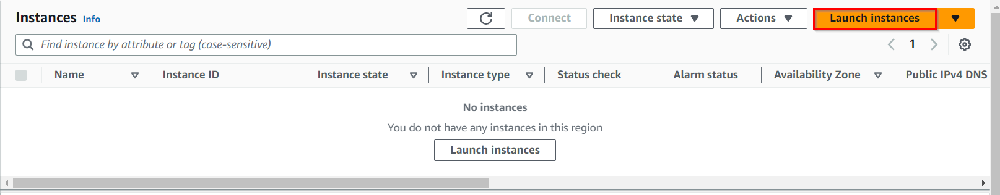

4. 名前として `MySpotInstance` と入力します。

5. **Amazon Machine Image (AMI) の選択**: 検索ボックスで `Amazon Linux 2023 AMI` を検索し、**選択**ボタンをクリックします。

6. **インスタンスタイプの選択**: `t2.micro` を選択します。

   

7. **キーペア**: **キーペアなしで続行**を選択します。

8. **ネットワーク設定**で、**編集**ボタンをクリックします:

   - **パブリック IP の自動割り当て**: **有効化**を選択
   - **セキュリティグループを作成する**を選択
   - **セキュリティグループ名**: `MyEC2Server_SG` と入力
   - **説明**: `Security Group to allow traffic to EC2` と入力
   - **SSH を追加**:
     - **タイプ**: **SSH** を選択
     - **ソース**: **任意の場所** を選択
   - **HTTP を追加**: **セキュリティグループルールを追加**ボタンをクリック
     - **タイプ**: **HTTP** を選択
     - **ソース**: **任意の場所** を選択

   

9. **高度な詳細**で:

   - **購入オプション**: **スポットインスタンス**オプションにチェックを入れます
   - **スポットインスタンスオプションのカスタマイズ**をクリックします

   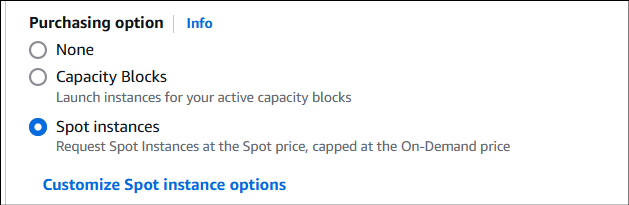

   - **最大価格**: **最大価格を設定する(インスタンスあたり/時間)**を選択
   - 価格として `$0.003` を設定します
   - **リクエストタイプ**: **1 回限り**を選択
   - **有効期間終了**: **リクエストの有効期限なし**を選択

   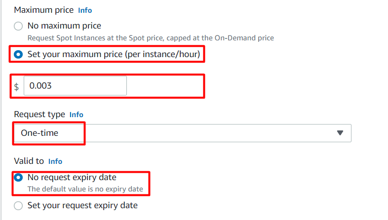

   > **リクエストタイプについて**:
   >
   > - **1 回限り(One-time)**: スポットインスタンスが中断された場合、自動的に再リクエストされません。このラボでは 1 回限りを選択します。
   > - **永続的(Persistent)**: 中断されたスポットインスタンスを自動的に再度リクエストします。リクエストタイプを指定していない場合、EC2 は起動テンプレートが指定したタイプを使用します。起動テンプレートでリクエストタイプを指定していない場合、EC2 はデフォルトでは 1 回限りリクエストを行います。永続リクエストは、中断動作を休止または停止に設定している場合にのみサポートされます。
   >
   > **永続的なリクエストの動作**:  
   > 永続的なスポットインスタンスリクエストは、期限切れまたはキャンセルするまでアクティブなままです。キャパシティが利用できない場合、スポットインスタンスは中断されます。インスタンスが中断された後、キャパシティが再び利用可能になると、スポットインスタンスは停止されている場合は起動され、休止状態の場合は再開されます。

10. **ユーザーデータ**セクションに、以下のスクリプトを入力します(Apache で提供される HTML ページを作成します):

```bash
#!/bin/bash
sudo su
yum update -y
yum install httpd -y
echo "<html><h1> Welcome to Whizlabs Server</h1><html>" >> /var/www/html/index.html
systemctl start httpd
systemctl enable httpd
```

11. その他はデフォルトのままにして、**インスタンスを起動**ボタンをクリックします。

12. **最大価格がアベイラビリティゾーンと現在の価格テーブルに表示されている現在の価格よりも低いというエラーメッセージが表示された場合は、「インスタンス設定を編集」をクリックして最大価格を `$0.01` に設定し、「インスタンスを起動」をクリックします。**

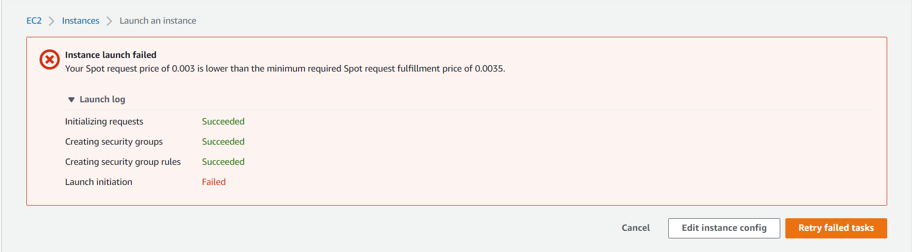

13. インスタンスが起動するまで待ちます。左メニューから**インスタンス**ページに移動し、EC2 インスタンスのステータスが「`running`」に変わり、ヘルスチェックステータスが「`2/2 checks passed`」に変わるまで待ちます。

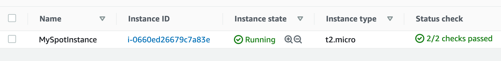

14. HTML ページが公開されているかテストするには、EC2 インスタンスの**パブリック IPv4 アドレス**をコピーし、ブラウザで実行します。URL プロトコルが `https` ではなく `http` であることを確認してください。


---

## タスク 3: スポットリクエストの表示

1. 左サイドバーの**スポットリクエスト**をクリックすると、スポットリクエストが表示されます。

   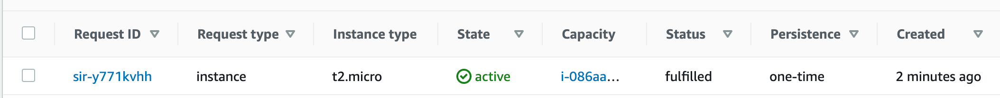

2. **リクエスト ID**をクリックして、スポットリクエストの詳細を確認します。

   - **最大価格**: スポットインスタンスに対して 1 時間あたりに支払う意思のある最大価格。スポットインスタンスは変動価格で利用可能で、現在の価格が指定した最大価格を下回っている限り、リクエストは満たされます。

   - **インスタンス ID**: リクエストしている特定のインスタンスの一意の識別子。特定のインスタンスタイプまたは構成を希望する場合に指定できます。

   - **中断**: スポット価格が指定した最大価格を上回った場合、または Amazon EC2 がオンデマンドインスタンスのためにキャパシティを取り戻す必要がある場合に中断が発生します。中断が発生すると、スポットインスタンスは終了し、発生前に通知を受け取ります。

   - **アベイラビリティゾーン**: スポットインスタンスの現在の価格はアベイラビリティゾーンによって異なります。他のアベイラビリティゾーンでは同じインスタンスをより低い価格で取得できる可能性があります。

   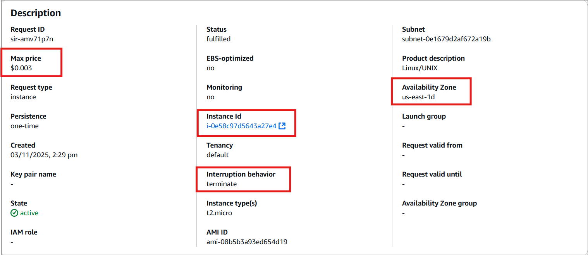

---

## タスク 4: スポットの削減の概要

このタスクでは、EC2 スポットインスタンスを使用する際に利用可能なさまざまなコスト削減オプションを確認します。

1. 左サイドバーの**スポットリクエスト**をクリックすると、スポットリクエストが表示されます。

2. **スポットの削減の概要**と**価格履歴**という 2 つのオプションを確認してみましょう。

3. スポットリクエストの下に**スポットの削減の概要**が表示されます。オンデマンドインスタンスと比較して、合計 **75%** 節約できます。詳細も表示されています。

   > **注意**: スポット価格は動的であり、時間の経過とともに大きく変動する可能性があることに注意してください。したがって、節約率は市場状況とスポットインスタンスの利用状況に基づいて変動し続ける可能性があります。

   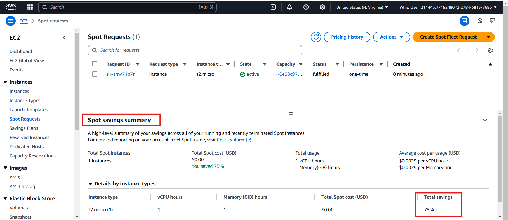

4. 右上の**価格設定履歴**をクリックします。

5. ここに価格履歴が表示されますが、別のインスタンスサイズの履歴が表示されています。オプションを変更しましょう:

   - **グラフ**: アベイラビリティゾーン
   - **インスタンスタイプ**: `t2.micro` と入力
   - **プラットフォーム**: `Linux/UNIX`
   - **日付範囲**: `3か月` を選択

   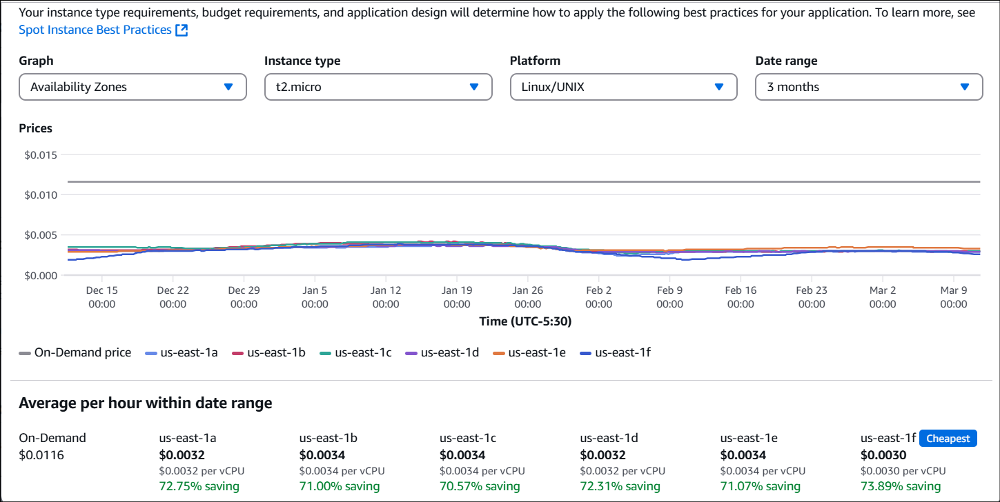

> **ご存知ですか?**  
> Amazon は「AWS Spot Instance Draining」という新機能を発表しました。これは、スポットインスタンスで実行されているステートフルワークロードを管理するのに役立ちます。この機能により、顧客は突然終了されるのではなく、ワークロードを徐々に終了するようにインスタンスを構成でき、アプリケーションが重要なタスクを完了し、中断を最小限に抑える時間を与えます。これは、ローカルインスタンスストレージにデータを保存したり、その他のステートフル操作を実行したりするアプリケーションに特に役立ちます。

---

## タスク 6: AWS リソースの削除

### EC2 スポットインスタンスの終了

1. 左サイドバーの**スポットリクエスト**をクリックし、現在のリクエストを選択します。

   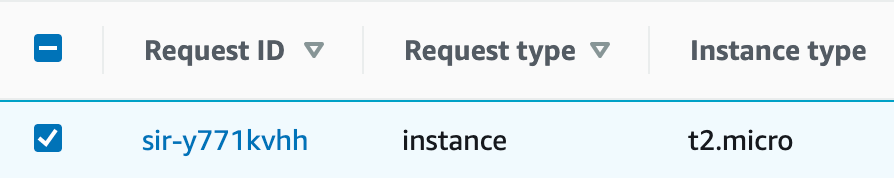

2. 右上に**アクション**が表示されるので、**リクエストをキャンセル**をクリックします。

   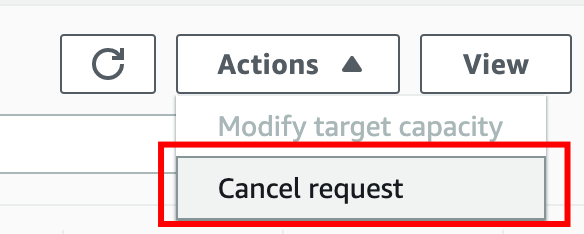

3. ポップアップが表示されます。スポットリクエスト ID を確認し、**インスタンスを終了**オプションにチェックを入れ、**確認**ボタンをクリックします。

   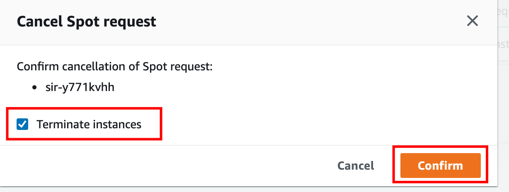

4. リクエストの状態が `Closed`、ステータスが `instance-terminated-by-user` と表示されます。これでクリーンアップが完了したことを意味します。

   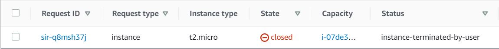

5. 左サイドバーの**インスタンス**をクリックして、インスタンスの終了状態を再確認できます。**インスタンスの状態**が `Terminated` と表示されます。

   

> **注意**: インスタンスステータスが `terminated` に更新されるまでに最大 5 分かかる場合があります。

---

## 完了と結論

1. Amazon EC2 スポットインスタンスの作成と起動に成功しました。

2. Web ページの作成と公開に成功しました。

---
