# Amazon Bedrock を使った長文ドキュメント要約アプリケーション構築手順

## 概要

このプロジェクトでは、Amazon Bedrock を活用して長い PDF ドキュメントを要約するアプリケーションを構築します。チャンク化手法を使用して大規模な文書を処理し、ECS (Elastic Container Service) と Docker を使ってデプロイします。

---

## タスク 1: AWS マネジメントコンソールにサインインする

1. **[コンソールを開く]** ボタンをクリックすると、新しいブラウザタブで AWS コンソールにリダイレクトされます。

2. AWS のサインインページで、以下の情報を入力します:

   - **アカウント ID**: デフォルトのままにしてください。AWS コンソールに表示される 12 桁のアカウント ID は編集または削除しないでください。
   - **ユーザー名**: プロジェクトコンソールのユーザー名を AWS コンソールの IAM ユーザー名にコピーします。
   - **パスワード**: プロジェクトコンソールのパスワードを AWS コンソールのパスワードにコピーします。
   - **[サインイン]** ボタンをクリックします。

3. AWS マネジメントコンソールにサインインしたら、デフォルトの AWS リージョンを **米国東部 (バージニア北部) us-east-1** に設定します。

---

## タスク 2: Bedrock モデルへのアクセスを確認する

1. **(バージニア州北部) us-east-1** リージョンにいることを確認します。

2. 上部の [サービス] メニューをクリックして Bedrock に移動し、[Bedrock] をクリックします。

3. Bedrock ページの左側のメニューから「モデルアクセス」を選択します。

   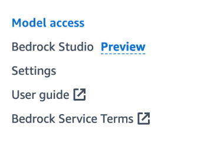

4. Amazon モデルまでスクロールダウンし、モデルアクセスが許可されていることを確認します。

   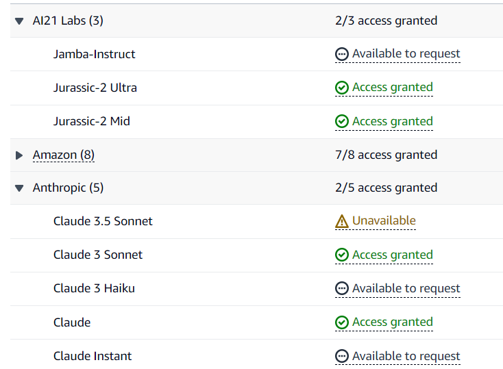

---

## タスク 3: ロードバランサーと ECS のセキュリティグループを作成する

1. **N.Virginia (us-east-1)** リージョンにいることを確認します。

2. 「コンピューティング」セクションの「サービス」メニューをクリックして、**EC2** に移動します。

3. 左側のパネル メニューで、[ネットワークとセキュリティ] セクションの**セキュリティ グループ**を選択します。

   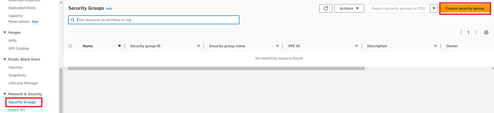

4. **「セキュリティ グループの作成」**ボタンをクリックします。

5. ロードバランサーのセキュリティ グループを作成します:

   - **セキュリティグループ名**: `LB-SG`
   - **説明**: `ロードバランサーのセキュリティグループ`
   - **VPC**: デフォルト VPC を選択

   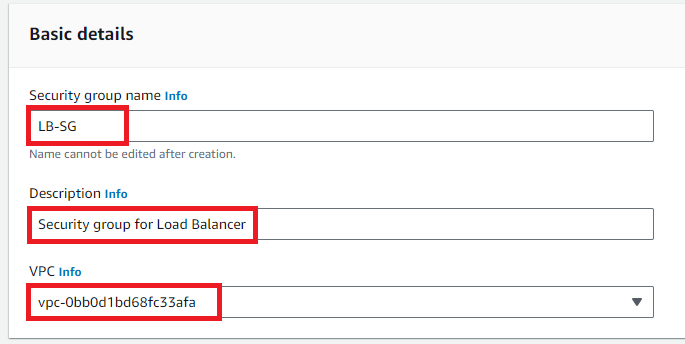

6. [受信規則] の下の [規則の追加] をクリックします:

   - **タイプ**: `HTTP` を選択
   - **出典**: `Anywhere-IPv4` を選択

7. ルールの追加をクリックして HTTPS を追加します:

   - **タイプ**: `HTTPS` を選択
   - **出典**: `Anywhere-IPv4` を選択

8. 「ルールの追加」をクリックして、カスタム TCP **8080** ポートを追加します:

   - **タイプ**: `カスタムTCP` を選択
   - **ポート範囲**: `8080` を入力
   - **出典**: `Anywhere-IPv4` を選択

   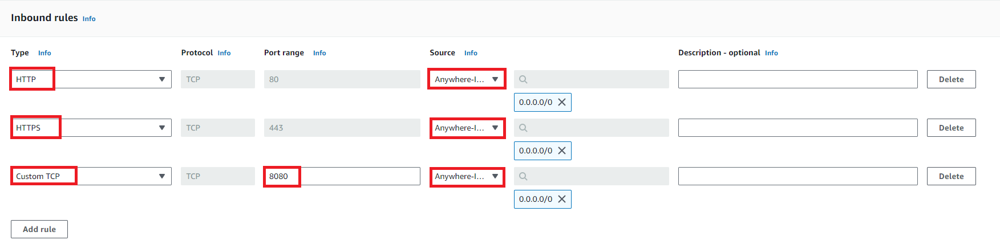

9. **「セキュリティ グループの作成」**ボタンをクリックすると、ロード バランサー セキュリティ グループが正常に作成されます。

10. もう一度、**「セキュリティ グループの作成」**ボタンをクリックして、ECS クラスターのセキュリティ グループを作成します。

11. ECS クラスター用のセキュリティグループを作成します:

    - **セキュリティグループ名**: `ECS-SG`
    - **説明**: `ECS クラスターのセキュリティ グループ`
    - **VPC**: デフォルト VPC を選択

12. [受信規則] の下の [規則の追加] をクリックします:

    - **タイプ**: `すべてのTCP` を選択
    - **ソース**: `カスタム` を選択
    - **テキストボックス**: `LB-SG` を入力

    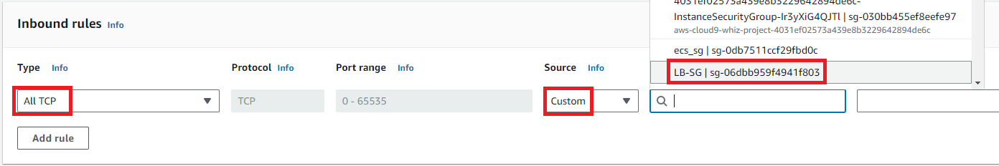

13. **「セキュリティ グループの作成」**ボタンをクリックすると、ECS クラスター セキュリティ グループが正常に作成されます。

    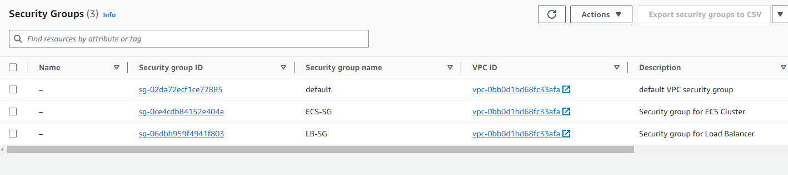

---

## タスク 4: EC2 環境でプロジェクトをセットアップする

1. **N.Virginia (us-east-1)** リージョンにいることを確認します。

2. サービスメニューをクリックして **EC2** に移動します。

3. 左側のパネルの **「インスタンス」** に移動して、事前構成された実行中のインスタンスを 1 つ確認します。

4. インスタンスを選択し、**「接続」**ボタンをクリックします。

   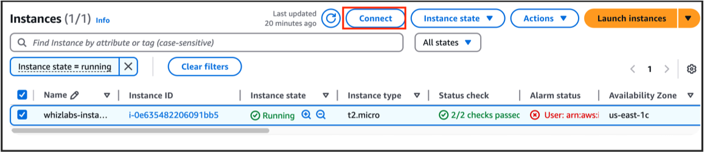

5. **「接続」**ボタンをクリックします。

   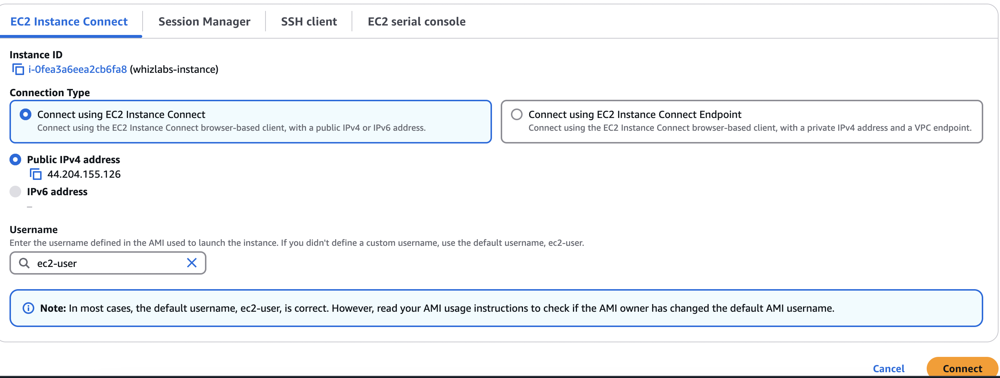

   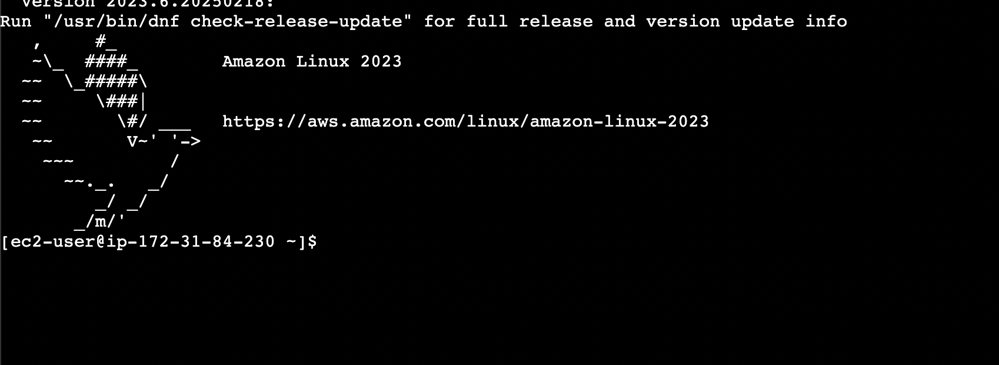

6. 以下のコマンドを実行して環境を設定します:

```bash
sudo yum update -y
sudo yum install -y docker git python3 pip
sudo service docker start
sudo usermod -aG docker ec2-user
newgrp docker
```

7. 次に、以下のコマンドを入力して **whizproject** のディレクトリを作成し、そのディレクトリに移動します:

```bash
mkdir whizproject
cd whizproject
```

8. 次に、**application.py** という新しいファイルを作成します:

```bash
nano application.py
```

9. インポート ステートメントを追加します:

```python
import streamlit as st
import asyncio
import json
import os
from pathlib import Path
from pypdf import PdfReader
from langchain.text_splitter import RecursiveCharacterTextSplitter
import aioboto3
```

10. 以下のコードを貼り付けて、AWS 認証情報とリージョンを構成します:
    - **AWS_ACCESS_KEY_ID** と **AWS_SECRET_ACCESS_KEY** を、whiz コンソールに記載されているものに置き換えます。
    - AWS リージョンを **us-east-1** として入力します。

```python
# Set AWS credentials and region
os.environ["AWS_ACCESS_KEY_ID"] = "AWS_ACCESS_KEY_ID"
os.environ["AWS_SECRET_ACCESS_KEY"] = "AWS_SECRET_ACCESS_KEY"
os.environ["AWS_REGION"] = "us-east-1"
```

11. チャンク化手法を使用して長い文書を要約する機能を追加するには、以下のコードを貼り付けます:

```python
async def get_bedrock_client():
    """
    Asynchronously creates and returns a client for interacting with the Bedrock Runtime service.
    """
    session = aioboto3.Session()
    async with session.client(service_name='bedrock-runtime', region_name=os.getenv("AWS_REGION")) as client:
        return client

async def summarizer(prompt_data: str) -> str:
    """
    Summarizes the provided text using Amazon Bedrock.
    :param prompt_data: The text chunk or combined summaries to be summarized.
    :return: The generated summary.
    """
    prompt = {
        "anthropic_version": "bedrock-2023-05-31",
        "max_tokens": 1000,
        "temperature": 0.5,
        "messages": [
            {
                "role": "user",
                "content": [
                    {
                        "type": "text",
                        "text": prompt_data
                    }
                ]
            }
        ]
    }
    json_prompt = json.dumps(prompt)
    try:
        async with await get_bedrock_client() as client:
            response = await client.invoke_model(
                body=json_prompt,
                modelId="anthropic.claude-3-sonnet-20240229-v1:0",  # Updated model ID
                accept="application/json",
                contentType="application/json"
            )
            response_body = await response['body'].read()
            response_json = json.loads(response_body)
            return response_json['content'][0]['text']
    except Exception as e:
        return f"An error occurred: {e}"

async def chunk_and_summarize(uploaded_file: str) -> str:
    """
    Processes the PDF, chunks it, and returns a final summary.
    :param uploaded_file: Path to the uploaded PDF file.
    :return: Final summary of the PDF document.
    """
    # Extract text from PDF
    reader = PdfReader(uploaded_file)
    text = ""
    for page in reader.pages:
        text += page.extract_text() + "\n"

    # Chunk the text
    text_splitter = RecursiveCharacterTextSplitter(
        chunk_size=1000,
        chunk_overlap=100,
        length_function=len,
        add_start_index=True
    )
    texts = text_splitter.create_documents([text])

    # Summarize each chunk
    summary = ""
    for chunk in texts:
        chunk_content = chunk.page_content
        prompt = f"\n\nHuman: Provide a detailed summary for the chunk of text provided to you:\nText: {chunk_content}\n\nAssistant:"
        chunk_summary = await summarizer(prompt)
        summary += chunk_summary

    # Final summary of all chunks
    final_summary_prompt = f"\n\nHuman: You will be given a set of summaries from a document. Create a cohesive summary from the provided individual summaries. The summary should be very detailed.\nSummaries: {summary}\n\nAssistant:"
    final_summary = await summarizer(final_summary_prompt)

    return final_summary
```

12. Streamlit アプリケーションとフロントエンドに次のコードを貼り付けます:

```python
st.title("Long Document Summarization with Amazon Bedrock")

with st.container():
    st.header('Single File Upload')
    uploaded_file = st.file_uploader('Upload a file', type=["pdf"], key="new")

    if uploaded_file is not None:
        save_path = Path.cwd() / uploaded_file.name  # Save in the current directory

        with open(save_path, mode='wb') as w:
            w.write(uploaded_file.getvalue())

        if save_path.exists():
            st.success(f'File {uploaded_file.name} is successfully saved!')

            # Start the summarization process
            try:
                final_summary = asyncio.run(chunk_and_summarize(save_path))
                st.write(final_summary)
            except Exception as e:
                st.error(f"An error occurred while summarizing the document: {e}")

            # Optionally, delete the saved file after processing
            os.remove(save_path)
```

13. **CTRL+S キー**と **CTRL+X** キーを押してファイルを保存します。

14. 同様に、**requirements.txt** として新しいファイルを作成します:

```bash
nano requirements.txt
```

15. 依存関係としてインストールする必要があるすべてのライブラリを含む次のコードを貼り付けます:

```
streamlit
asyncio
pypdf
langchain
aioboto3
botocore
anthropic
```

16. **CTRL+S キー**と **CTRL+X** キーを押してファイルを保存します。

17. **Dockerfile** として新しいファイルを作成します:

```bash
nano Dockerfile
```

18. 次の Dockerfile スクリプトを貼り付けて、アプリケーション全体を 1 つのパッケージにコンテナ化します:

```dockerfile
## Use the official Streamlit image as a base

FROM python:3.11

WORKDIR /app

COPY . .

RUN pip3 install -r requirements.txt

# Expose the port the app runs on

EXPOSE 8080

# Run the specified command to start the Streamlit application

CMD ["streamlit", "run", "application.py", "--server.port", "8080", "--server.enableXsrfProtection=false"]
```

19. **CTRL+S キー**と **CTRL+X** キーを押してファイルを保存します。

---

## タスク 5: ECR リポジトリを作成する

1. **N.Virginia (us-east-1)** リージョンにいることを確認します。

2. 「サービス」メニューをクリックして **ECR** に移動します。

3. **リポジトリ**を選択し、**「リポジトリの作成」**ボタンをクリックします。

   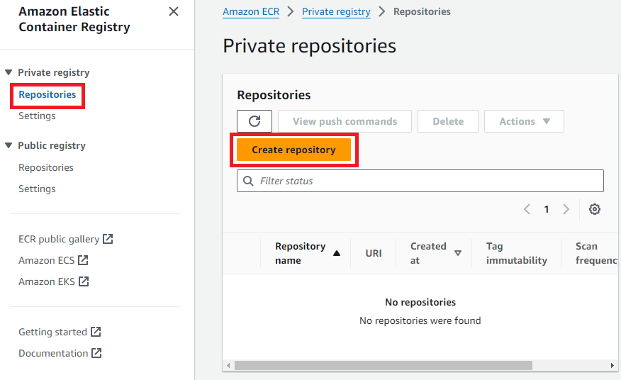

4. **リポジトリ名**を **whizrepo** と入力します。

5. すべてをデフォルトのままにして、**「リポジトリの作成」**ボタンをクリックします。

6. 将来使用するために、リポジトリ URI をメモ帳にコピーします。

   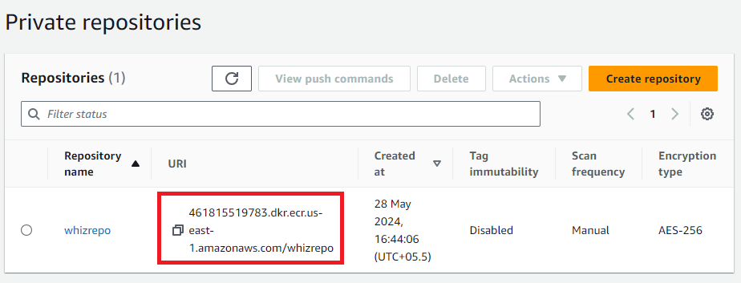

---

## タスク 6: Docker イメージを作成して ECR にプッシュする

1. **北バージニア（us-east-1）**リージョンにいることを確認してください。

2. サービスメニューをクリックして **EC2** に移動します。

3. 前のタスクで作成した **whizProject 環境**の開いている SSH ターミナルに移動します。

4. 次のコマンドを実行して、docker イメージを作成します:

   - このコマンドを実行して Docker のバージョンを確認します:

   ```bash
   docker --version
   ```

   - ディレクトリを whizproject に変更します:

   ```bash
   cd whizproject
   ```

   - 次のコマンドを実行して、Dockerfile を使用して Docker イメージをビルドします:

   ```bash
   docker build -t whizimg .
   ```

   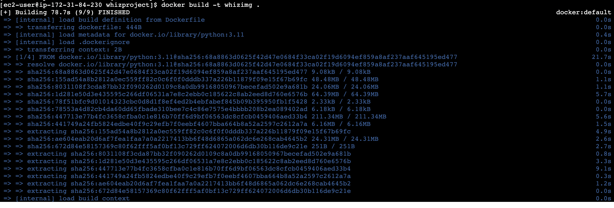

5. Bash ターミナルで次のコマンドを実行して、イメージを ECR リポジトリにプッシュします:

   - 次のコマンドを使用して新しいプロファイルを構成します:

   ```bash
   aws configure --profile someprofile
   ```

   - **アクセスキー**には**ログイン詳細から入力します**
   - **シークレットアクセスキー**には**ログイン詳細から入力してください**
   - **リージョン**が **us-east-1** に入る
   - **デフォルトの出力形式**: **Enter キーを押します**

   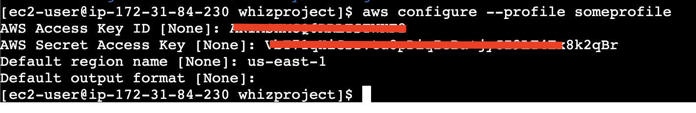

   - リポジトリでイメージにタグを付けます:

   ```bash
   docker tag whizimg:latest <repositoryUri>:latest
   ```

   例: `docker tag whizimg:latest 461815519783.dkr.ecr.us-east-1.amazonaws.com/whizrepo:latest`

   > **注意**: 最後に `/latest` を忘れずに付けてください。

   - 認証するには、AWS ECR get-login-password コマンドを実行します:

   ```bash
   aws ecr get-login-password --region us-east-1 --profile someprofile | docker login --username AWS --password-stdin <repositoryUri>
   ```

   例: `aws ecr get-login-password --region us-east-1 --profile someprofile | docker login --username AWS --password-stdin 461815519783.dkr.ecr.us-east-1.amazonaws.com`

   > **注**: 末尾の `/whizrepo` を削除します。

   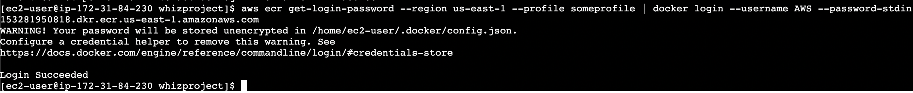

   - whizimg というイメージを ECR リポジトリにプッシュします:

   ```bash
   docker push <repositoryUri>:latest
   ```

   例: `docker push 461815519783.dkr.ecr.us-east-1.amazonaws.com/whizrepo:latest`

   > **注意**: 最後に `/latest` を忘れずに付けてください。

   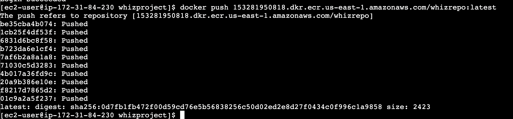

6. ECR に戻り **whizrepo** を開きます。

7. イメージが ECR にプッシュされます。

8. 将来使用するために、画像の URI をメモ帳にコピーします。

   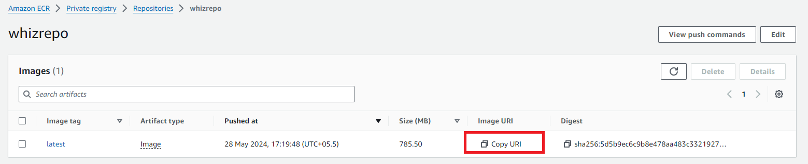

---

## タスク 7: ECS クラスターとタスク定義を作成する

1. **北バージニア**州地域にいることを確認します。

2. 上部の [サービス] メニューをクリックして **Elastic Container Service** に移動し、[コンテナー] セクションで [Elastic Container Service] をクリックします。

3. 左側のサイドバーで、Amazon ECS セクションの下にある**「クラスター」**オプションをクリックします。

4. **「クラスターの作成」**ボタンをクリックします。

   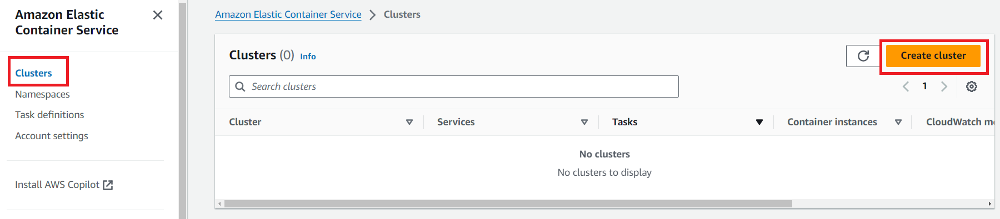

5. ステップ 1: クラスター構成の場合:

6. **クラスター名**: `whiz` と入力

7. ステップ 2: インフラストラクチャ:

8. **AWS Fargate（サーバーレス）**を選択する

   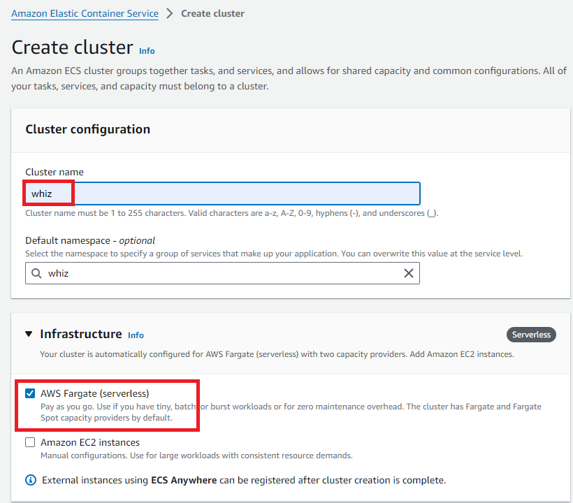

9. **「作成」**ボタンをクリック

   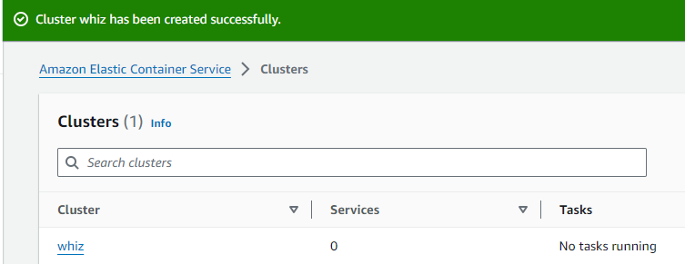

10. 左側のサイドバーで、Amazon ECS セクションの下にある**[タスク定義]** オプションをクリックします。

11. **「新しいタスク定義の作成」**ボタンをクリックします。

    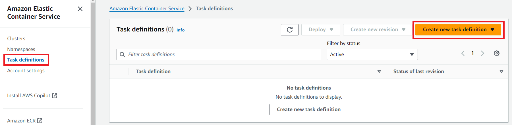

12. ステップ 1：タスク定義ファミリ名を入力します：**appstream**

    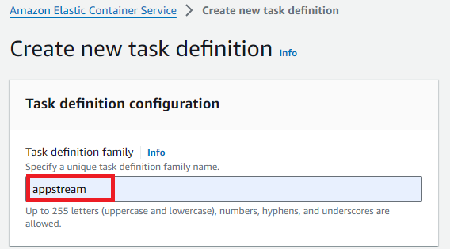

13. ステップ 2：インフラストラクチャ要件

14. **起動タイプ**: `AWS Fargate`

15. **オペレーティングシステム**: `Linux/X86_64`

16. タスクサイズセクションで:

17. **合計 CPU**: `1 vCPU` を入力

18. **合計メモリ**: `3 GB` を入力

19. **タスクロール**: `ContainerInstanceIAMRole` (デフォルトで存在するもの)

20. **タスク実行 IAM ロール**: `ContainerInstanceIAMRole` (デフォルトで存在するもの)

    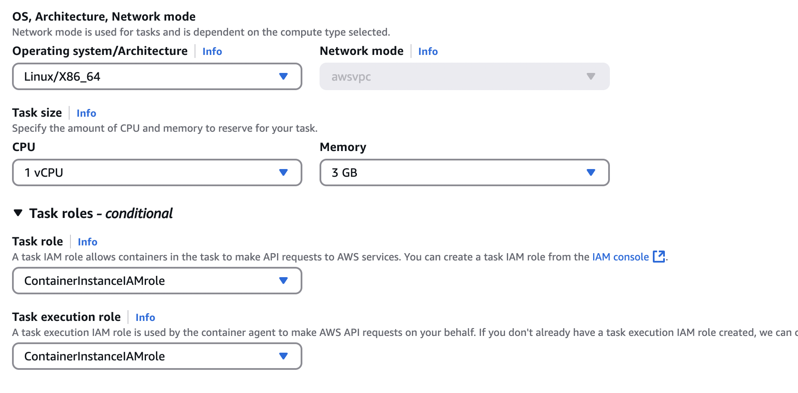

21. コンテナの詳細セクションで:

22. **コンテナ名**: `whizimg` を入力

23. **イメージ**: `<Replace-with-image-URI->` (画像 URI に置き換える)

24. ポートマッピングフィールドに、次の情報を入力します:

25. **コンテナポート**: `8080` を入力

26. **プロトコル**: `TCP` を選択

    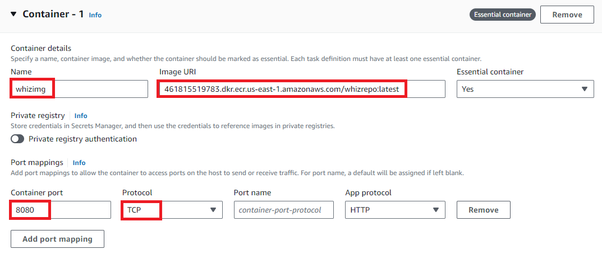

27. コンテナの詳細がコンテナ定義に追加されました。

28. ログ収集の下で: **チェックを外す** (use log collection のチェックを外す)

    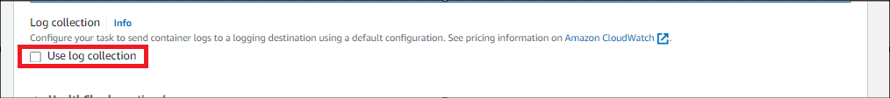

29. 他のオプションはデフォルトのままにして、**作成**ボタンをクリックします。

30. タスク定義 appstream が作成されました。

    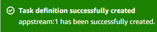

---

## タスク 8: ECS サービスを作成してロードバランサーをプロビジョニングする

1. 左側のサイドバーで、Amazon ECS セクションの下にある**クラスター**オプションをクリックします。

2. **whiz** ECS クラスターがここに表示されます。**whiz** をクリックします。

   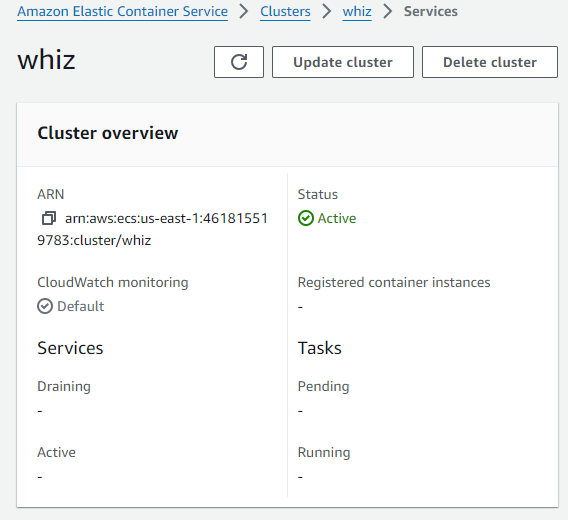

3. サービスを作成するには、**作成**ボタンをクリックします。

   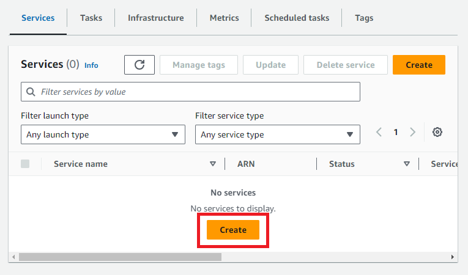

4. ステップ 1: 環境

5. **既存のクラスター**: デフォルト `whiz`

6. **コンピューティング構成**: 起動タイプとして `FARGATE` を選択

7. デプロイ構成のアプリケーションタイプで **Service** を選択

8. **タスク定義ファミリ**: `appstream` を選択し、リビジョンで `(1) LATEST` を選択

9. **サービス名**: `whiz-service` を入力

10. **サービスタイプ**: `REPLICA`

11. **必要なタスク (タスクの数)**: `2` を入力

    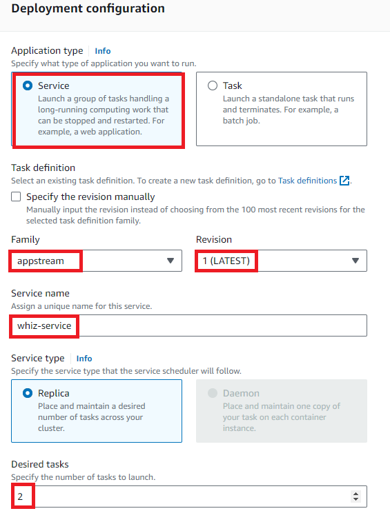

12. デプロイオプションセクションで:

13. **デプロイタイプ**: `Rolling update` を選択

14. **最小実行タスクパーセント**: `100` を入力

15. **最大実行タスクパーセント**: `200` を入力

16. ネットワークセクションで:

17. **VPC**: `default`

18. **セキュリティグループ**: `既存のセキュリティグループを使用`

19. **セキュリティグループ名**: `ECS-SG`

20. **パブリック IP**: `オンにする`

    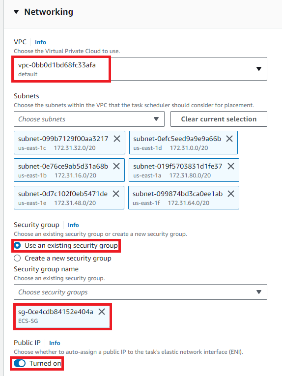

21. ロードバランシングセクションで、「ロードバランシングを使用」を**チェック**します:

22. **ロードバランサータイプ**: `Application Load balancer`

    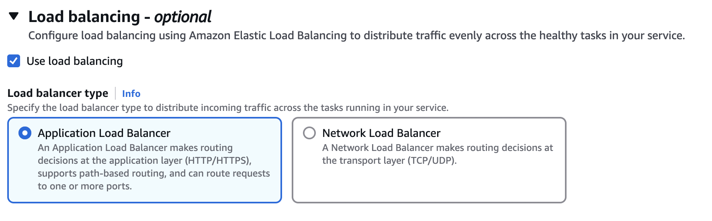

23. **アプリケーションロードバランサー**: 新しいロードバランサーを作成

24. **ロードバランサー名**: `whizbalancer`

25. **リスナー**: `新しいリスナーを作成`

26. **ポート**: `8080`

27. **プロトコル**: `HTTP`

    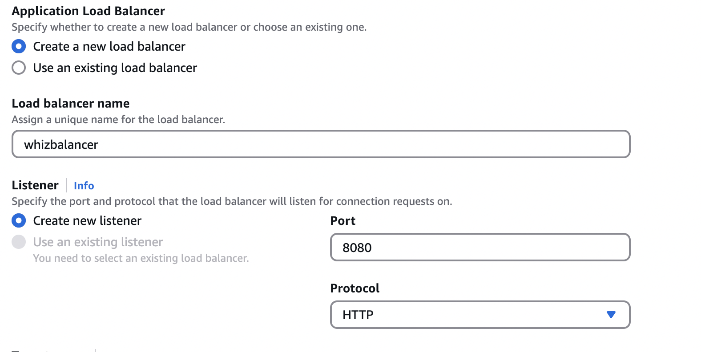

28. **ターゲットグループ**: 新しいターゲットグループを作成

29. **ターゲットグループ名**: `ecs-whiz-target-group`

30. **プロトコル**: `HTTP`

31. **登録解除期間**: `30`

32. **ヘルスチェックプロトコル**: `HTTP`

33. **ヘルスチェックパス**: `/`

    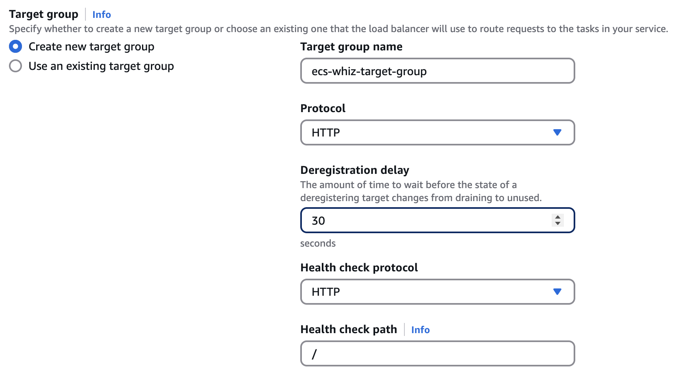

34. サービスが構成されました。右下隅の**作成**ボタンをクリックします。

35. サービスが実行中になります(数分待ちます)

    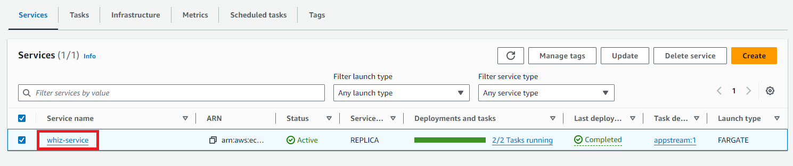

36. サービスが作成されている間に、コンピューティングセクションの **EC2** サービスに移動します。

37. ロードバランシングセクションの左側のメニューから「**ロードバランサー**」を選択します。

38. 先ほど作成した「**whizbalancer**」ロードバランサーを選択します(アクティブ状態になるまで待ちます)。

    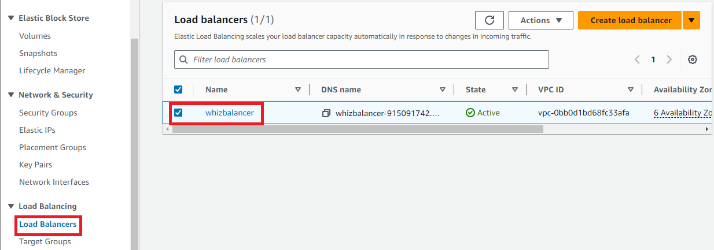

39. **セキュリティ**タブに移動し、セキュリティグループセクションの下にある「**編集**」ボタンをクリックします。

    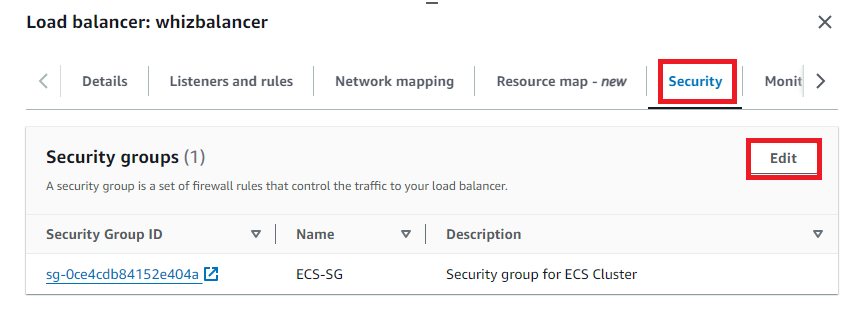

40. セキュリティグループとして「**LB-SG**」を選択し、「**変更を保存**」ボタンをクリックします。

    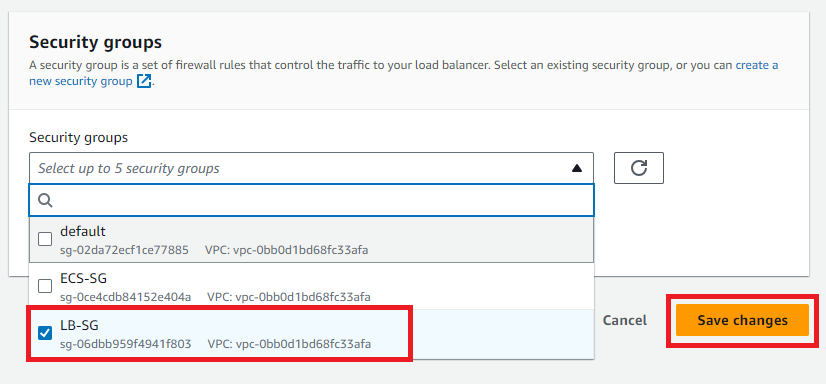

41. 最後に、ロードバランサーの **DNS 名**をメモ帳にコピーして、後で使用できるようにします。

    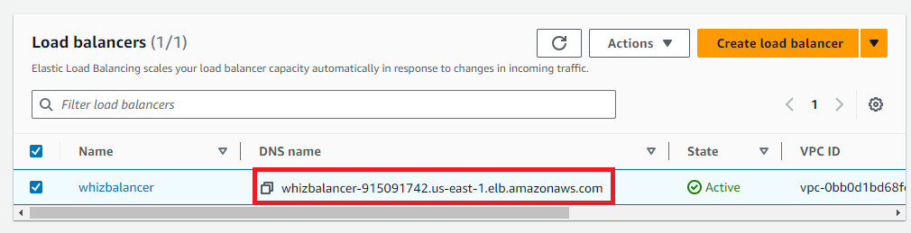

---

## タスク 9: Route 53 DNS を ALB にアタッチする

1. **N.Virginia** リージョンにいることを確認してください。

2. 上部の「サービス」メニューをクリックして **Route 53** に移動し、「ネットワークとコンテンツ配信」セクションで Route 53 をクリックします。

3. 左側のサイドバーで、**ホストゾーン**オプションをクリックします。

4. 作成されたホストゾーン **whiz-user-<random_number>.whizlabs-aws.click** をクリックします。

   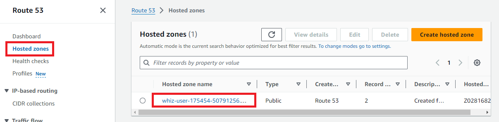

5. **レコードの作成**ボタンをクリックします。

   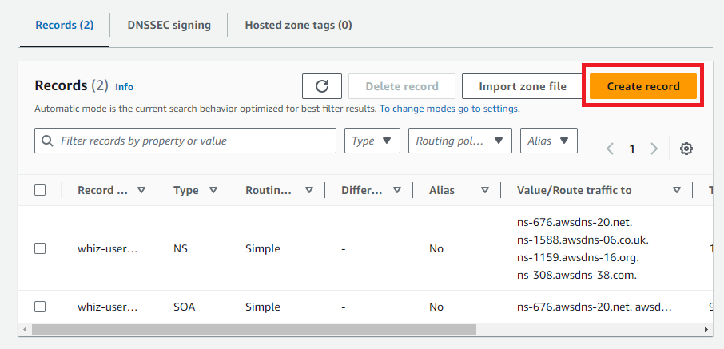

6. 次の詳細を入力します:

7. **レコード名**: `whizapp`

8. **エイリアス**: `有効`

9. **レコードタイプ**: `A`

10. **ロードバランサーを選択**: `利用可能なロードバランサーを選択`

11. **ルーティングポリシーを選択**: `Simple`

    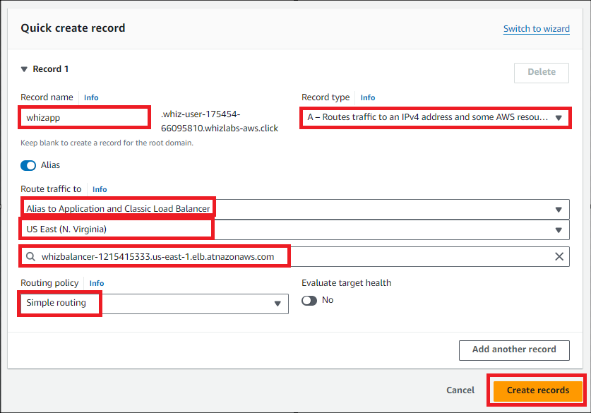

12. **レコードの作成**ボタンをクリックします。

13. 「**whizapp**」で始まるレコード名をコピーして、新しいタブに貼り付けます。また、DNS の最後にポート番号を追加します: **:8080**

14. 例: **<whizapp.whiz-user…. record-name>:8080**

---

## タスク 10: アプリケーションをテストする

1. 以下のような Web ページが表示されます:

   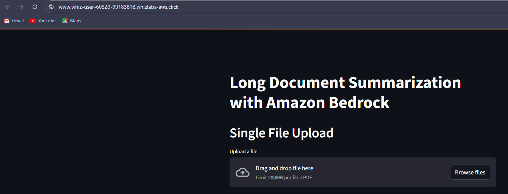

2. テストに使用するために [sample.pdf](https://labresources.whizlabs.com/789cafbbbc62633157075cfbbfd0ac3b/sample.pdf) をダウンロードします。

3. **Browse Files** ボタンをクリックして、ダウンロードしたファイルを選択します。

4. PDF ファイルをチャンクに変換し、各チャンクを Bedrock に渡して要約しているため、実行には時間がかかることがわかります。最後に、最終的な要約が返されます。

   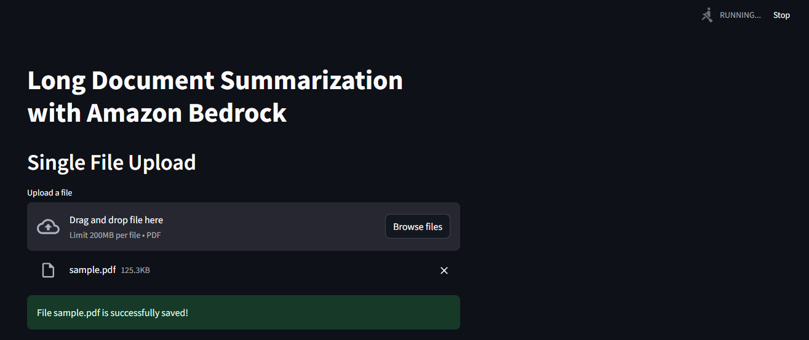

5. Amazon Bedrock を活用することで、長い PDF を要約することができます。

   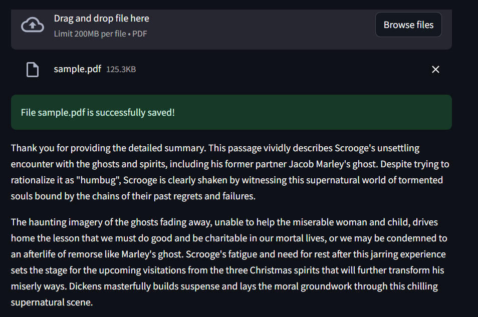

---

## 重要なポイント

AWS Bedrock を使用して大規模ドキュメントのチャンク要約を作成する場合、パフォーマンスを向上させるにはチャンクサイズを最適化することが重要です。チャンクを小さくすることで、各チャンクがモデルの入力制限内に収まり、コンテキストの損失を防ぐことができ、より正確な要約を作成できます。このアプローチにより、Bedrock は大規模なドキュメントであっても、高い要約品質を維持しながら効率的に処理・要約できます。

---

## 完了と結論

1. 2 つのセキュリティ グループが正常に作成されました。
2. EC2 でプロジェクトが正常に設定されました。
3. Docker イメージが正常に作成され、ECR にプッシュされました。
4. ECS でコンテナを正常にテストし、ロードバランサーをプロビジョニングしました。
5. Route 53 DNS が ALB に正常に接続されました。
6. プロジェクトの検証が正常に完了しました。
