# AWS EKS クラスター構築と ALB 設定ガイド

## 概要

このラボでは、AWS CloudShell を使用して Amazon EKS（Elastic Kubernetes Service）クラスターを作成し、AWS Load Balancer Controller（ALB）を設定してサンプルアプリケーションを公開します。

## アーキテクチャ図

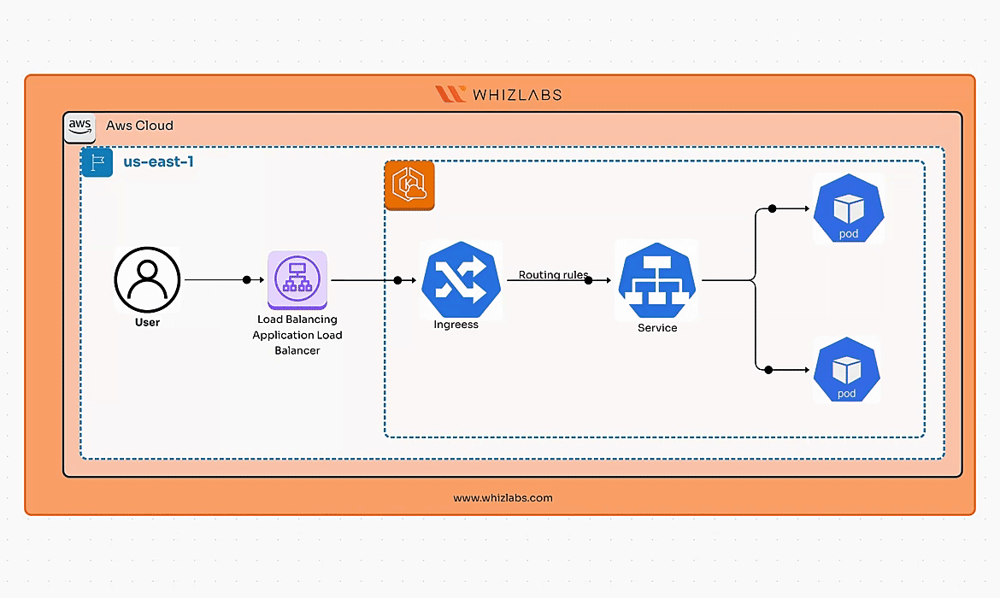

---

## Task 2: CloudShell で環境を作成する

### 1. リージョンの確認

**N.Virginia** リージョンにいることを確認してください。

### 2. CloudShell の起動

AWS 管理コンソールの右上にある **CloudShell** アイコンをクリックします。

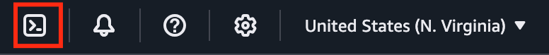

### 3. 環境の準備完了を待つ

ブラウザで新しいタブが開きます。環境の作成が完了するまで数秒待ちます。環境が作成されると、ターミナルを使用する準備が整います。

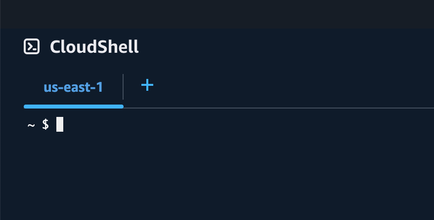

---

## Task 3: AWS CLI、eksctl、kubectl のインストール

### 1. AWS CLI のインストール

yum を使用して AWS CLI をインストールするには、シェルで以下のコマンドを実行します。

```bash
sudo yum install awscli -y
```

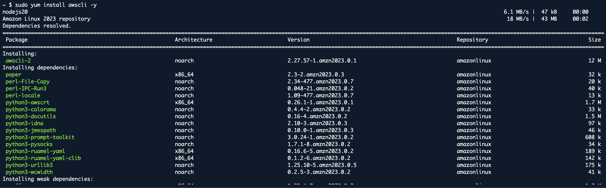

### 2. AWS CLI のバージョン確認

インストールを確認するためにバージョンをチェックします。

```bash
aws --version
```

### 3. eksctl のインストール

eksctl をインストールするには、以下の 2 つのコマンドをシェルにコピー&ペーストします。

```bash
curl --silent --location "https://github.com/weaveworks/eksctl/releases/latest/download/eksctl_$(uname -s)_amd64.tar.gz" | tar xz -C /tmp
```

```bash
sudo mv /tmp/eksctl /usr/local/bin
```

### 4. eksctl のバージョン確認

インストールを確認するために eksctl のバージョンをチェックします。

```bash
eksctl version
```


### 5. kubectl のダウンロード

CloudShell で環境が準備できたら、Amazon S3 からクラスターの Kubernetes バージョンに対応した Amazon EKS 提供の kubectl バイナリをダウンロードします。

```bash
curl -o kubectl https://amazon-eks.s3-us-west-2.amazonaws.com/1.18.9/2020-11-02/bin/linux/amd64/kubectl
```

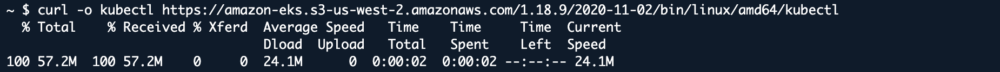

### 6. 実行権限の付与

バイナリに実行権限を付与します。

```bash
chmod +x ./kubectl
```

### 7. kubectl を PATH にコピー

バイナリを PATH 内のフォルダにコピーします。既に kubectl のバージョンをインストールしている場合は、$HOME/bin/kubectlを作成し、$HOME/bin が$PATH の最初に来るようにすることをお勧めします。

```bash
mkdir -p $HOME/bin && cp ./kubectl $HOME/bin/kubectl && export PATH=$PATH:$HOME/bin
```

### 8. kubectl のバージョン確認

kubectl をインストールした後、以下のコマンドでバージョンを確認できます。

```bash
kubectl version --short --client
```


---

## Task 4: EKS クラスターの作成

### 1. EKS クラスターの作成

EKS クラスターを作成するには、eksctl を使用して以下のコマンドを実行します。

```bash
eksctl create cluster --version=1.32 --name=eksspottutorial --nodes=2 --managed --region=us-east-1 --zones us-east-1a,us-east-1b,us-east-1c --node-type t2.medium --asg-access
```

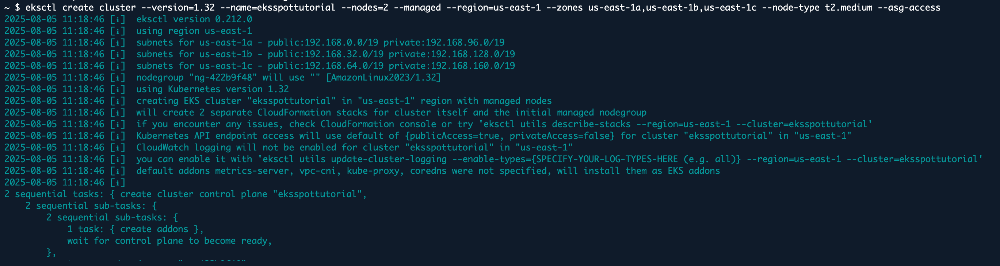

### 2. kubeconfig の更新

```bash
aws eks --region us-east-1 update-kubeconfig --name eksspottutorial
```


### 3. Helm パッケージのインストール

```bash
curl https://raw.githubusercontent.com/helm/helm/master/scripts/get-helm-3 | bash
```

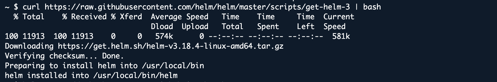

### 4. AWS Load Balancer Controller の Helm リポジトリを追加

```bash
helm repo add eks https://aws.github.io/eks-charts
```

```bash
helm repo update
```

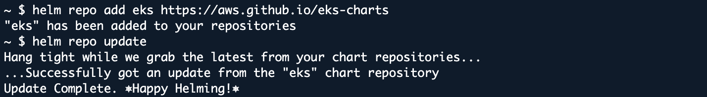

### 5. Ingress コントローラーのインストール

```bash
kubectl apply -f https://raw.githubusercontent.com/kubernetes/ingress-nginx/main/deploy/static/provider/cloud/deploy.yaml
```

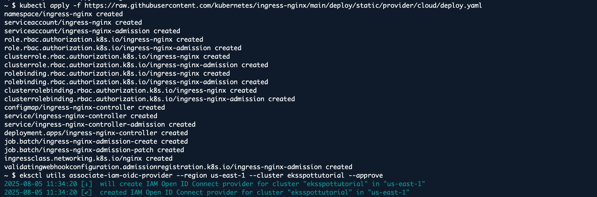

### 6. IAM OIDC プロバイダーのインストール

```bash
eksctl utils associate-iam-oidc-provider --region us-east-1 --cluster eksspottutorial --approve
```

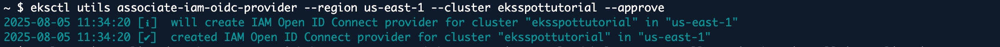

### 7. コントローラー用の IAM ポリシーの作成

```bash
curl -Lo iam-policy.json https://raw.githubusercontent.com/kubernetes-sigs/aws-load-balancer-controller/main/docs/install/iam_policy.json
```

```bash
aws iam create-policy --policy-name ALBIngressControllerIAMPolicy --policy-document file://iam-policy.json
```

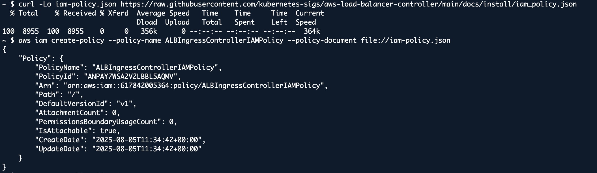

### 8. AWS アカウント ID の確認

以下のコマンドをシェルで実行して、**AWS Account ID**を確認します。

```bash
aws sts get-caller-identity
```

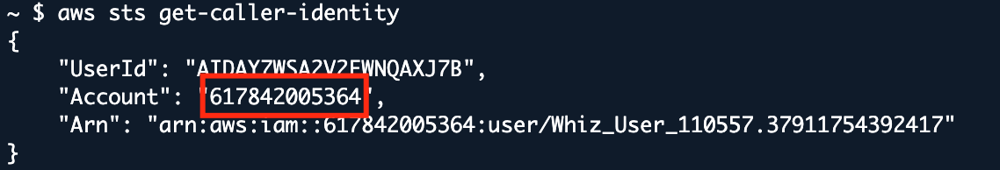

### 9. IAM ポリシーを持つサービスアカウントの作成

上記のステップで取得した`<YOUR_AWS_ACCOUNT_ID>`を置き換えます。

```bash
eksctl create iamserviceaccount \
  --cluster eksspottutorial \
  --namespace kube-system \
  --name aws-load-balancer-controller \
  --attach-policy-arn arn:aws:iam::<YOUR_AWS_ACCOUNT_ID>:policy/ALBIngressControllerIAMPolicy \
  --override-existing-serviceaccounts \
  --approve
```

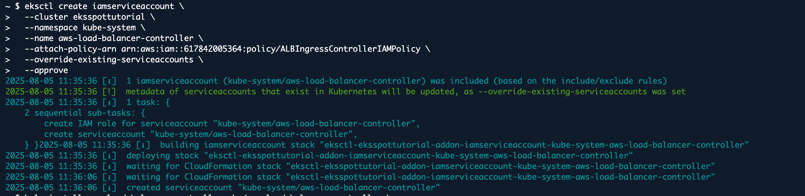

### 10. AWS Load Balancer Controller のインストール

```bash
helm install aws-load-balancer-controller eks/aws-load-balancer-controller \
  --set clusterName=eksspottutorial \
  --set serviceAccount.create=false \
  --set serviceAccount.name=aws-load-balancer-controller \
  --namespace kube-system
```

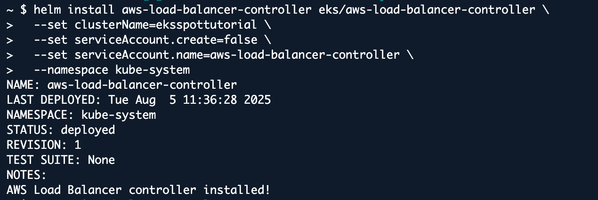

---

## Task 5: サンプルアプリケーションのデプロイ

### 1. Kubernetes デプロイメントの作成

シンプルなアプリケーション用の Kubernetes デプロイメントを作成します。ここでは nginx を例として使用します。

```bash
nano nginx-deployment.yaml
```

### 2. デプロイメント設定ファイルの編集

ファイルに以下の内容を入力した後、**Ctrl+x**を押し、次に**Y**を押してから**Enter**を押してファイルを保存します。

```yaml
apiVersion: apps/v1
kind: Deployment
metadata:
  name: nginx
spec:
  replicas: 2
  selector:
    matchLabels:
      app: nginx
  template:
    metadata:
      labels:
        app: nginx
    spec:
      containers:
        - name: nginx
          image: nginx:latest
          ports:
            - containerPort: 80
```

### 3. nginx デプロイメントの作成

クラスターに nginx デプロイメントを作成します。

```bash
kubectl apply -f nginx-deployment.yaml
```

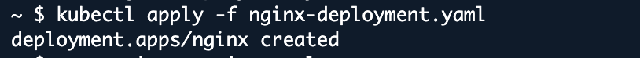

### 4. サービスの作成

アプリケーションを内部的に公開するサービスを作成します。

```bash
nano nginx-service.yaml
```

### 5. サービス設定ファイルの編集

ファイルに以下の内容を入力した後、**Ctrl+x**を押し、次に**Y**を押してから**Enter**を押してファイルを保存します。

```yaml
apiVersion: v1
kind: Service
metadata:
  name: nginx
spec:
  selector:
    app: nginx
  ports:
    - protocol: TCP
      port: 80
      targetPort: 80
  type: ClusterIP
```

### 6. サービスの適用

以下のコマンドを実行します。

```bash
kubectl apply -f nginx-service.yaml
```

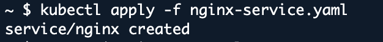

---

## Task 6: ALB 用の Ingress の設定

### 1. Ingress リソースの作成

```bash
nano nginx-ingress.yaml
```

### 2. Ingress 設定ファイルの編集

ファイルに以下の内容を入力した後、**Ctrl+x**を押し、次に**Y**を押してから**Enter**を押してファイルを保存します。

```yaml
apiVersion: networking.k8s.io/v1
kind: Ingress
metadata:
  name: nginx-ingress
  annotations:
    kubernetes.io/ingress.class: alb
    alb.ingress.kubernetes.io/scheme: internet-facing
spec:
  rules:
    - http:
        paths:
          - path: /
            pathType: Prefix
            backend:
              service:
                name: nginx
                port:
                  number: 80
```

### 3. Ingress の適用

以下のコマンドを実行します。

```bash
kubectl apply -f nginx-ingress.yaml
```

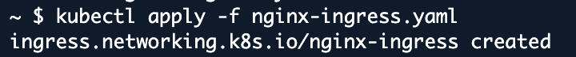

### 4. 外部 IP の確認

サービスの外部 IP を確認します。

```bash
kubectl get svc -n ingress-nginx
```

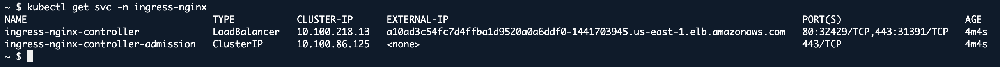

---

## 完了と結論

1. eksctl を使用して Amazon EKS クラスターを正常に作成し、スケーラブルな Kubernetes 環境をセットアップしました。
2. AWS Load Balancer Controller をインストールし、ALB リソースを管理するための IAM ロールを設定しました。
3. EKS 上にサンプルアプリケーションをデプロイし、ClusterIP サービスを使用して公開しました。
4. ALB を使用して Kubernetes Ingress を設定し、アプリケーションへの外部トラフィックをルーティングしました。
5. ALB のセットアップを検証し、デプロイされたアプリケーションへの外部アクセスを確認しました。

---

## ラボの終了

1. AWS アカウントからサインアウトします。
2. ラボを正常に完了しました。
3. 手順を完了したら、Whizlabs ダッシュボードから**End lab**をクリックしてください。
