# Pod Security Admission による Amazon EKS クラスターのセキュリティ保護

## 概要

このラボでは、Pod Security Admission (PSA) を使用して Amazon EKS クラスターのセキュリティを保護する方法を学習します。

**対象者:**

- Cloud Architect
- DevOps

---

## Task 2: CloudShell で環境を作成する

### 1. リージョンの確認

**N.Virginia** リージョンにいることを確認してください。

### 2. CloudShell を開く

AWS メニューバーの右上にある **CloudShell** アイコンをクリックします。


### 3. 環境の準備

ブラウザで新しいタブが開きます。環境の作成が完了するまで数分待ちます。環境が作成されると、ターミナルを使用する準備が整います。

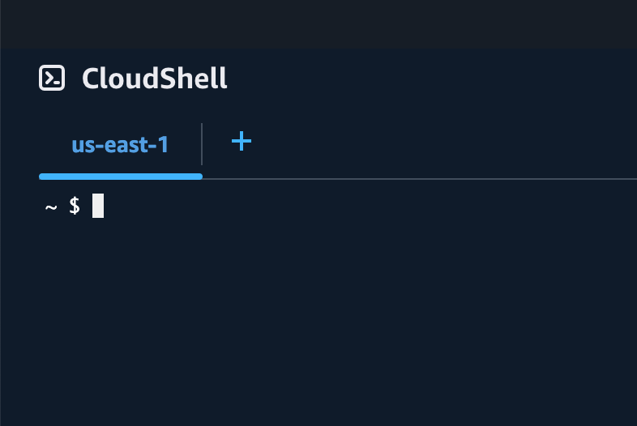

---

## Task 3: AWS CLI、eksctl、kubectl をインストールする

### 1. 環境の準備

環境の準備が完了するまで待ちます。

### 2. AWS CLI のインストール

yum を使用して AWS CLI をインストールするには、シェルで以下のコマンドを実行します:

```bash
sudo dnf install awscli -y
```

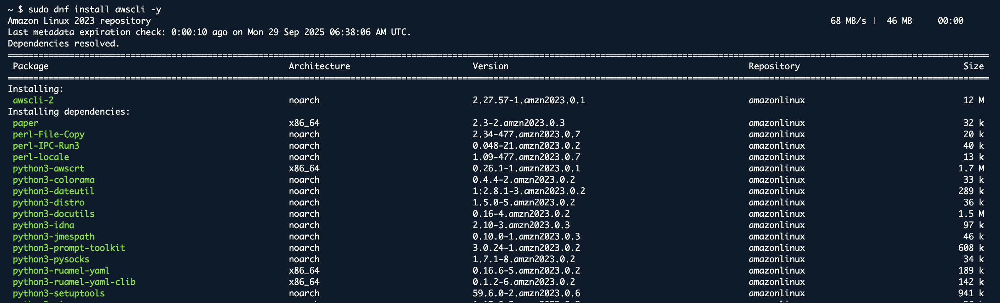

### 3. AWS CLI のバージョン確認

インストールを確認するためにバージョンをチェックします:

```bash
aws --version
```

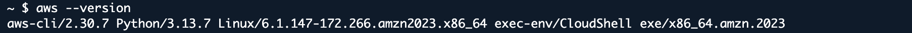

### 4. eksctl のインストール

eksctl をインストールするには、シェルで以下の 2 つのコマンドをコピー&ペーストします:

```bash
curl --silent --location "https://github.com/weaveworks/eksctl/releases/latest/download/eksctl_$(uname -s)_amd64.tar.gz" | tar xz -C /tmp
```

```bash
sudo mv /tmp/eksctl /usr/local/bin
```

### 5. eksctl のバージョン確認

eksctl のバージョンを確認してインストールを確認します:

```bash
eksctl version
```


### 6. kubectl バイナリのダウンロード

CloudShell で環境が準備できたら、Amazon S3 からクラスターの Kubernetes バージョン用の Amazon EKS 提供の kubectl バイナリをダウンロードします。以下のコマンドを実行します:

```bash
curl -LO https://dl.k8s.io/release/v1.31.0/bin/linux/amd64/kubectl
```

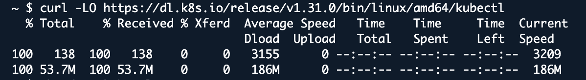

### 7. 実行権限の付与

バイナリに実行権限を適用します:

```bash
chmod +x ./kubectl
```

### 8. kubectl を PATH にコピー

バイナリを PATH 内のフォルダにコピーします。すでに kubectl のバージョンをインストールしている場合は、$HOME/bin/kubectlを作成し、$HOME/bin が$PATH の最初に来るようにすることをお勧めします:

```bash
mkdir -p $HOME/bin && cp ./kubectl $HOME/bin/kubectl && export PATH=$PATH:$HOME/bin
```

### 9. kubectl のバージョン確認

kubectl をインストールした後、以下のコマンドでバージョンを確認できます:

```bash
kubectl version --client
```

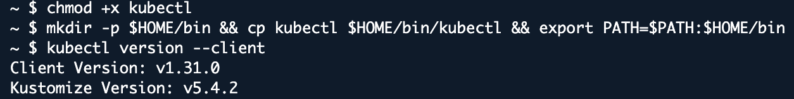

---

## Task 4: EKS クラスターを作成する

### 1. EKS クラスターの作成

EKS クラスターを作成するには、eksctl を使用して以下のコマンドを実行します:

```bash
eksctl create cluster --name=eksspottutorial --version=1.31 --nodes=2 --managed --region=us-east-1 --zones=us-east-1a,us-east-1b,us-east-1c --node-type=t2.medium --asg-access
```


### 2. kubeconfig の更新

```bash
aws eks --region us-east-1 update-kubeconfig --name eksspottutorial
```

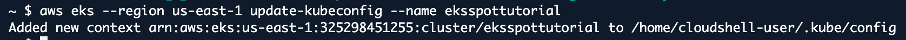

### 3. Pod Security Admission が有効であることを確認

```bash
kubectl api-versions | grep admission
```

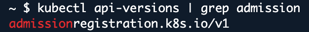

---

## Task 5: Pod Security Admission (PSA) を適用する

### 1. Pod Security Admission レベルで名前空間にラベルを付ける

```bash
kubectl create namespace privileged-namespace
```

```bash
kubectl label namespace privileged-namespace \
  pod-security.kubernetes.io/enforce=privileged \
  pod-security.kubernetes.io/audit=privileged \
  pod-security.kubernetes.io/warn=privileged
```

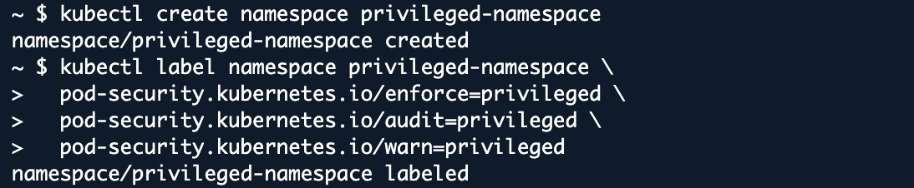

### 2. セキュリティレベルを確認するために Pod をデプロイ

```bash
kubectl run nginx-privileged --image=nginx --namespace=privileged-namespace
```

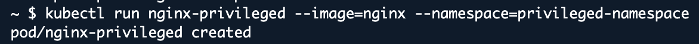

### 3. Pod Security Admission ログの監視と確認

```bash
kubectl get events --namespace=privileged-namespace
```

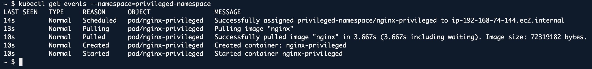

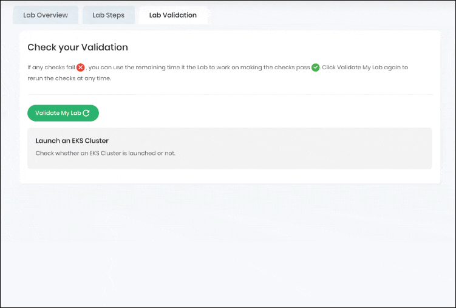

---

## 完了と結論

このラボを通じて、以下を達成しました:

1. Pod Security Admission (PSA) を有効にした Amazon EKS クラスターの作成に成功しました。
2. kubeconfig を更新し、EKS クラスター上の Pod Security Admission セットアップを確認しました。
3. 異なる PSA レベルで名前空間にラベルを付けてセキュリティポリシーを適用しました。
4. privileged 名前空間に Pod をデプロイし、セキュリティイベントを監視しました。
5. ログとイベントを確認して、Pod Security Admission が機能していることを検証しました。

---

## ラボの終了

1. AWS アカウントからサインアウトします。
2. ラボを正常に完了しました。
3. 手順を完了したら、whizlabs ダッシュボードから **End lab** をクリックしてください。
