# Docker コンテナの構築、実行、管理

## アーキテクチャ

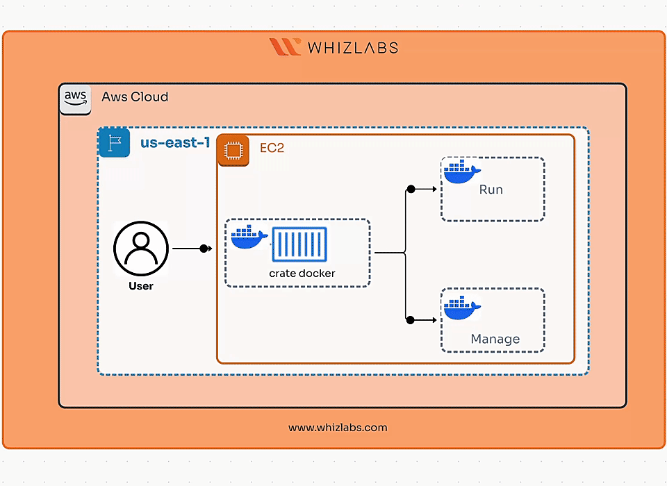

## タスク 2: EC2 インスタンスへの SSH 接続

1. Docker を実行するための EC2 インスタンス(Amazon Linux 2)を起動しています。

2. EC2 の下にある Instances をクリックします:

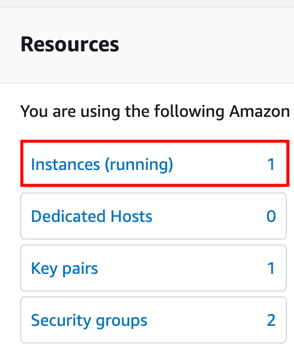

3. インスタンスを選択し、Connect をクリックします:

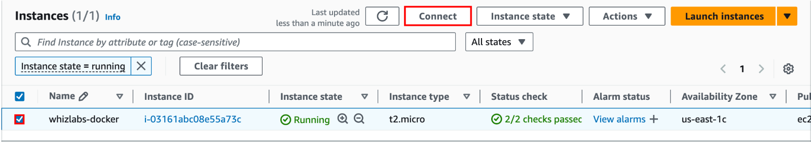

4. Connect をクリックします:

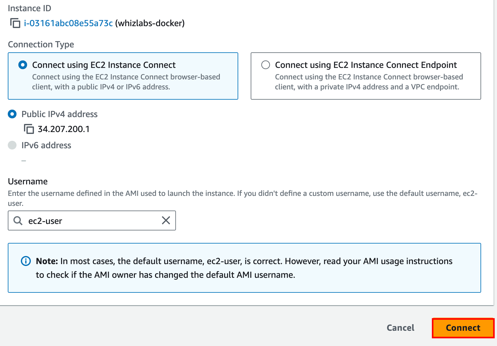

5. **Docker をインストール** - EC2 インスタンスに SSH で接続し、以下のコマンドを実行して Docker をインストールします:

```bash
sudo yum update -y
```

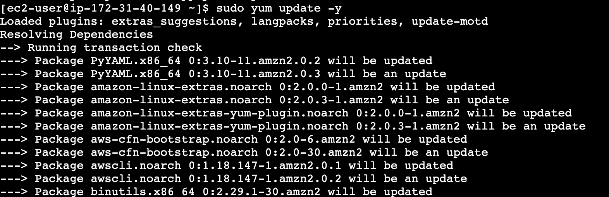

```bash
sudo amazon-linux-extras install docker
```


```bash
sudo systemctl start docker
```

```bash
sudo usermod -aG docker ec2-user
```

```bash
exit
```

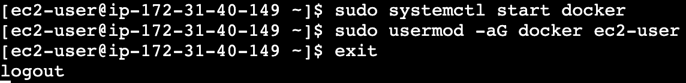

6. **Step-2**を使用してターミナルを再起動します

## タスク 3: プロジェクトディレクトリのセットアップ

1. **プロジェクトディレクトリを作成**し、そのディレクトリに移動します:

```bash
mkdir docker-python-app
```

```bash
cd docker-python-app
```

2. app.py という名前のファイルを作成します:

```bash
nano app.py
```

3. app.py に以下のコードを追加し、Ctrl+X+Y+Enter を押してファイルを保存します:

```python
# app.py
from flask import Flask
app = Flask(__name__)
@app.route('/')
def hello():
    return 'Hello from Dockerized Python App!'
if __name__ == '__main__':
    app.run(host='0.0.0.0', port=80)
```

4. 依存関係を指定する requirements.txt ファイルを作成します:

```bash
nano requirements.txt
```

5. requirements.txt に以下の内容を追加し、Ctrl+X+Y+Enter を押してファイルを保存します:

```
Flask
```

6. Docker イメージの構築方法を定義する Dockerfile を作成します:

```bash
nano Dockerfile
```

7. Dockerfile に以下の内容を追加し、Ctrl+X+Y+Enter を押してファイルを保存します:

```dockerfile
# Use a lightweight Python image
FROM python:3.9-slim

# Set the working directory inside the container
WORKDIR /usr/src/app

# Copy requirements file and install dependencies
COPY requirements.txt ./
RUN pip install --no-cache-dir -r requirements.txt

# Copy the rest of the application code
COPY . .

# Expose port 80
EXPOSE 80

# Command to run the application
CMD ["python", "app.py"]
```

8. Docker イメージをビルドする際に不要なファイルを無視するための.dockerignore ファイルを作成します:

```bash
nano .dockerignore
```

9. .dockerignore に以下の内容を追加し、Ctrl+X+Y+Enter を押してファイルを保存します:

```
__pycache__
*.pyc
.DS_Store
```

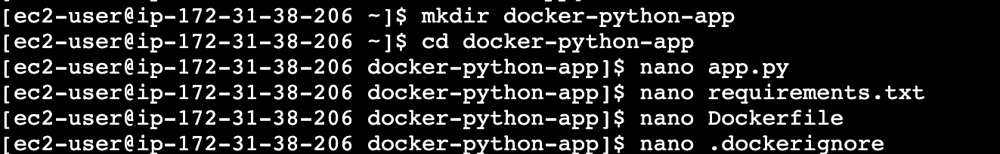

## タスク 4: Docker イメージのビルド

1. **Docker イメージをビルド**します:

```bash
docker build -t docker-python-app .
```

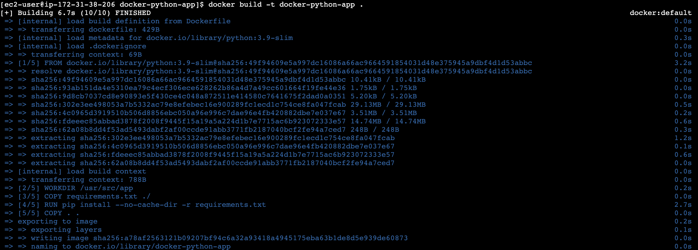

## タスク 5: Docker コンテナの実行

1. Docker コンテナを実行し、コンテナのポート 80 をホストマシンのポート 80 にマッピングします:

```bash
docker run -p 80:80 docker-python-app
```

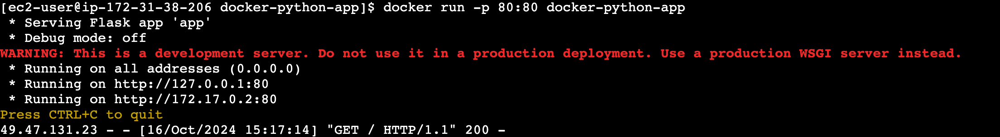

2. http://&lt;EC2 の Public IPv4 アドレス&gt; にアクセスして、Web ブラウザでアプリケーションにアクセスします:

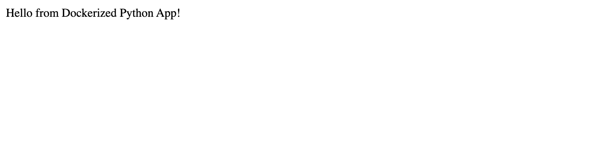

## タスク 6: Docker コンテナの管理

1. 実行中のコンテナのリストを表示するために以下のコマンドを実行します:

```bash
docker ps -a
```

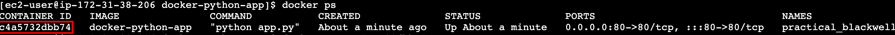

2. 実行中のコンテナを停止するには、docker ps の出力からコンテナ ID または名前を取得し、以下のコマンドを実行します。**&lt;container_id_or_name&gt;**を前のステップの出力から置き換えてください:

```bash
docker stop <container_id_or_name>
```

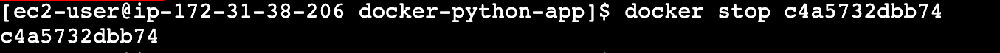

3. シェルで以下のコマンドを実行して、停止したコンテナを含むすべてのコンテナを表示します:

```bash
docker ps -a
```

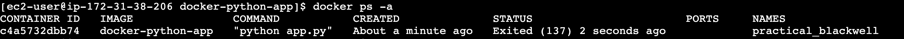

4. シェルで以下のコマンドを実行してコンテナを削除します。前のステップから**&lt;container_id_or_name&gt;**を置き換えてください:

```bash
docker rm <container_id_or_name>
```

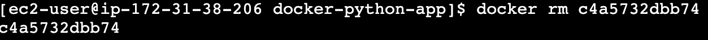

5. 以下のコマンドを実行して Docker イメージをリスト表示します:

```bash
docker images
```

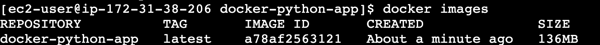

6. 以下のコマンドを実行してイメージを削除します:

```bash
docker rmi <image_id_or_name>
```

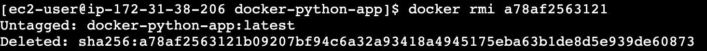

7. 以下のコマンドを実行して、停止したすべてのコンテナを削除します:

```bash
docker container prune
```

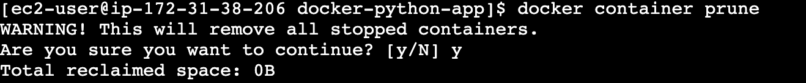

8. 以下のコマンドを実行して、未使用のすべてのイメージを削除します:

```bash
docker image prune -a
```

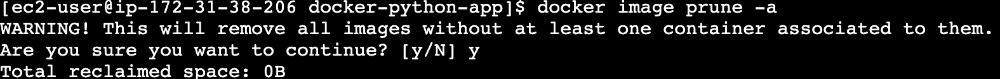

## 完了と結論

1. Docker のインストールに成功しました。
2. プロジェクトディレクトリを作成し、Python Flask アプリを開発しました。
3. Dockerfile を作成し、Docker イメージをビルドしました。
4. Docker コンテナを実行し、EC2 のパブリック IP 経由でアプリケーションにアクセスしました。
5. コンテナのリスト表示、停止、削除によって Docker コンテナを管理しました。
6. 未使用の Docker イメージと停止したコンテナをクリーンアップしてリソースを最適化しました。

## ラボの終了

1. AWS アカウントからサインアウトします。
2. ラボを正常に完了しました。
3. 手順が完了したら、whizlabs ダッシュボードから**End lab**をクリックしてください。
