# Amazon ECS - Fargate を使用した開始手順

## ラボ詳細

1. このラボでは、Amazon ECS サンプルアプリを作成する手順を実行します。
2. Fargate を使用して、タスク定義、サービス、クラスターを作成および設定する練習をします。
3. 所要時間: **45 分**
4. AWS リージョン: **US East (N. Virginia) us-east-1**

## はじめに

### Docker とは？

1. Docker は、コンテナを使用してアプリケーションの作成、デプロイ、実行を容易にするために設計されたツールです。
2. コンテナを使用すると、開発者はライブラリやその他の依存関係など、必要なすべての部品を含むアプリケーションをパッケージ化し、1 つのパッケージとしてデプロイできます。
3. これにより、コードの記述とテストに使用されたマシンとは異なる可能性のある、マシンのカスタマイズされた設定に関係なく、アプリケーションは他の Linux マシンで実行されます。

### Amazon ECS とは？

1. Amazon ECS はコンテナを管理し、開発者がコードを実行する環境を設定することなく、クラウドでアプリケーションを実行できるようにします。
2. AWS アカウントを持つ開発者が、API 呼び出しとタスク定義を通じて、クラスターと呼ばれるサーバーグループで実行されるスケーラブルなアプリケーションをデプロイおよび管理できるようにします。
3. Amazon ECS により、開発者は Docker コンテナをさまざまな用途で簡単に使用できます。シンプルな Web サイトのホスティングから、数千のコンテナを必要とする複雑な分散マイクロサービスの実行まで対応できます。

## アーキテクチャ図

## タスク詳細

1. AWS Management Console にサインインします。
2. Fargate を使用して Amazon ECS を開始します。
3. コンテナとタスク定義を作成します。
4. サービスを定義します。
5. サービスを表示します。
6. ラボの検証を行います。

## ラボ環境の起動

1. ラボ環境を起動するには、**Start lab** ボタンをクリックします。
2. クラウド環境がプロビジョニングされるまでお待ちください。プロビジョニングには 1 分もかかりません。
3. ラボが開始されると、**IAM username**、**Password**、**Access Key**、**Secret Access Key** が提供されます。

**注意**: 一度に開始できるラボは 1 つだけです。

---

## ラボ手順

### Task 1: AWS Management Console にサインイン

1. **Open Console** ボタンをクリックすると、新しいブラウザタブで AWS Console にリダイレクトされます。
2. AWS サインインページで:
   - Account ID はデフォルトのままにしておきます。AWS Console に表示されている 12 桁の Account ID を編集/削除しないでください。削除するとラボを進めることができません。
   - ラボコンソールの **Username** と **Password** をコピーして、AWS Console の **IAM Username** と **Password** に入力し、**Sign-in** ボタンをクリックします。
3. AWS Management Console にサインインしたら、デフォルトの AWS リージョンを **US East (N. Virginia) us-east-1** にします。

**注意**: 問題が発生した場合は、FAQs and Troubleshooting for Labs をご覧ください。

### Task 2: Fargate を使用した Amazon ECS の開始

1. AWS Fargate は、基盤となるインフラストラクチャを管理する必要なく、コンテナを実行できるサーバーレスインフラストラクチャです。
2. AWS Fargate で Amazon ECS を開始するには、タスク定義で Fargate 起動タイプを使用できます。
3. このタスク定義を使用してタスクを起動すると、Fargate はタスク定義の仕様に基づいて、タスクの実行に必要なコンピューティングリソースを自動的にプロビジョニングします。

### Task 3: コンテナとタスク定義の作成

1. タスク定義は、コンテナベースのアプリケーションをコンテナクラスターで実行する方法を定義する設計図または構成ファイルです。
2. Amazon ECS (Elastic Container Service) では、タスクを起動するたびにタスク定義が必要です。タスクはタスク定義の実行中のインスタンスです。
3. タスク定義では、使用する Docker イメージ、各コンテナの CPU とメモリの要件、マウントするデータボリューム、設定する環境変数などの詳細を指定します。
4. **US East (N. Virginia) us-east-1** にいることを確認してください。
5. 上部の **Services** ボタンを選択し、**Containers** セクションの **Elastic Container Service** を選択します。
6. 左パネルから **Cluster** をクリックします。
7. **Create Cluster** ボタンをクリックします。

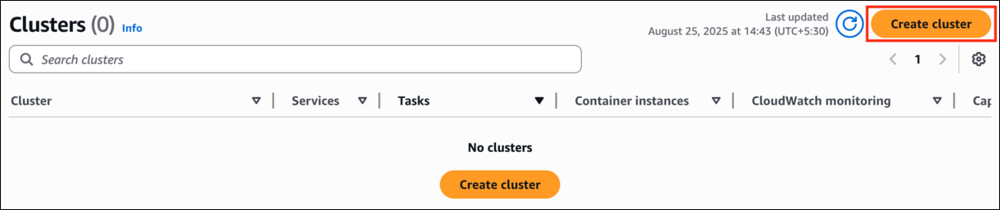

8. Cluster name フィールドはそのまま **(デフォルト値)** にしておきます。

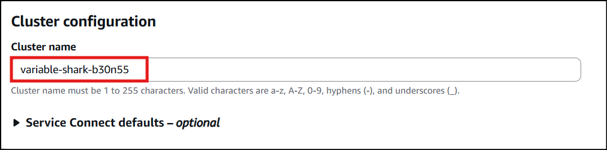

9. 残りはデフォルトのままにして、**create** ボタンをクリックします。
10. クラスターが正常に作成されます。

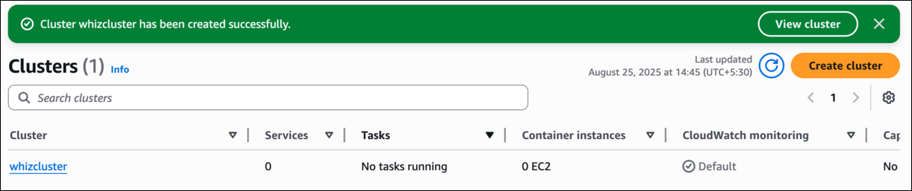

11. 左側のナビゲーションパネルで **Task Definitions** に移動します。
12. **Create new task definition** をクリックし、**Create new task definition** をクリックします。

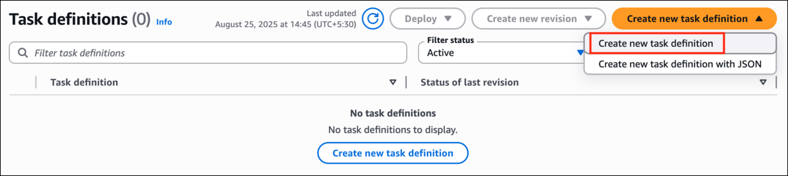

13. **Step 1: タスク定義とコンテナの設定**

    - Task Definition family: **whizdefinition** と入力します。

    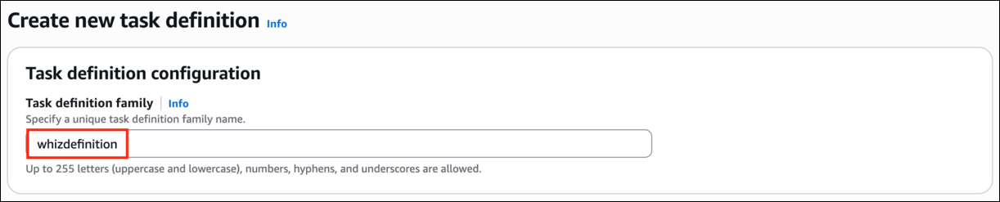

    - Launch type: **AWS Fargate** を選択します。
      - CPU: **.25 vCPU** を選択します。
      - Memory: **1 GB** を選択します。
    - Task Role と Task Execution Role: **None** を選択します。

    **注意**: task execution role を None に変更してください。デフォルトでは Create new role になっています。

    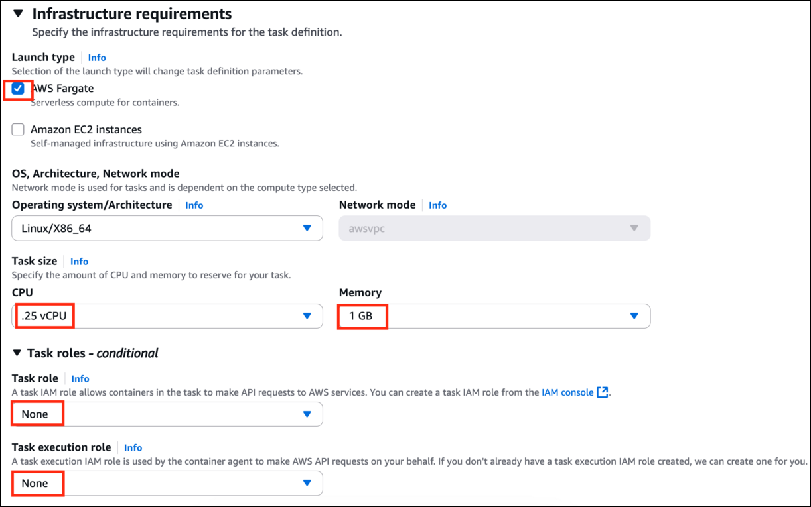

    - **Container -1**

      - Name: **sample-app** と入力します。
      - Image URL: **httpd:2.4** と入力します。
      - **Use log collection のチェックを外します**

      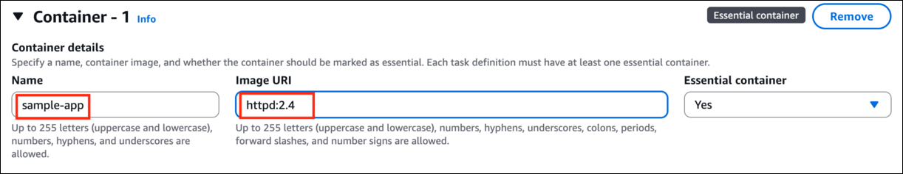

      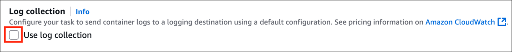

14. 残りはデフォルトのままにして、**Create** ボタンをクリックします。
15. タスク定義が正常に作成されます。

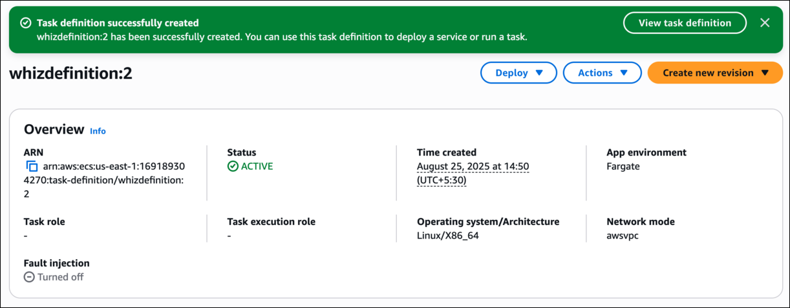

### Task 4: サービスの定義

1. このセクションでは、タスク定義から作成される Amazon ECS サービスの設定方法を選択する必要があります。
2. サービスを使用すると、ECS クラスターでタスク定義の指定された数 (「desired count」) の同時インスタンスを実行および維持できます。
3. Amazon ECS サンプルアプリケーションは、無期限に実行されることを意図した Web ベースの Hello World スタイルのアプリケーションです。
4. **Deploy** ボタンをクリックしてから、**Create Service** をクリックします。

5. サービスページにリダイレクトされます。

   - Service Name: **whizservice** と入力します。
   - Existing Cluster: 以前に作成したクラスターを選択します。この場合、クラスター名は **whizcluster** です。
   - Compute options: **Launch Type** を選択します。
   - Launch type: **Fargate** を選択します。

   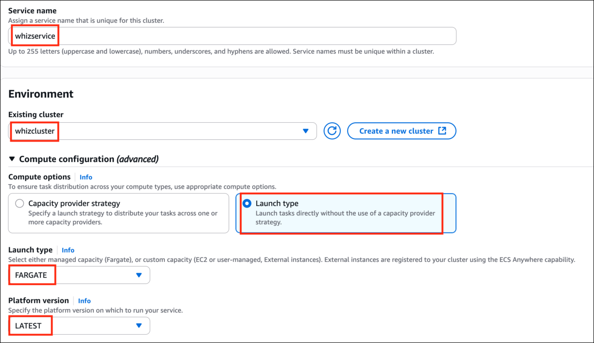

   - Scheduling strategy: **Replica (default)** を選択します。

     - Desired Tasks: **2** と入力します。

     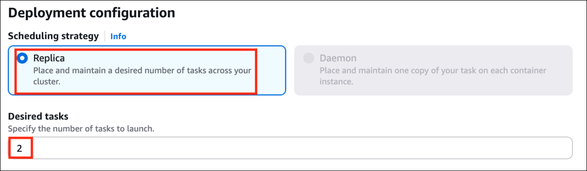

   - 下にスクロールして **Networking** セクションを展開します。
   - Security group で、**Create a new security group** を選択します。

     - Security group name: **whizecssg** と入力します。
     - Security group description: **Security group for ECS cluster** と入力します。
     - Type: **HTTP** を選択します。
     - Source: **Anywhere** を選択します。

     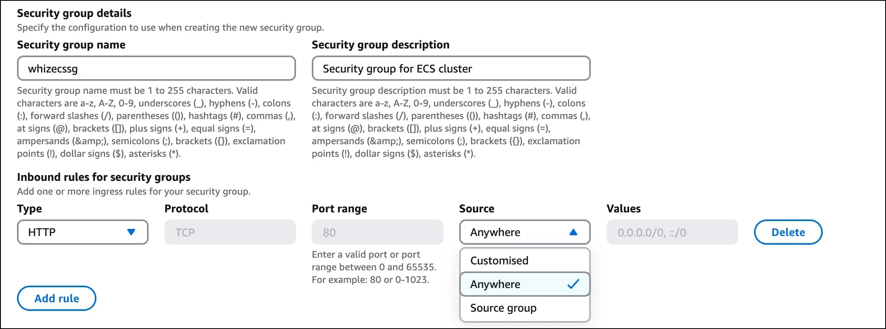

6. **Create** ボタンをクリックします。

### Task 6: サービスの表示

1. サービスがデプロイされるまで待ちます。サービスが正常に作成されたことが表示されます。

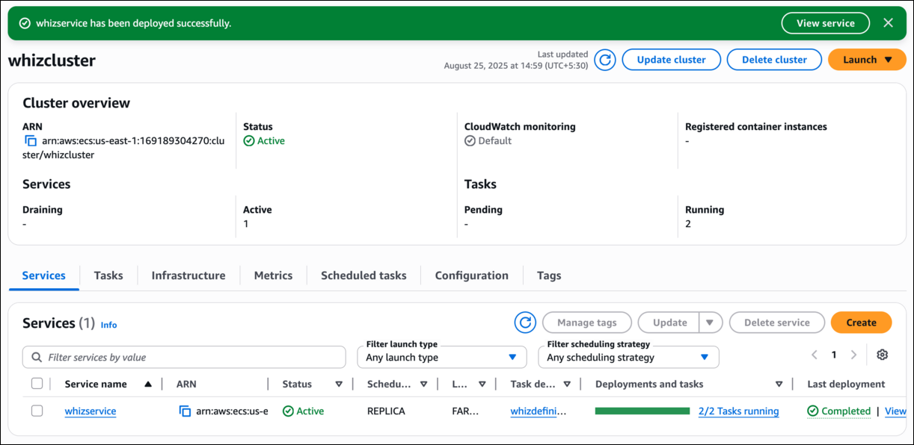

2. サービスが Web ベースのアプリケーション (Amazon ECS サンプルアプリケーションなど) の場合、Web ブラウザでコンテナを表示できます。
3. **Tasks** タブに移動します。
4. サービスのタスクのリストからタスクをクリックします。

5. **Networking** タブに切り替えます。**Public IPv4 IP** アドレスをコピーします。

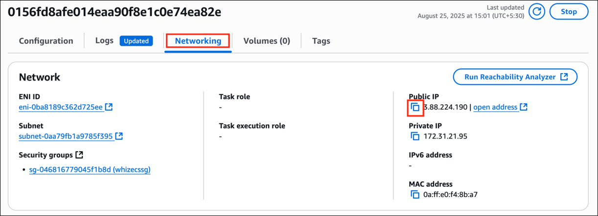

6. IP アドレスの前に **http://** を入力し、Web ブラウザに入力すると、「**It works**」と表示される Web ページが表示されます。

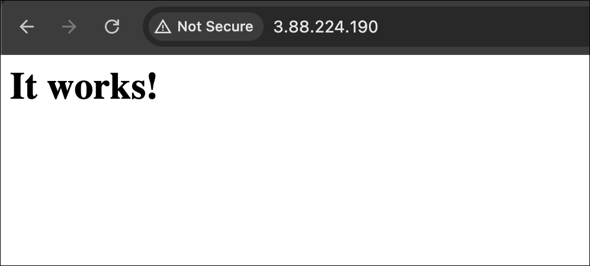

### 豆知識

ECS により、開発者はコンテナ化されたアプリケーションを需要に基づいて簡単にスケールアップまたはスケールダウンできます。クラスター全体でのコンテナのプロビジョニングと配布を自動的に管理し、効率的なリソース利用を可能にします。このスケーラビリティにより、企業は手動介入なしで、さまざまなワークロードに対応し、変化するトラフィックパターンに適応できます。

## 完了と結論

1. Fargate を使用してタスク定義、サービス、クラスターを正常に作成しました。
2. Amazon ECS サンプルアプリをテストしました。

## ラボの終了

1. AWS アカウントからサインアウトします。
2. ラボを正常に完了しました。
3. 手順を完了したら、whizlabs ダッシュボードから **End lab** をクリックしてください
