# EKS における水平ポッド自動スケーリング

## ラボ手順

### タスク 1: AWS Management Console にサインイン

1. **Open Console**ボタンをクリックすると、新しいブラウザタブで AWS コンソールにリダイレクトされます。

2. AWS サインインページで:

   - アカウント ID はデフォルトのままにしてください。AWS コンソールに表示されている 12 桁のアカウント ID を編集/削除しないでください。削除するとラボを続行できません。
   - ラボコンソールから**User Name**と**Password**をコピーして、AWS コンソールの**IAM Username and Password**に貼り付け、**Sign-in**ボタンをクリックしてください。

3. AWS Management Console にサインインしたら、デフォルトの AWS リージョンを**US East (N. Virginia) us-east-1**に設定してください。

---

### タスク 2: CloudShell で環境を作成

1. **N.Virginia**リージョンにいることを確認してください。

2. AWS 画面右上のメニューバーにある**CloudShell**アイコンをクリックしてください。

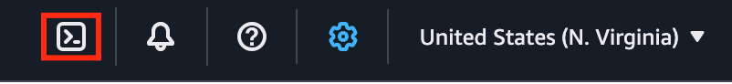

3. ブラウザで新しいタブが開きます。環境の作成が完了するまで数分間待ってください。環境が作成されると、ターミナルを使用する準備が整います。


---

### タスク 3: AWS CLI、eksctl、kubectl をインストール

1. 環境の準備が完了するまで待ってください。

2. yum を使用して AWS CLI をインストールするには、シェルで以下のコマンドを実行してください:

```bash
sudo dnf install awscli -y
```


3. バージョンを確認してインストールを確認してください:

```bash
aws --version
```

4. eksctl をインストールするには、以下の 2 つのコマンドをシェルにコピーして貼り付けてください:

```bash
curl --silent --location "https://github.com/weaveworks/eksctl/releases/latest/download/eksctl_$(uname -s)_amd64.tar.gz" | tar xz -C /tmp
```

```bash
sudo mv /tmp/eksctl /usr/local/bin/
```

5. eksctl のバージョンを確認してインストールを確認してください:

```bash
eksctl version
```

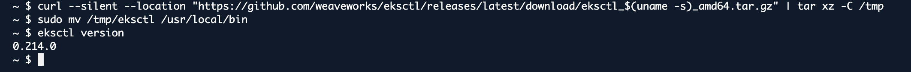

6. CloudShell で環境の準備ができたら、Amazon S3 からクラスターの Kubernetes バージョン用の Amazon EKS 提供の kubectl バイナリをダウンロードしてください。以下のコマンドを実行してください:

```bash
curl -LO https://dl.k8s.io/release/v1.31.0/bin/linux/amd64/kubectl
```

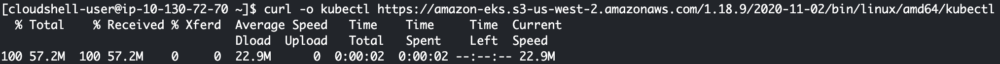

7. バイナリに実行権限を適用してください:

```bash
chmod +x ./kubectl
```

8. バイナリを PATH 内のフォルダにコピーしてください。既に kubectl のバージョンをインストールしている場合は、$HOME/bin/kubectlを作成し、$HOME/bin が$PATH の最初に来るようにすることをお勧めします:

```bash
mkdir -p $HOME/bin && cp kubectl $HOME/bin/kubectl && export PATH=$PATH:$HOME/bin
```

9. kubectl のインストール後、以下のコマンドでバージョンを確認できます:

```bash
kubectl version --client
```

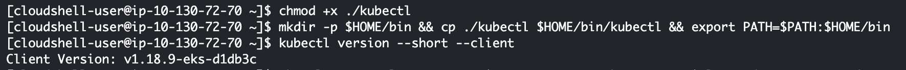

---

### タスク 4: EKS クラスターを作成

1. EKS クラスターを作成するには、eksctl を使用して以下のコマンドを実行してください:

```bash
eksctl create cluster --name=eksspottutorial --version=1.31 --nodes=2 --managed --region=us-east-1 --zones=us-east-1a,us-east-1b,us-east-1c --node-type=t2.medium --asg-access
```

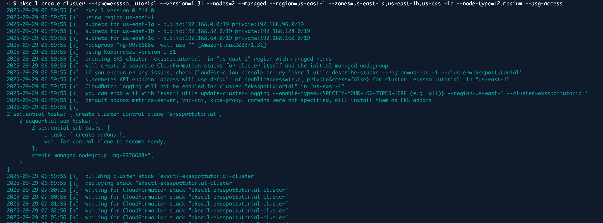

2. kubeconfig を更新してください:

```bash
aws eks --region us-east-1 update-kubeconfig --name eksspottutorial
```


3. 以下のコマンドを実行してノードを確認してください:

```bash
kubectl get nodes
```

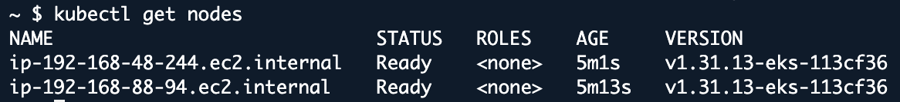

---

### タスク 5: Metrics Server を確認

1. Metrics Server が実行されていることを確認してください:

```bash
kubectl get pods -n kube-system | grep metrics-server
```

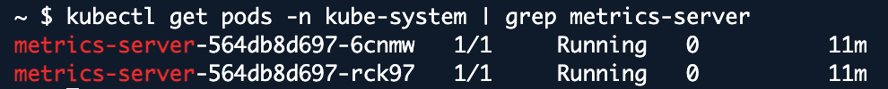

---

### タスク 6: サンプルアプリケーション(Nginx)をデプロイ

1. 以下のコマンドを実行して Nginx Deployment を作成してください:

```bash
kubectl create deployment nginx --image=nginx
```

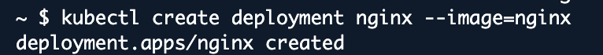

2. Deployment を 2 レプリカにスケールしてください:

```bash
kubectl scale deployment nginx --replicas=2
```

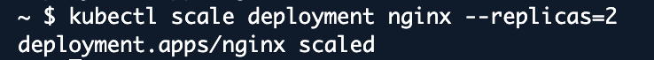

3. シェルで以下のコマンドを実行して Deployment と Pods を確認してください:

```bash
kubectl get deployments
```

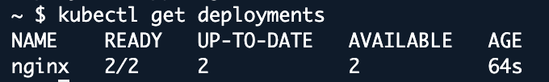

```bash
kubectl get pods
```

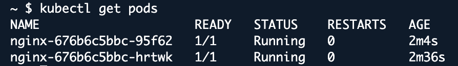

4. Deployment をサービスとして公開してください:

```bash
kubectl expose deployment nginx --port=80 --type=LoadBalancer
```

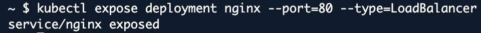

5. Deployment と Service のステータスを確認してください:

```bash
kubectl get deployments
```

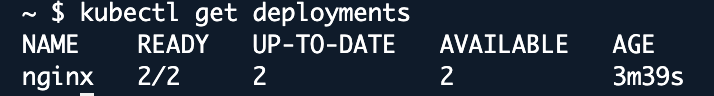

```bash
kubectl get svc
```


---

### タスク 7: Nginx のリソースリクエストとリミットを設定

1. HPA には、アプリケーションポッド用のリソースリクエストとリミットの設定が必要です。Nginx Deployment をエディットして CPU リクエストとリミットを指定してください:

```bash
kubectl edit deployment nginx
```

2. containers セクションの下に以下の resources セクションを追加してください。Ctrl+X+Y+Enter を押してファイルを保存してください:

```yaml
resources:
  limits:
    cpu: "200m"
  requests:
    cpu: "100m"
```


3. Deployment が更新されたことを確認してください:

```bash
kubectl get deployment nginx
```

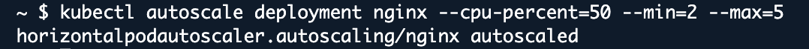

---

### タスク 8: Horizontal Pod Autoscaler (HPA)を作成

1. 最小 2 個、最大 5 個のレプリカを持つ HPA を作成し、CPU 使用率を 50% にすることを目標とします。

```bash
kubectl autoscale deployment nginx --cpu-percent=50 --min=2 --max=5
```

2. 以下のコマンドを実行して HPA が作成されたことを確認してください:

```bash
kubectl get hpa
```

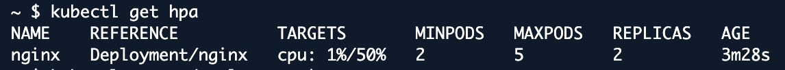

---

### タスク 9: 負荷を生成してオートスケーリングをトリガー

1. シェルで以下のコマンドを実行して Nginx Service の External IP を取得してください:

```bash
kubectl get svc nginx
```

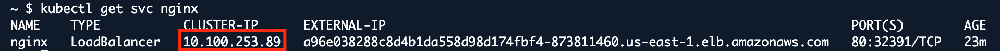

2. busybox コンテナを起動して、Nginx サービスへの継続的なトラフィックを生成してください:

```bash
kubectl run -i --tty load-generator --image=busybox /bin/sh
```

3. busybox コンテナ内で、以下のコマンドを実行して負荷を生成してください。**タスク 9 - ステップ 1**の出力から<nginx-external-ip>を置き換えてください。**Ctrl+C**を入力してから「**exit**」と入力してください:

```bash
while true; do wget -q -O- http://<nginx-external-ip>; done
```

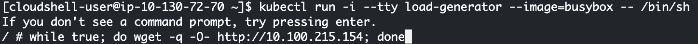

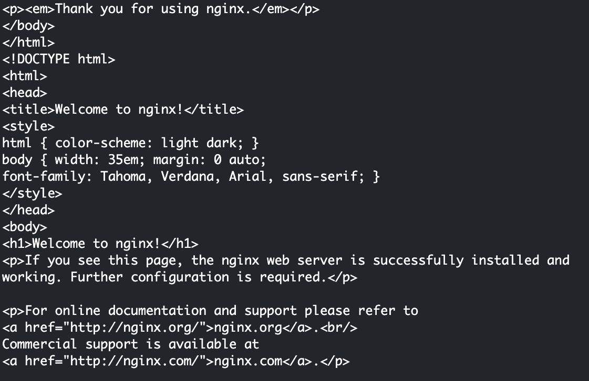

```bash
exit
```

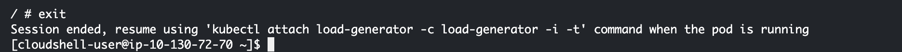

4. HPA を監視して、レプリカ数がスケールされるかどうかを確認してください:

```bash
kubectl get hpa
```

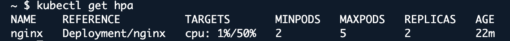

```bash
kubectl get pods -l app=nginx
```

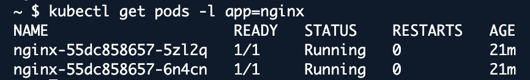

---

## 完了と結論

1. eksctl を使用して Amazon EKS クラスターを正常に作成し、アプリケーションのニーズに合わせて設定しました。

2. EKS クラスターに Nginx アプリケーションを正常にデプロイし、希望する設定で実行されることを確認しました。

3. Horizontal Pod Autoscaler (HPA)を正常に設定し、CPU 使用率に基づいて Nginx レプリカの数を自動的に調整できるようにしました。

4. Nginx サービスに負荷を生成してオートスケーリング機能をテストし、増加した需要にどのように応答するかを観察しました。

5. アプリケーションのパフォーマンスと HPA のスケーリング動作を正常に監視し、Kubernetes におけるリソース管理に関する洞察を得ました。

---

## ラボの終了

1. AWS アカウントからサインアウトしてください。

2. ラボを正常に完了しました。

3. 手順を完了したら、Whizlabs ダッシュボードから**End lab**をクリックしてください。
