# Lab 手順

## Task 1: AWS Management Console へのサインイン

1. **Open Console**ボタンをクリックすると、新しいブラウザタブで AWS コンソールにリダイレクトされます。

2. AWS サインインページで、以下を実行します:

   - Account ID はデフォルトのままにしてください。AWS コンソールに表示されている 12 桁の Account ID を編集/削除しないでください。削除するとラボを続行できなくなります。
   - ラボコンソールの**User Name**と**Password**をコピーし、AWS コンソールの**IAM Username と Password**に貼り付けて、**Sign in**ボタンをクリックします。

3. AWS Management Console にサインインしたら、デフォルトの AWS リージョンを**US East (N. Virginia) us-east-1**に設定します。

## Task 2: Amazon ECS でクラスターを作成する

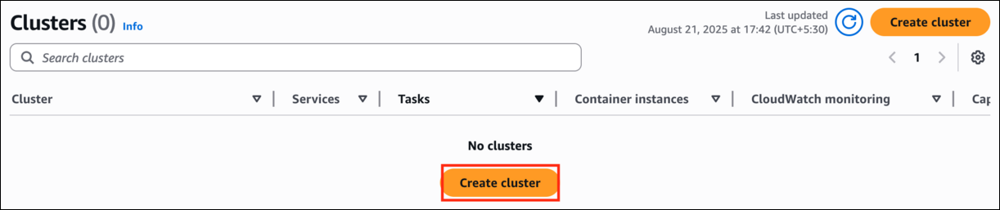

1. **US East (N.Virginia) us-east-1**リージョンにいることを確認します。

2. 上部の**Services**メニューをクリックし、**Containers**セクションの**Elastic Container Services**をクリックして、**Elastic Container Services**に移動します。

3. 左サイドバーで Clusters オプションをクリックし、**Create Cluster**ボタンをクリックします。

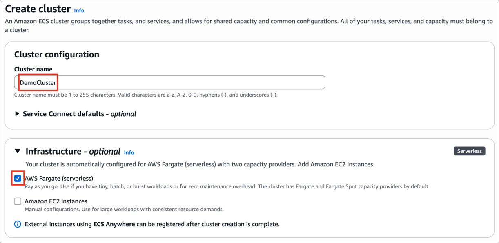

4. Cluster name - **DemoCluster**と入力します

5. Infrastructure セクションで、サーバーレスインフラストラクチャ用に AWS Fargate オプションが選択されたままにします。

6. 残りはデフォルトのままにして、**Create**をクリックします。

7. これで、クラスターが作成されているのが確認できます。作成には 5〜7 分かかる場合があります。

8. 作成が完了すると、タスクが実行されていない状態で、クラスターが Cluster セクションに表示されます。

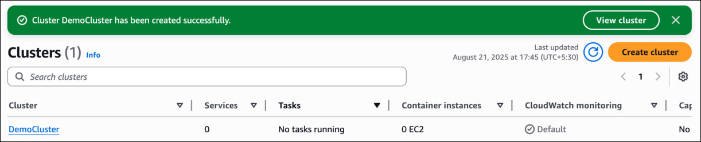

## Task 3: タスク定義を作成する

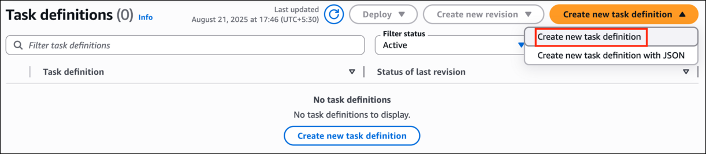

1. 左パネルにある Task Definitions をクリックします。

2. Create new task definition をクリックし、**Create new task definition**を選択します。

3. Task definition family - Task definition configuration タブで**DemoTaskDefintion**と入力します。

4. Infrastructure requirements で、Launch type - **AWS Fargate**を選択し、OS はそのままにします。

5. task size で、CPU 量に**0.5 vCPU**を選択し、メモリは**3 GB**のままにします。

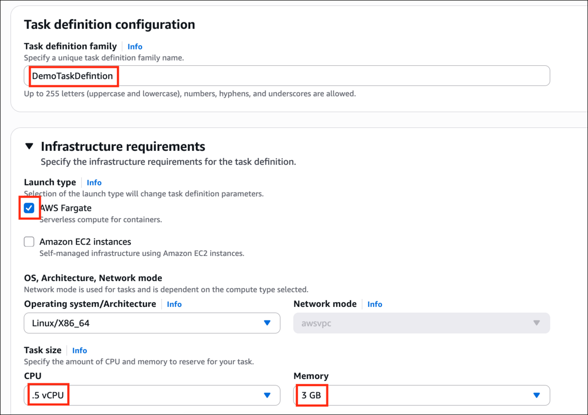

6. task role を展開し、Task execution role で、このラボ用に事前に作成された**ECSDemoIAMRole**を選択します。

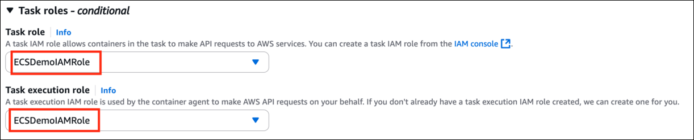

7. [リンク](https://gallery.ecr.aws/nginx/nginx)にアクセスして**NGINX**を検索し、最初のオプションをクリックして、Image URL をコピーします。

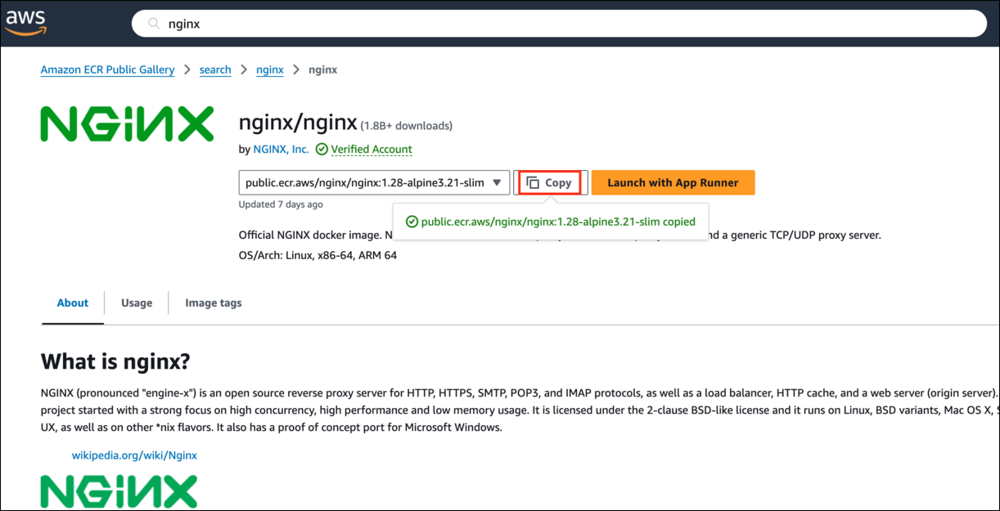

8. タスク定義の Container セクションで、コンテナの名前として**nginx**と入力し、Amazon Public ECR Registry からコピーした Image URI を Image URI ボックスに貼り付けます。

9. Essential container のドロップダウンオプションは**Yes**のままにします。

10. port mappings セクションで、Container port を**80**、protocol を**TCP**にし、デモポート名として**demoport**と入力します。すべて小文字であることを確認してください。そうでないとエラーが発生します。

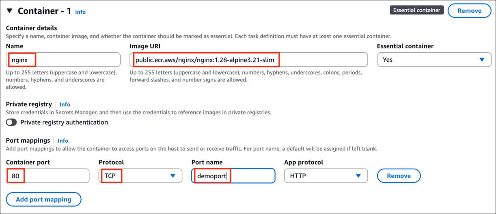

11. すべてをデフォルトのままにして、Storage セクションまでスクロールダウンします。

12. **Amount option**で、**21 GiB**と入力します。(これは割り当てる必要があるボリュームの最小量です)

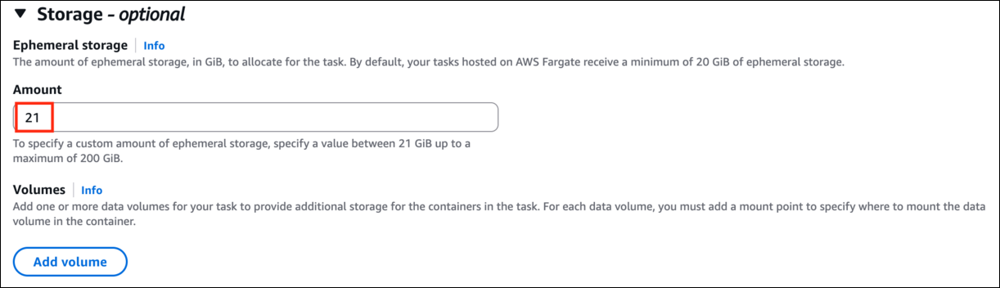

13. すべてをデフォルトのままにして、**Create**オプションをクリックします。

14. タスク定義が作成されているというメッセージが表示され、作成が完了したら、cluster オプションに戻ります。

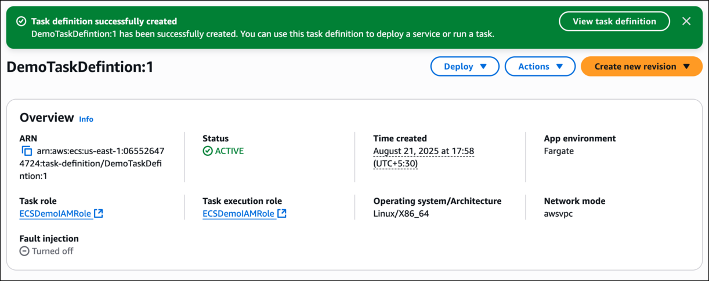

## Task 4: 作成したクラスターで Fargate タスクを実行する

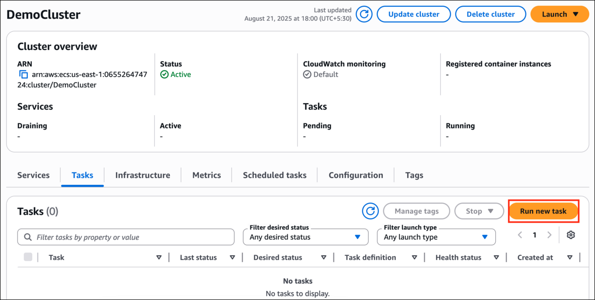

1. 左サイドバーで**Clusters**オプションをクリックし、**DemoCluster**を選択します。

2. Cluster Overview の下にある**Tasks**タブをクリックし、**Run** a new Task をクリックします。

3. Task details で、Task definition family - **DemoTaskDefinition**と入力し、task definition revision で**1 (LATEST)**を選択します。

4. 希望するタスク数を**1**のままにします。

5. Task Group name - **DemoTaskGroup**と入力します。

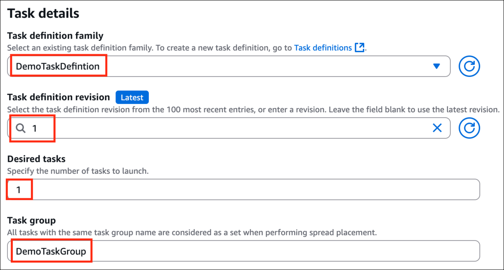

6. Compute options として**Launch Type**を選択し、Launch Type を**FARGATE**のままにします。

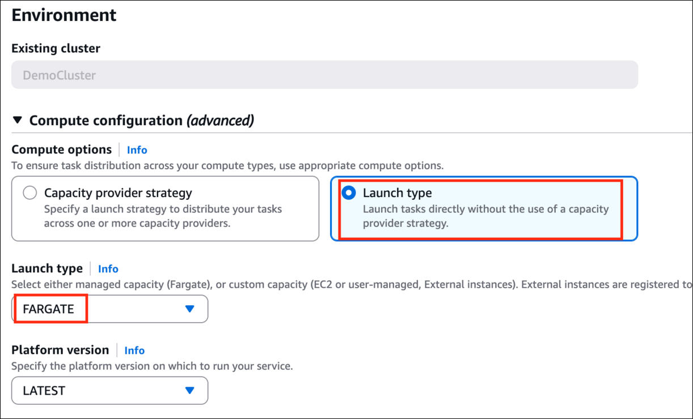

7. **Networking**セクションで、**new security group**を選択します。名前として**demo-security-group**、説明として**demo-security-group**と入力します。

8. inbound rule タイプとして**HTTP**を選択し、ソースとしてドロップダウンメニューから**Anywhere**を選択します。

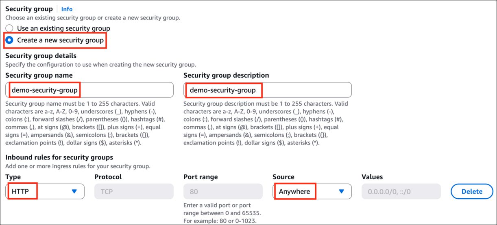

9. すべてをデフォルトのままにして、**Create**をクリックします。タスクが起動され、ステータスと desired state が running になっているのが確認できます。

10. Last Status が Running と表示されるまで**5〜7 分**かかります。

## Task 5: タスク定義に EBS ボリュームをアタッチする

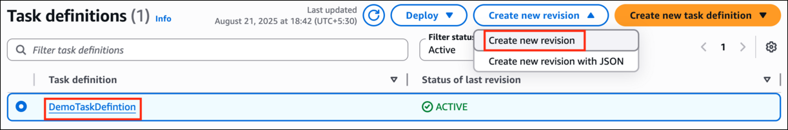

1. **Task Definition**ページに移動します。

2. Task Definition 名をクリックし、**Create a new revision**を選択します。

3. **Storage**セクションで、**Add Volume**ボタンをクリックします。

4. Volume Name に**DemoVol**という名前を入力し、configuration type に**Configure at deployment**オプションを選択します。これにより、スタンドアロンタスクを作成、更新、または実行するときに**1 つの Amazon EBS ボリューム**が設定されます。

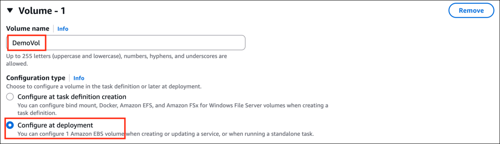

5. **Container mount points**で、**Add mount point**をクリックします
   - Container name: **nginx**を選択
   - Source volume: **DemoVol**を選択
   - Container path: マウントが追加されるコンテナパスとして**/data**と入力します。

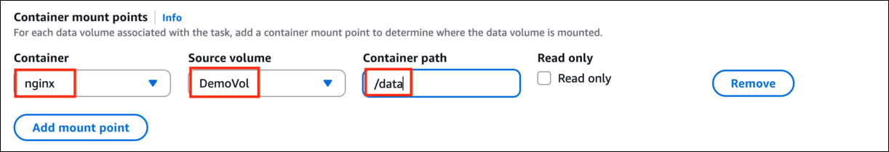

6. Create ボタンをクリックして、タスク定義の新しいリビジョンを保存します。

## Task 6: EBS ボリュームがアタッチされたタスク定義の新しいリビジョンに関連付けられた新しいタスクを実行する

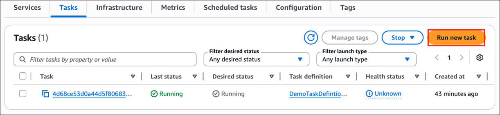

1. クラスターに戻り、クラスター内の Task タブで、**Run new task**オプションを選択します。

2. Task details で、Task definition family - **DemoTaskDefinition**と入力し、task definition revision で**2(LATEST)**を選択します。

3. 希望するタスク数を**1**のままにします。

4. Task Group name - **DemoTaskGroup**と入力します。

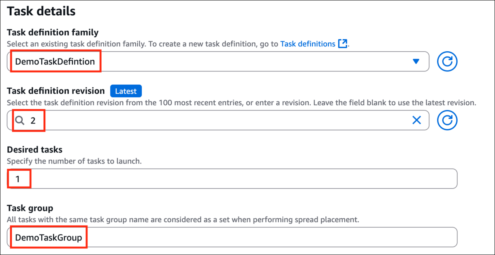

5. Compute options として**Launch Type**を選択し、Launch Type を**FARGATE**のままにします。

6. **Volume section**を開き、EBS Volume type として**General Purpose SSD(gp3)**を選択し、Size を**11 GiB**、IOPS を**3000 以上(3001 を選択)**、Throughput を**125 以上(126 を選択)**にし、File System type として**EXT3**を選択します。

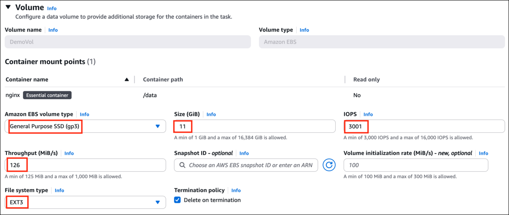

7. **Infrastructure role - ECSDemoIAMRole**を選択します(すでに作成されています)。

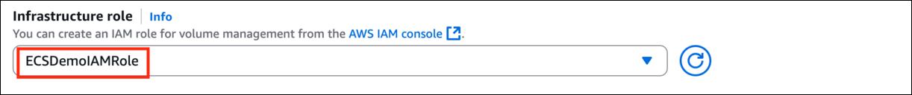

8. すべてをデフォルトのままにして、**Create**をクリックします。

9. 5〜7 分後にタスクが実行中の状態になります。

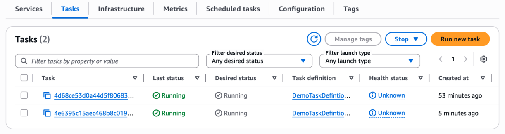

10. 最新のタスクを選択し、Volume タブをクリックして、ECS タスクにアタッチされている EBS ボリュームを確認します。

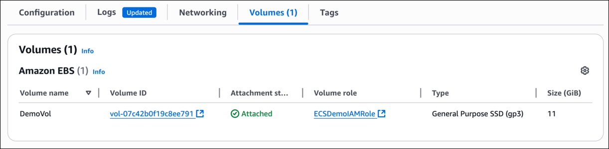

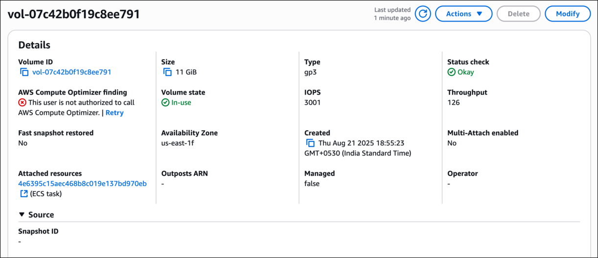

> **ご存知ですか:**
> Amazon ECS は Docker と Windows の両方のコンテナをサポートしており、開発者はサービスディスカバリーやロードバランシングなどの機能を活用しながら、統合環境でさまざまなアプリケーションを実行し、シームレスなスケーリングと管理を実現できます。

## 完了と結論

1. ECS クラスターを正常に作成しました。

2. ECS タスク定義を正常に作成しました。

3. ECS タスクを正常に作成しました。

4. ECS タスクに EBS ボリュームを正常に設定しました。

## ラボの終了

1. AWS アカウントから**サインアウト**します。

2. ラボを正常に完了しました。

3. 手順を完了したら、whizlabs ダッシュボードから**End lab**をクリックします。
