# Amazon ECS で AWS Secrets Manager シークレットを使用する - 操作手順書

## ラボ概要

このラボでは、AWS Secrets Manager でシークレットを作成し、Amazon ECS コンテナから機密情報に安全にアクセスする方法を学びます。

---

## Task 1: AWS Management Console へのサインイン

1. **Open Console** ボタンをクリックして、新しいブラウザタブで AWS コンソールを開きます。

2. AWS サインインページで以下を実行します:

   - Account ID はデフォルトのままにします。12 桁の Account ID を編集または削除しないでください。削除すると、ラボを続行できなくなります。
   - Lab Console から **User Name** と **Password** をコピーして、AWS Console の **IAM Username** と **Password** に貼り付けます。
   - **Sign in** ボタンをクリックします。

3. AWS Management Console にサインインしたら、デフォルトの AWS リージョンを **US East (N. Virginia) us-east-1** に設定します。

---

## Task 2: Secrets Manager シークレットの作成

このタスクでは、Secrets Manager シークレットを作成し、実行中のコンテナに SSH 接続してアクセスする機密データを保存します。

1. **US East N.Virginia (us-east-1)** リージョンにいることを確認します。

2. 上部の **Services** メニューをクリックし、**Security, Identity & Compliance** セクションから **Secrets Manager** を選択します。

3. ホームページで **Store a new secret** ボタンをクリックします。

   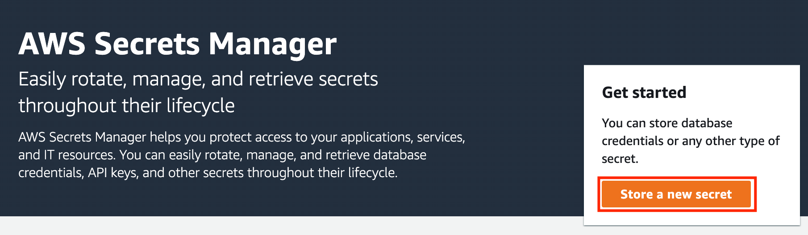

4. **Step 1** - シークレットタイプの選択:

   - Secret type: **Other type of secret** を選択

   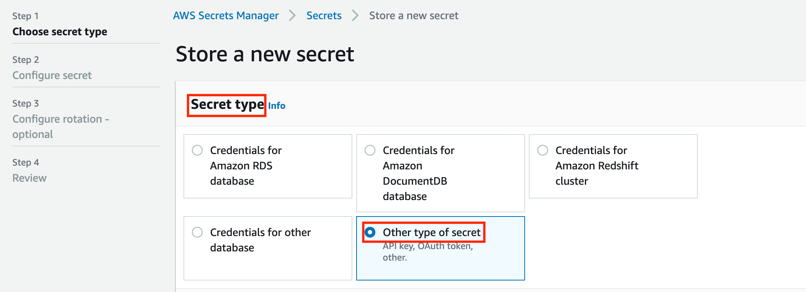

   - **PlainText** を選択
   - 既存のテキストを削除し、`password_value` と入力
   - Encryption key: デフォルトのままにします
   - **Next** ボタンをクリック

5. **Step 2** - シークレットの設定:

   - Secret name: `ProductionUserCredentials` と入力
   - Description: `These credentials will be used in a production environment` と入力
   - その他のオプションはデフォルトのままにします
   - **Next** ボタンをクリック

6. **Step 3** - ローテーションの設定:

   - すべてのオプションをデフォルトのままにします
   - **Next** ボタンをクリック

7. **Step 4** - レビュー:

   - すべての内容を確認し、**Store** ボタンをクリック

8. シークレットが作成されました。

   

9. **Refresh** ボタンをクリックして、シークレットを表示します。

   

10. **Secret name** をクリックして、シークレットを開きます。

11. **Secret ARN** の **copy** ボタンをクリックしてコピーします。コピーしたら、メモ帳に保存してください。次のステップで使用します。

    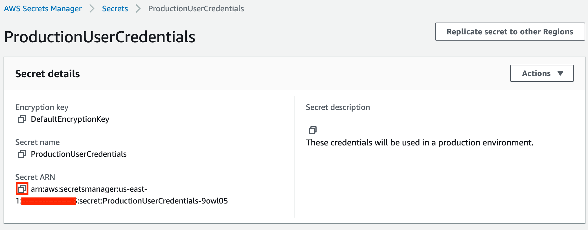

---

## Task 3: IAM ロール ecsTaskExecutionRole の ARN をコピー

1. 上部の **Services** メニューをクリックし、**Identity and Management** セクションから **IAM** を選択します。

   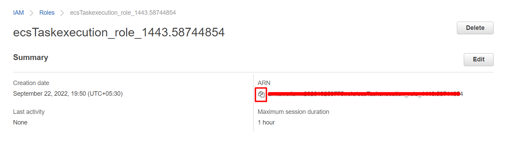

2. IAM リンク: [https://us-east-1.console.aws.amazon.com/iamv2/home?region=us-east-1#/roles](https://us-east-1.console.aws.amazon.com/iamv2/home?region=us-east-1#/roles) にアクセスし、`ecsTaskexecution_role_<XXXXXXX>` を検索します。

3. **ARN** をコピーして、**メモ帳に保存**します。

---

## Task 4: ECS クラスター用のセキュリティグループを作成

1. **N.Virginia** リージョンにいることを確認します。

2. 上部の **Services** メニューをクリックし、**Compute** セクションから **EC2** を選択します。

3. 左側のパネルメニューで、**Network & Security** セクションの **Security group** を選択します。

4. **Create Security Group** をクリックします。

5. ECS クラスター用のセキュリティグループを作成します:

   - Security group name: `ECS-SG` と入力
   - Description: `Security group for ECS Cluster` と入力
   - VPC: **Default VPC** を選択

   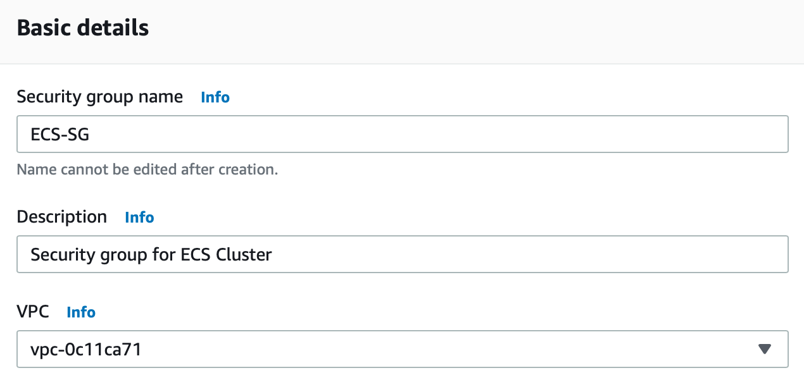

6. **Inbound rules** で **Add Rule** をクリック:

   - Type: **SSH** を選択
   - Source: **Anywhere-IPv4** を選択

   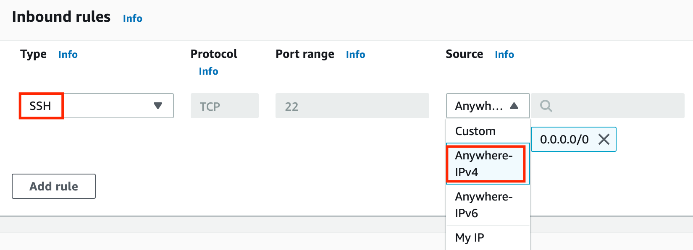

7. その他はデフォルトのままにし、**Create Security Group** をクリックします。

   

---

## Task 5: ECS クラスター内の EC2 インスタンス用のキーペアを作成

1. 左側のナビゲーションペイン（下にスクロール）の **Network & Security** 内で、**KeyPairs** をクリックします。

2. 新しいキーペアを作成するために、**Create Key Pair** をクリックします。

3. 以下の詳細を入力します:

   - Name: `WhizKeyPair` と入力
   - Key pair type: **RSA**
   - File format: **pem (Linux & Mac Users)** または **ppk (Windows users)**
   - その他のオプションはデフォルトのままにします
   - **Create Key pair** をクリック

   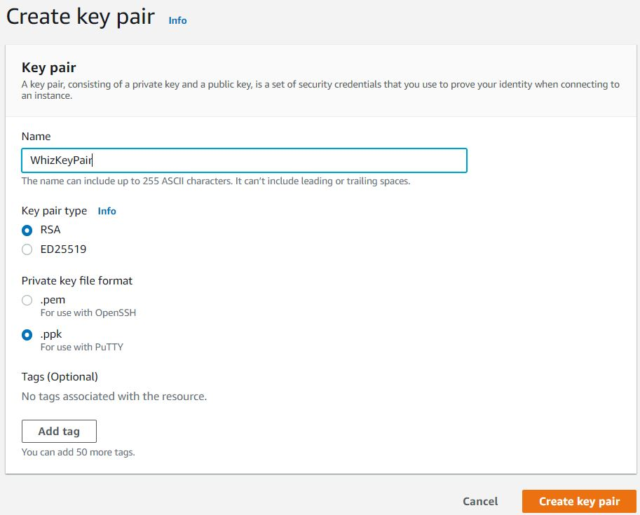

4. キーペアが作成されます。

   

5. キーをデスクトップ/ダウンロードフォルダに保存します。

---

## Task 6: ECS クラスターの起動

1. **N.Virginia** リージョンにいることを確認します。

2. 上部の **Services** メニューをクリックし、**Container** セクションから **Elastic Container Service** を選択します。

3. 左側のサイドバーで、**Amazon ECS** セクションの **Clusters** オプションをクリックします。

4. **Create Cluster** をクリックします:

   - Cluster name: `whiz` と入力（またはデフォルトのままでも可）
   - Infrstructure: **Amazon EC2 Instances** チェックボックスをチェック
   - Auto Scaling group: **Create new ASG** を選択
   - Provisioning Model: **On-Demand** を選択

   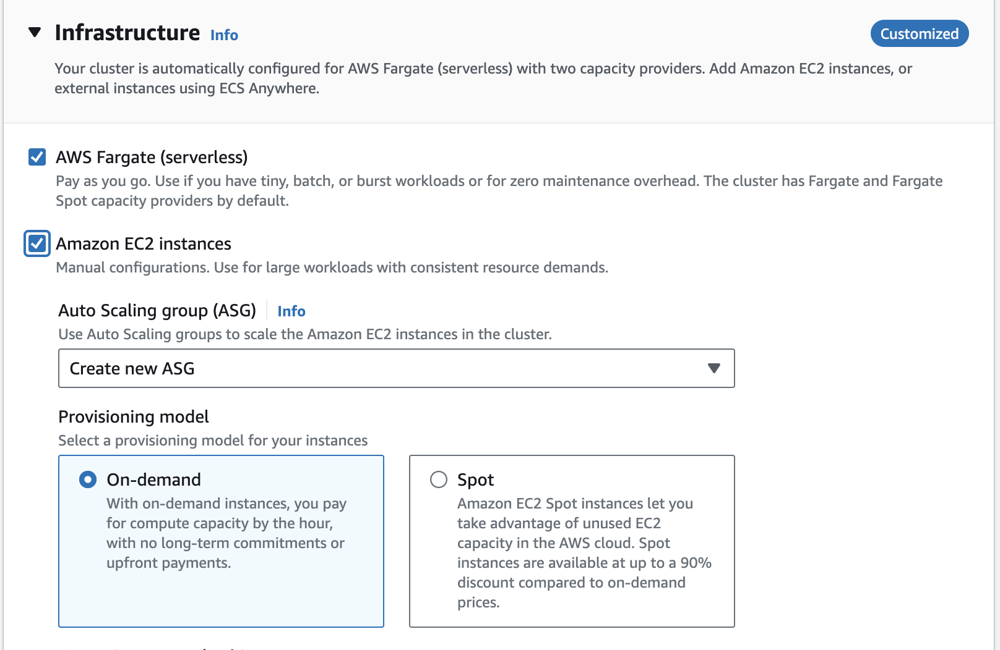

5. 以下の設定を続けます:

   - Operating system/Architecture: **Amazon Linux 2023** を選択
   - EC2 instance type: **t2.micro** を選択
   - Desired Capacity: **Minimum** に `1`、**Maximum** に `2` と入力
   - SSH Key pair: **WhizKeyPair** を選択
   - Root EBS Volume Size (GiB): `30` と入力

   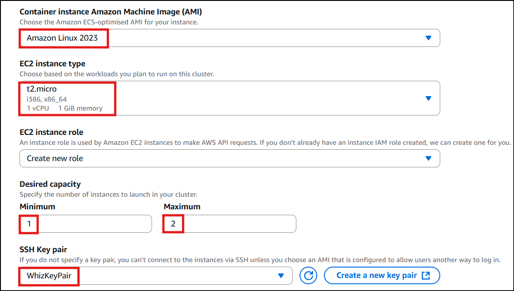

6. **Network settings for Amazon EC2 instances** セクションを展開:

   - VPC: **Default VPC** を選択
   - Subnets: **us-east-1a** と **us-east-1b** を選択
   - Auto assign public IP: **Use subnet setting** を選択（デフォルト）
   - Security group: **ECS-SG** セキュリティグループを選択

   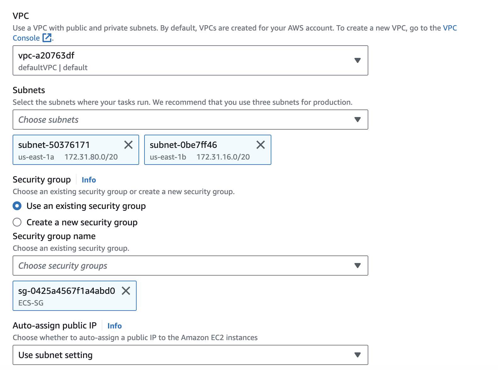

7. その他のオプションはデフォルトのままにします。

8. **Create** ボタンをクリックして、**whiz** ECS クラスターを作成します。

9. ECS クラスターは 2 分で作成されます。

10. ECS インスタンスのプロビジョニングには数分かかります。

11. **whiz** ECS クラスターが **1 Container instances** で作成されます。

    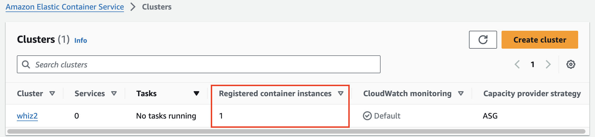

---

## Task 7: タスク定義の作成

1. 左側のサイドバーで、**Amazon ECS** セクションの **Task Definitions** オプションをクリックします。

2. **Create New task defination with JSON** をクリックします。

   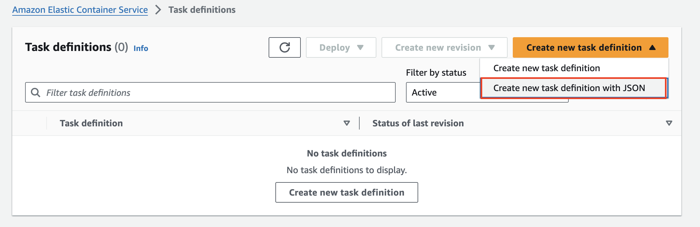

3. JSON エディタに以下のコードをコピー＆ペーストします:

```json
{
  "executionRoleArn": "arn:aws:iam::940696859768:role/ecsTaskexecution_role_50197.63374735",
  "containerDefinitions": [
    {
      "entryPoint": ["sh", "-c"],
      "portMappings": [
        {
          "hostPort": 80,
          "protocol": "tcp",
          "containerPort": 80
        }
      ],
      "command": [
        "/bin/sh -c \"echo '<html> <head> <title>Amazon ECS Sample App</title> <style>body {margin-top: 40px; background-color: #333;} </style></head><body> <div style=color:white;text-align:center> <h1>Amazon ECS Sample App</h1><h2>Congratulations!</h2> <p>Your application is now running on a container in Amazon ECS.</p> </div></body></html>' > /usr/local/apache2/htdocs/index.html && httpd-foreground\""
      ],
      "cpu": 10,
      "secrets": [
        {
          "valueFrom": "arn:aws:secretsmanager:us-east-1:940696859768:secret:ProductionUserCredentials-JNiMEf",
          "name": "username_value"
        }
      ],
      "memory": 300,
      "image": "httpd:2.4",
      "essential": true,
      "name": "ecs-secrets-container"
    }
  ],
  "family": "ecs-secrets-tutorial"
}
```

4. 2 行目で、**IAM Role ARN** を先ほどコピーした IAM ロール ARN の値に置き換えます。

5. 22 行目で、**value** を先ほどコピーした Secret ARN に置き換えます。

6. **Create** ボタンをクリックします。

7. タスク定義 **ecs-secrets-container** が作成されました。

---

## Task 8: タスクの実行

1. タスクを実行するために、**Deploy** ボタンをクリックして、**Run Task** を選択します。

   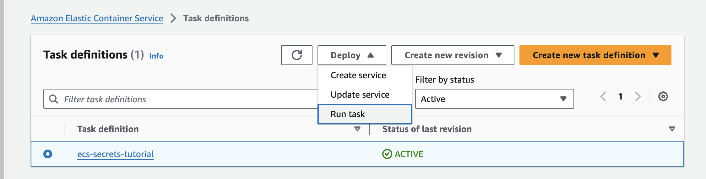

2. Existing cluster: 作成した **cluster** を選択します。

3. Compute options: **Launch type** を選択し、Launch type として **EC2** を選択します。

4. 最後までデフォルトのままにします。

5. **Tags** セクションを展開し、**Turn on Amazon ECS managed tags** オプションの **チェックを外します**。

6. 最後に、**Create** をクリックしてプロセスを完了します。

7. タスクが作成されました。

8. 2 分後にページを更新して、実行中のタスクを確認します。

9. タスクが実行中で、EC2 の Running tasks カウントが 1 になっていることを確認できます。

   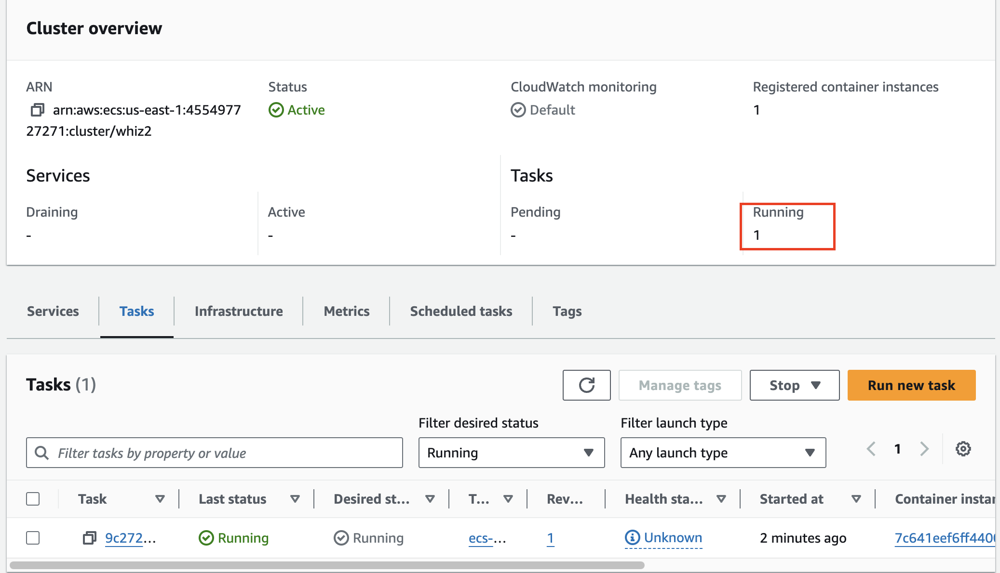

---

## Task 9: EC2 インスタンスへの SSH 接続

1. **Infrastructure** タブに切り替え、**container instances** までスクロールダウンし、**EC2 Instance ID** をクリックします。

   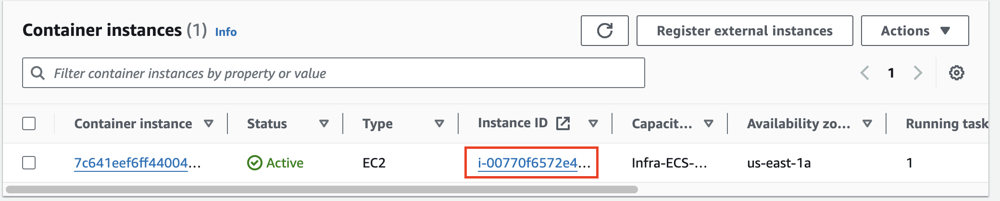

2. [このガイド](https://whizlabs.com/labs/support-document/ssh-into-ec-instance)を使用して、このインスタンスに SSH 接続します。

---

## Task 10: すべてのプロセスをリスト表示し、シークレットの値を出力

1. 以下のコマンドを実行して、docker プロセスをリスト表示します:

```bash
docker ps
```

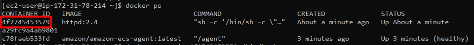

2. 現在のコンテナ **ecs-secrets-container** のコンテナ ID をコピーします。

3. コピーしたコンテナ ID を使用して、**ecs-secrets-tutorial** コンテナに接続します:

   - **構文:**

   ```bash
   docker exec -it container_ID /bin/bash
   ```

   - **例:** `docker exec -it d5d61219371e /bin/bash`

4. echo コマンドを使用して、環境変数の値を出力します:

```bash
echo $username_value
```

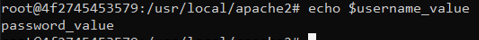

- 出力が **password_value** であれば、ラボは成功です。

---

### 豆知識

AWS Secrets Manager は、シークレットの自動ローテーション機能を提供しています。これにより、事前定義されたスケジュールや特定のイベント発生時（時間ベース、オンデマンド、侵害検知時など）に、シークレットの値を自動的に変更するように AWS Secrets Manager を設定できます。

---

## Task 11: ラボの検証

1. ラボの手順が完了したら、左側のパネルにある **Validation** ボタンをクリックしてください。

2. これにより、AWS アカウントのリソースが検証され、このラボが正常に完了したかどうかが表示されます。

3. サンプル出力:

   

---

## Task 12: 作成したリソースの削除

### Secrets Manager シークレットの削除

1. **N.Virginia** リージョンにいることを確認します。

2. 上部の **Service** メニューをクリックし、**Management & Governance** セクションから **Systems Manager** を選択します。

3. シークレット名をクリックして開きます。

4. シークレットを削除するには、**Actions** オプションを選択し、**Delete secret** を選択します。

   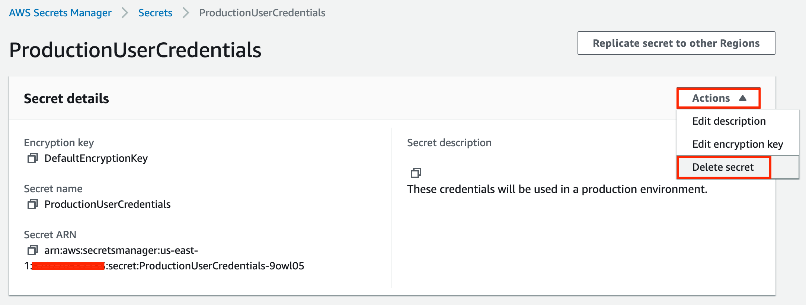

5. 待機期間を **7 days** と入力し、**Schedule deletion** オプションをクリックします。

   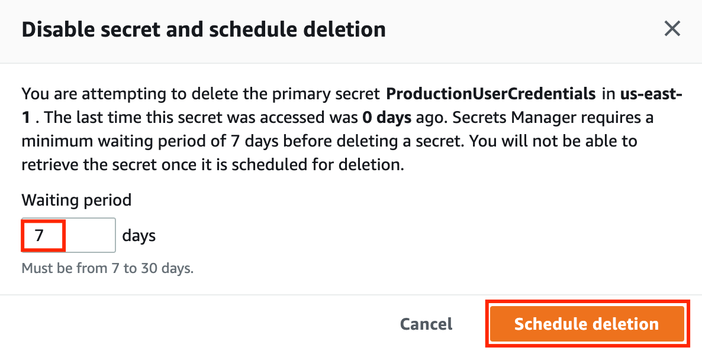

### ECS クラスターの削除

1. **N.Virginia** リージョンにいることを確認します。

2. 上部の **Services** メニューをクリックし、**Container** セクションから **Elastic Container Service** を選択します。

3. 左側のサイドバーで、**Amazon ECS** セクションの **Clusters** オプションをクリックします。

4. クラスター名 **whiz** をクリックします。

5. **Delete Cluster** オプションをクリックします。

6. ポップアップウィンドウでフレーズ `delete whiz` を入力して削除を確認します。

---

## 完了と結論

このラボで実施した内容:

1. Secrets Manager シークレットを作成しました。
2. IAM ロール ecsTaskExecutionRole の ARN をコピーしました。
3. セキュリティグループとキーペアを作成しました。
4. ECS クラスターを作成しました。
5. タスク定義を作成し、タスクを開始しました。
6. すべてのプロセスをリスト表示し、シークレットの値を出力しました。
7. すべてのリソースを削除しました。

---

## ラボの終了

1. AWS アカウントからサインアウトします。

2. ラボを正常に完了しました。

3. 手順を完了したら、whizlabs ダッシュボードから **End Lab** をクリックしてください。

---

**© 2025 - Amazon ECS with AWS Secrets Manager Lab Guide**
