# ECS のターゲットトラッキングポリシーを使用してアプリケーションの自動スケーリングを構成する

## Lab Steps

### Task 1: AWS Management Console へのサインイン

1. **Open Console** ボタンをクリックし、新しいブラウザタブで AWS コンソールにリダイレクトされます。

2. AWS サインインページで以下を実行します:

   - Account ID はデフォルトのままにします。AWS コンソールに表示されている 12 桁の Account ID を編集・削除しないでください。編集すると、ラボを続行できません。
   - Lab Console からあなたの User Name と Password をコピーし、AWS コンソールの IAM Username と Password に貼り付けて、**Sign in** ボタンをクリックします。

3. AWS Management Console にサインインしたら、デフォルトの AWS リージョンを **US East (N. Virginia) us-east-1** に設定します。

---

### Task 2: Load Balancer と ECS Cluster 用の Security Group を作成する

1. **N.Virginia** リージョンにいることを確認します。

2. 上部の **Services** メニューから **Compute** セクションの **EC2** に移動します。

3. 左側パネルメニューの **Network & Security** セクションから **Security Groups** を選択します。

4. **Create security group** ボタンをクリックします。

5. ECS Cluster と Load Balancer 用の Security Group を作成します:

   - Security group name: `ALB-ECS-SG`
   - Description: `Security group for the load balancer and the ECS Cluster`
   - VPC: **Default VPC** を選択

   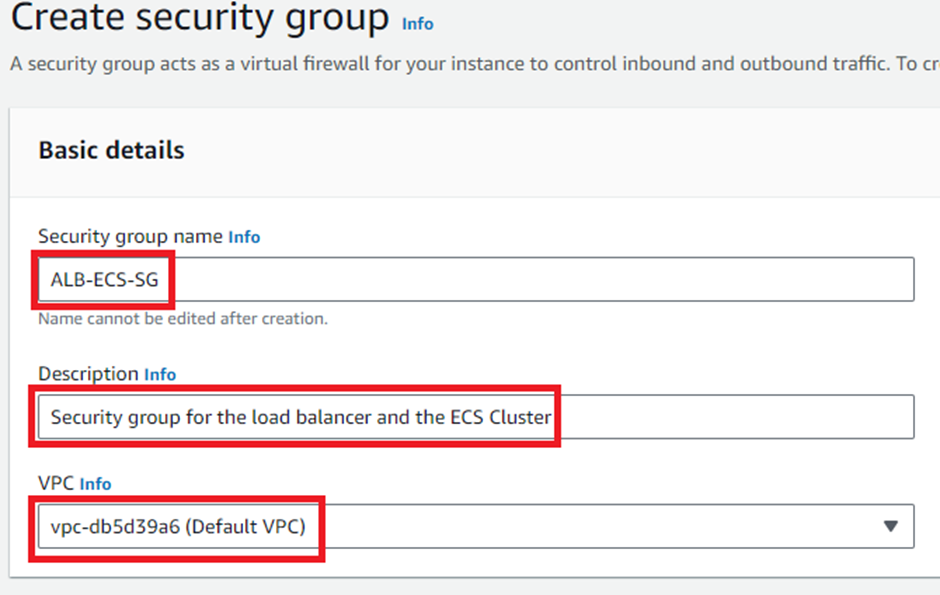

6. **Inbound rules** の下にある **Add rule** ボタンをクリックし、以下のルールを追加します:

   **ルール 1:**

   - Type: **SSH**
   - Source: **Anywhere-IPv4**
   - テキストボックスに `0.0.0.0/0` を入力

   **ルール 2:**

   - Type: **ALL TCP**
   - Source: **Anywhere-IPv4**
   - テキストボックスに `0.0.0.0/0` を入力

   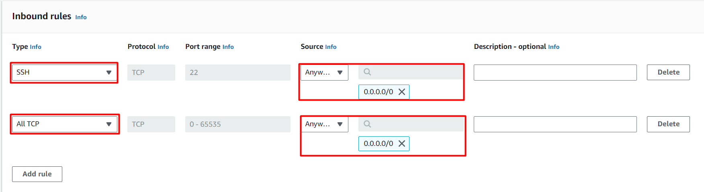

7. その他はデフォルトのままにして、**Create security group** ボタンをクリックします。

---

### Task 3: ECS Cluster 内の EC2 インスタンス用の Key Pair を作成する

1. 左側ナビゲーションパネルの **Network & Security** 内で、**Key Pairs** をクリックします。

2. 新しい Key Pair を作成するため、**Create key pair** ボタンをクリックします。

3. 以下の詳細を入力します:

   - Name: `WhizKeyPair`
   - File format: **pem (Linux & Mac Users)** または **ppk (Windows users)**
   - その他のオプションはデフォルトのままにします
   - **Create key pair** ボタンをクリックします

   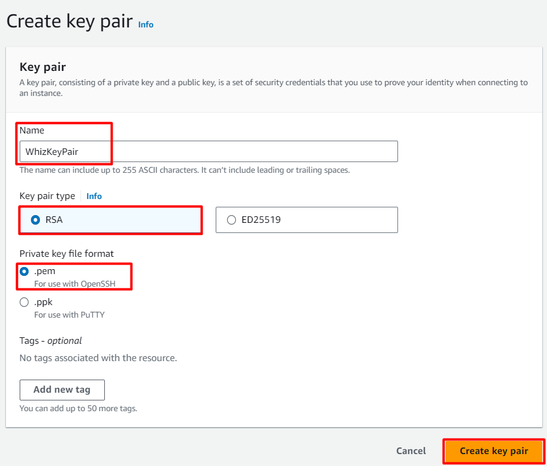

4. Create key pair をクリックすると、Key Pair をローカルにダウンロードするポップアップが表示されるので、ファイルを保存します。

5. Key Pair が作成されます。

   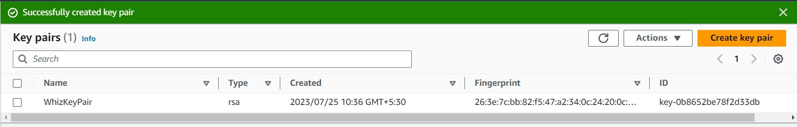

---

### Task 4: Target Group と Load Balancer を作成する

1. **EC2** コンソールで、左パネルの **Load Balancing** の下にある **Target Groups** に移動します。

2. **Create target group** ボタンをクリックします。

   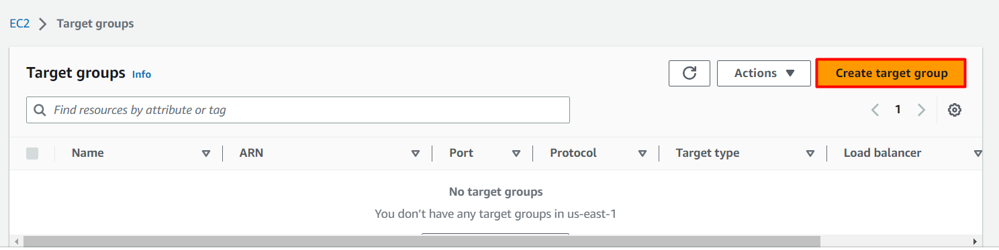

3. **Step 1, Specify group details** の設定:

   - Basic configurations の下で:
     - Choose a target group: **Instances** を選択
     - Target group name: `ecs-TG`
   - すべての設定をデフォルトのままにします
   - ページ下部にスクロールして **Next** ボタンをクリックします

4. **Step 2, Register targets** の設定:

   - すべての設定をデフォルトのままにします
   - **Create target group** ボタンをクリックします

5. 左側ナビゲーションパネルの **Load Balancers** に移動します。

6. 左上の **Create load balancer** ボタンをクリックして、Web サーバー用の新しい Load Balancer を作成します。

   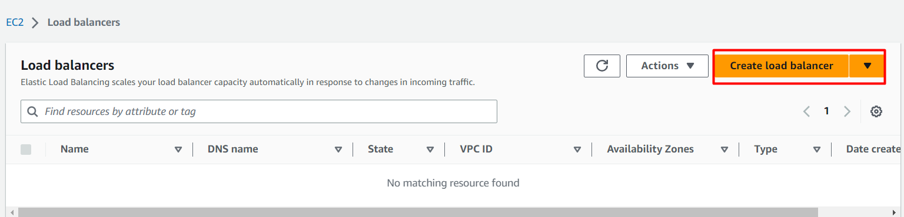

7. **Compare and select load balancer type**: **Application load balancer** の下にある **Create** ボタンをクリックします。

8. Application Load Balancer を作成するため、以下のように設定します:

   **Basic configuration セクション:**

   - Load balancer name: `httpd-LB`
   - Scheme: **Internet-facing** を選択
   - IP address type: **IPv4** を選択

   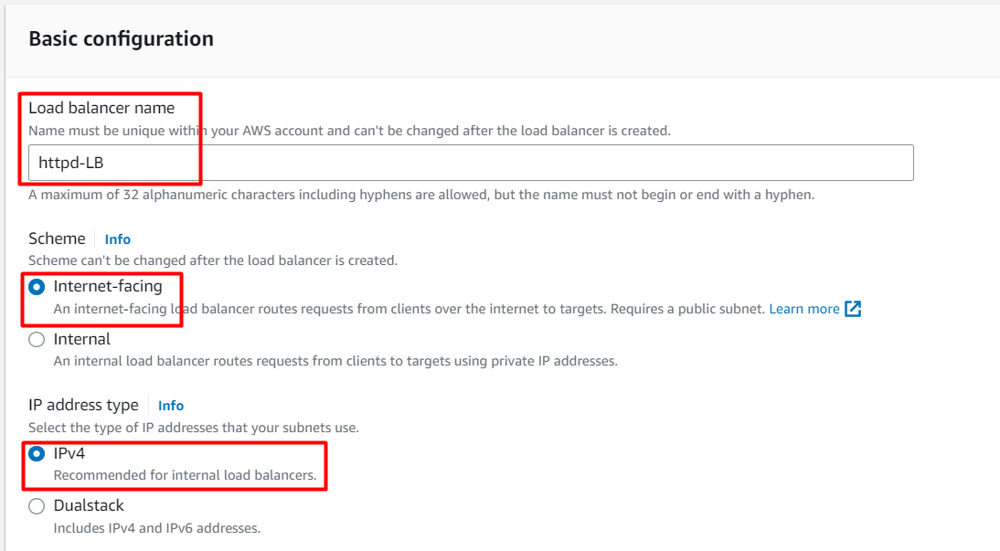

   **Network mapping セクション:**

   - VPC: **default** のままにします
   - Mappings: **すべての Availability Zone を選択**

   **Security groups セクション:**

   - ドロップダウンから **ALB-ECS-SG** を選択し、**デフォルトの Security Group を削除**します

   

   **Listeners and routing セクション:**

   - リスナーはすでに Protocol HTTP と Port 80 で存在しています
   - Default action forwards to オプションで、Target Group として **ecs-TG** を選択します

   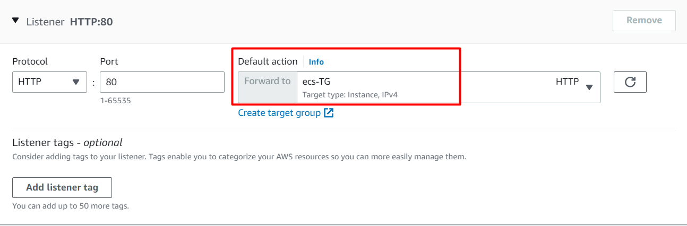

9. タグはデフォルトのままにして、**Create load balancer** ボタンをクリックします。

10. Application Load Balancer が正常に作成されました。**View load balancers** ボタンをクリックします。Load Balancer が **Active** になるまで 2〜3 分待ちます。

---

### Task 5: ECS Cluster を起動する

1. 上部の **Services** メニューをクリックし、**Containers** セクションの **Elastic Container Service** に移動します。

2. 左サイドバーの **Amazon ECS** セクションから **Clusters** オプションをクリックします。

3. **Create cluster** ボタンをクリックします。

   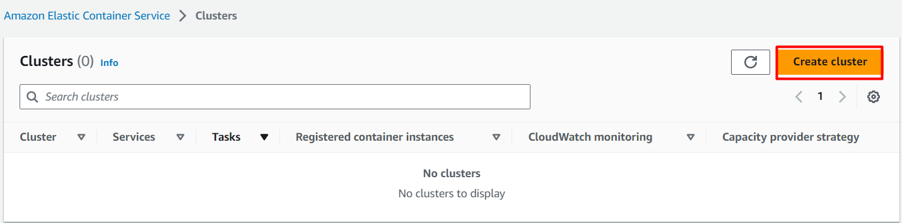

4. Cluster を作成します:

   **Step 1: Cluster Configuration:**

   - Cluster name: `whiz`

   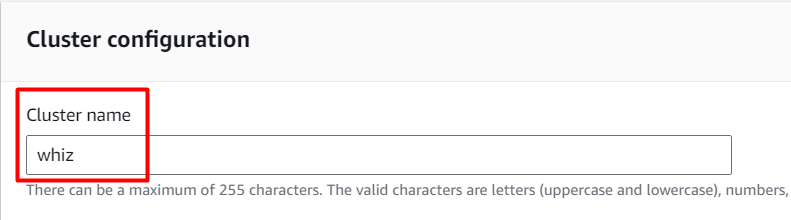

   **(オプション: Cluster name はデフォルトの自動生成されたものを使用することもできます)**

   **Step 2: Infrastructure セクション:**

   - **Amazon EC2 Instances** チェックボックスをチェック:
     - Auto Scaling group (ASG): **Create new ASG** を選択
     - Operating System/Architecture: **Amazon Linux 2** を選択
     - EC2 instance type: **t2.small** を選択
     - EC2 instance role: 既存の IAM ロール **ECS_Role** を選択
     - Desired capacity:
       - Minimum: `1`
       - Maximum: `3`
     - SSH Key pair: **WhizKeyPair** を選択

   **Step 3: Networking セクション:**

   - VPC: デフォルトのままにします
   - Subnets: **すべての Subnet を選択**

   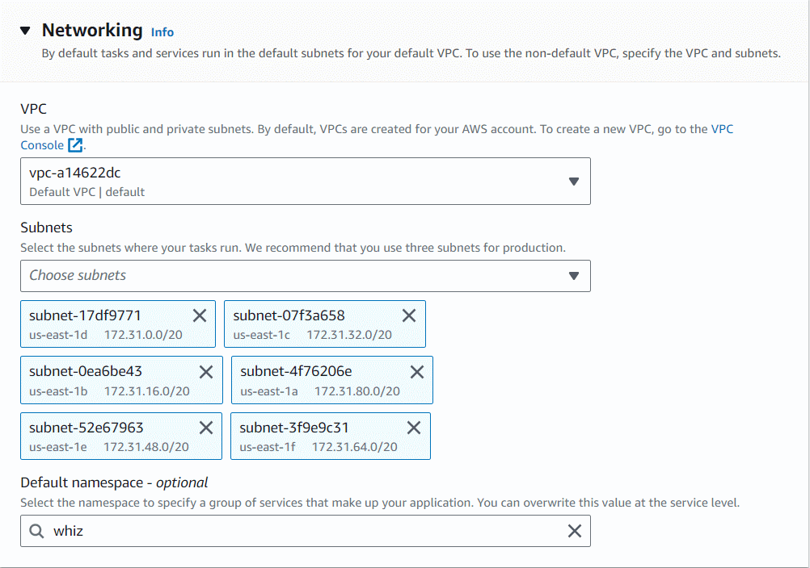

5. **Create** ボタンをクリックして **whiz ECS cluster** を作成します。Whiz ECS Cluster が **1 つの Container instances** で作成されます。

---

### Task 6: Task Definitions を作成する

1. 左サイドバーの **Amazon ECS** セクションから **Task Definitions** オプションをクリックします。

2. **Create new Task Definition** ボタンをクリックします。

   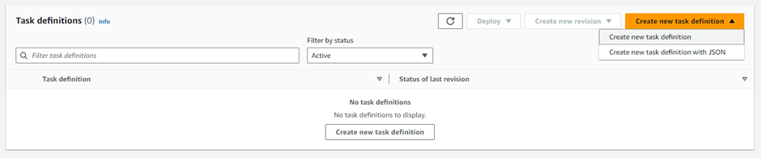

3. Task definition と Containers を設定します:

   **Step 1: Task definition configuration:**

   - Task definition family: `ecs-whiz`

   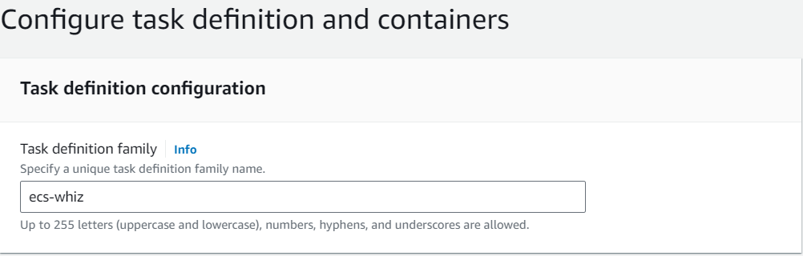

   **Step 2: Infrastructure requirements:**

   - App Environment: **AWS Fargate を削除**し、**Amazon EC2 Instances** を選択
   - Network Mode: **Bridge** を選択
   - Task size セクション:
     - CPU: **.25 vCPU**
     - Memory: **.5 GB**
   - Task Role: **none** を選択
   - Task execution role: **none** を選択

   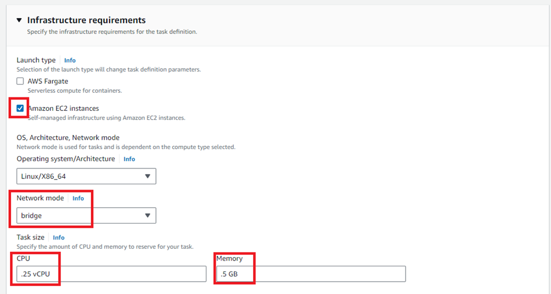

   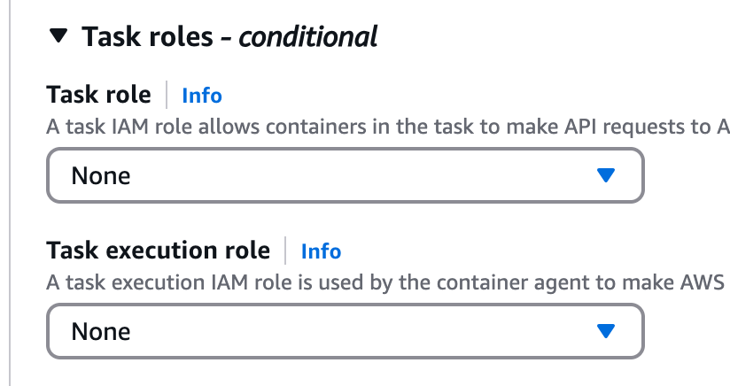

   **Step 3: Container - 1:**

   - Name: `httpd`
   - Image URI: `httpd:latest`
   - Port mappings フィールドに以下の情報を入力:
     - Container port: `80`
     - Protocol: **TCP**
     - App Protocol: **None** を選択

4. 下にスクロールして **Create** ボタンをクリックします。

5. Task Definition **ecs-whiz** が作成されました。

---

### Task 7: デフォルトの Security Group を更新する

1. **N.Virginia** リージョンにいることを確認します。

2. 上部の **Services** メニューから **Compute** セクションの **EC2** に移動します。

3. 左側パネルメニューの **Network & Security** セクションから **Security Groups** を選択します。

4. デフォルトの Security Group を選択し、**Actions** に移動して **Edit inbound rules** をクリックします。

   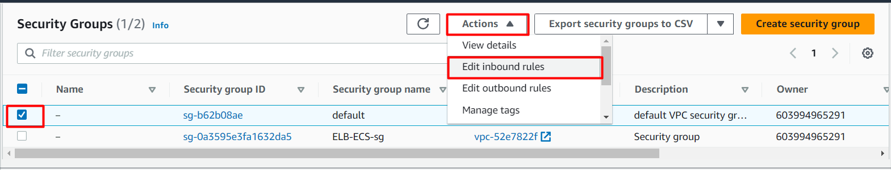

5. 下にスクロールして **Add Rule** ボタンをクリックします:

   - Type: **ALL TCP** を選択
   - Source: **Anywhere-IPv4** を選択
   - テキストボックスに `0.0.0.0/0` を追加

6. **Save rules** ボタンをクリックします。

---

### Task 8: Service を作成し、ECS で HTTPD コンテナを起動する

1. 左サイドバーの **Amazon ECS** セクションから **Clusters** オプションをクリックします。

2. whiz ECS Cluster がリストされます。**whiz** をクリックします。

   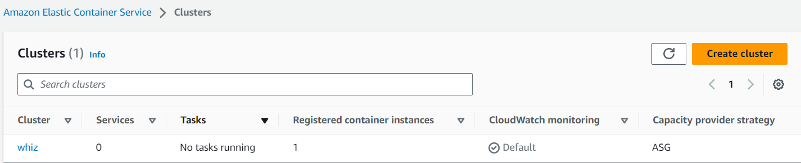

3. Service を作成するため、**Create** ボタンをクリックします。

   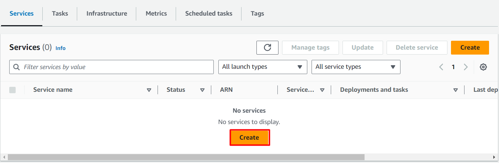

4. **Step 1: Environment** の設定:

   - Compute options: **Launch Type** を選択
   - Launch type: **EC2** を選択

   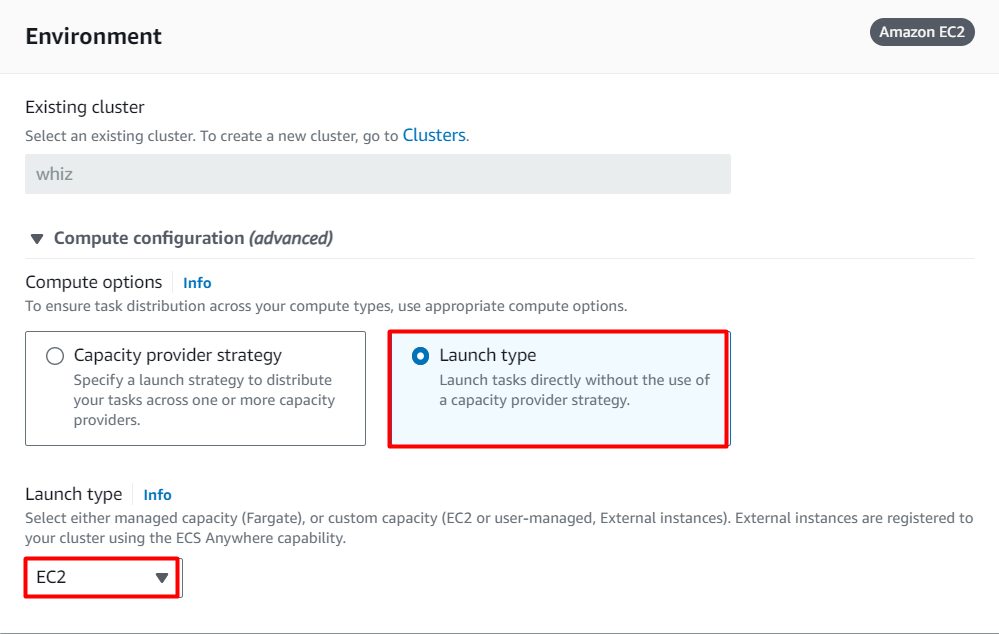

   - Family: **ecs-whiz**
   - Revision: **1 (latest)** [あなたの場合は異なる可能性があります]
   - Service name: `httpd-ecs`
   - Service type: **REPLICA**
   - Desired tasks: `1`

   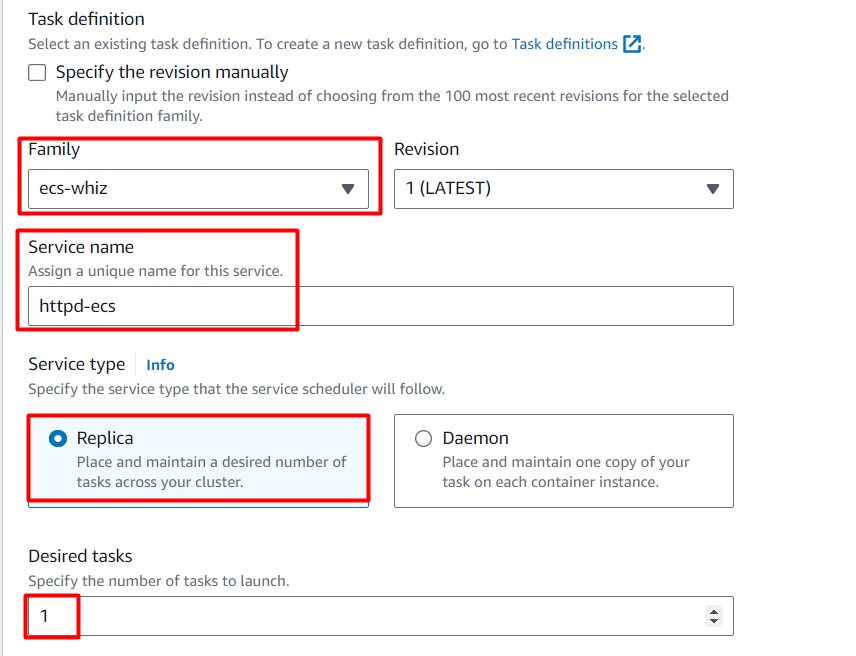

5. **Load balancing** の下で:

   - Load balancer type: **Application Load Balancer** を選択
   - Application Load Balancer: **Use an existing load balancer** を選択
   - Load balancer: **httpd-LB** を選択
   - Listener: **Use an existing Listener** を選択
   - Listener port: **80:HTTP** を選択
   - Target group: **Use an existing target group** を選択
   - Target group name: **ecs-tg** を選択

   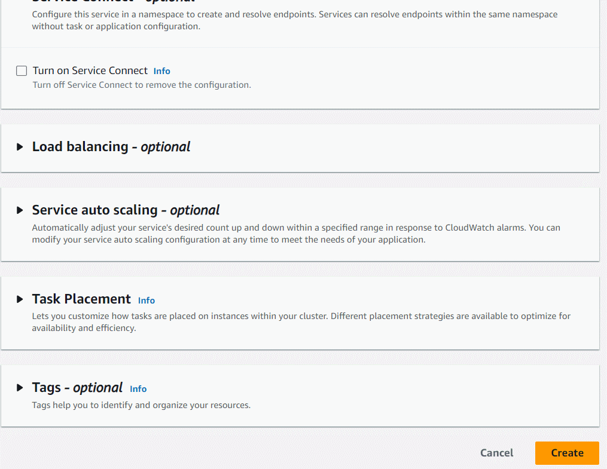

6. **Step 3: Set Auto Scaling (optional)** の設定:

   - **Use Service Auto Scaling** チェックボックスをチェック
   - Minimum number of Tasks: `1`
   - Maximum number of Tasks: `3`
   - Scaling policy type: **Target tracking**

   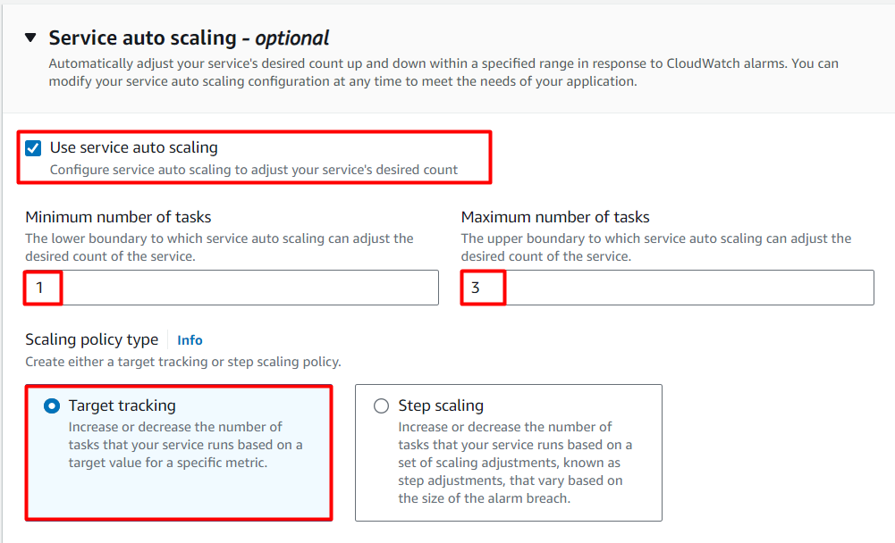

   - Policy name: `WhizPolicy`
   - ECS Service metric: **ALBRequestCountPerTarget**
   - Target value: `1000`
   - Scale-out cooldown period: `60` seconds between scaling actions
   - Scale-in cooldown period: `60` seconds between scaling actions

   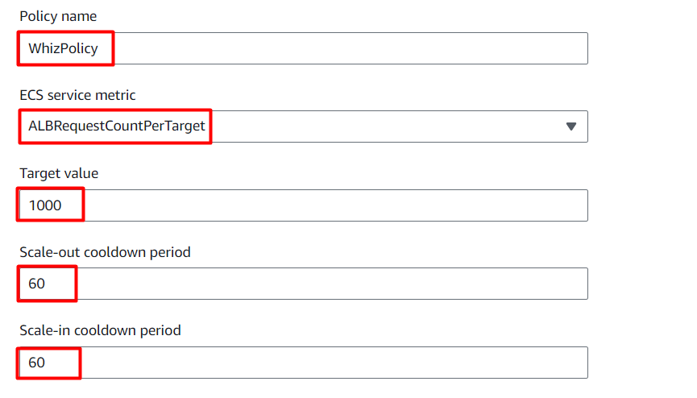

7. **Create** ボタンをクリックします。

   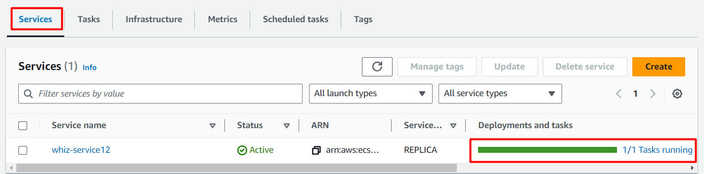

---

### Task 9: Cluster インスタンスに移動する

1. 左サイドバーの **Amazon ECS** セクションから **Clusters** オプションをクリックします。

2. **whiz** ECS Cluster がリストされます。**whiz** クラスターをクリックします。

   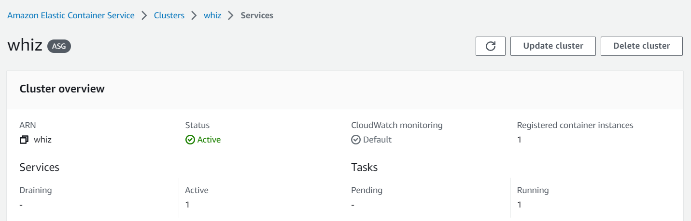

3. ECS Instance を表示するには、**Infrastructure** タブに移動し、下にスクロールして **Container instances** を確認します。**Instance ID** をクリックします。

   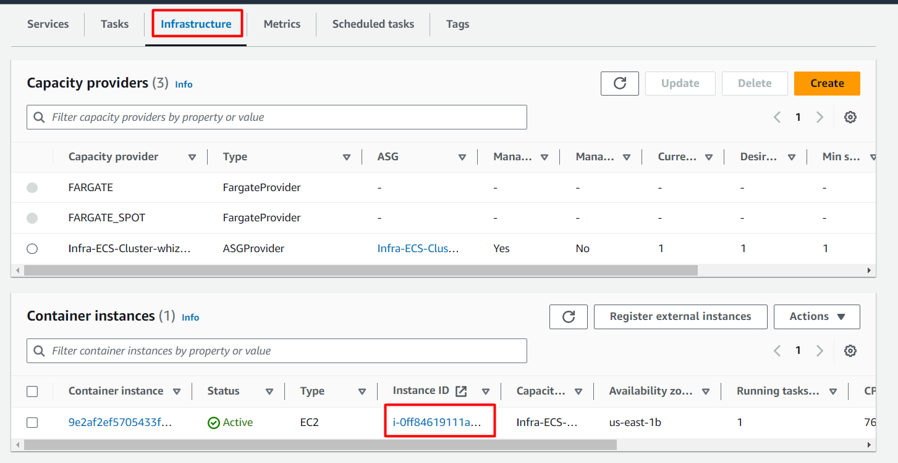

---

### Task 10: 基盤となる EC2 インスタンスに SSH 接続する

1. [SSH into EC2 Instance](https://whizlabs.com/labs/support-document/ssh-into-ec-instance) の手順に従ってください。

   **注意:** ECS インスタンスでは EC2 Instance Connect が機能しないため、他の SSH 方法をお試しください。

---

### Task 11: スケーリングアクティビティをトリガーする

1. 以下のコマンドを使用して root アクセスを取得します:

   ```bash
   sudo su
   ```

2. 以下のコマンドを使用してアップデートを実行します:

   ```bash
   yum -y update
   ```

3. 以下のコマンドを実行して Docker バージョンを確認します:

   ```bash
   docker version
   ```

4. ECS Cluster で実行されているすべての Docker プロセスを確認します:

   ```bash
   docker ps
   ```

5. ApacheBench (ab) ユーティリティを使用して、短時間に Load Balancer に数千の HTTP リクエストを行うために **httpd-tools** をインストールします:

   ```bash
   yum install -y httpd-tools
   ```

6. 以下のコマンドを実行します。**Load Balancer の DNS 名を置き換えてください**:

   ```bash
   ab -n 1000000 -c 1000 http://httpd-lb-558473488.us-east-1.elb.amazonaws.com/
   ```

   **注意:**

   - Load Balancer 名を置き換える際、最後に `/` を追加してください
   - **ab** HTTP リクエストが CloudWatch コンソールでスケールアウトアラームをトリガーするのを待ちます。Amazon ECS Service がスケールアウトし、Service の desired count に 2 つのタスクを追加するはずです。**ab** HTTP リクエストが完了した後(1〜2 分の間)、スケールインアラームがトリガーされ、スケールインポリシーが Service の desired count を 1 に戻します
   - スケーリングアクティビティには 5 分以上かかる場合があります

   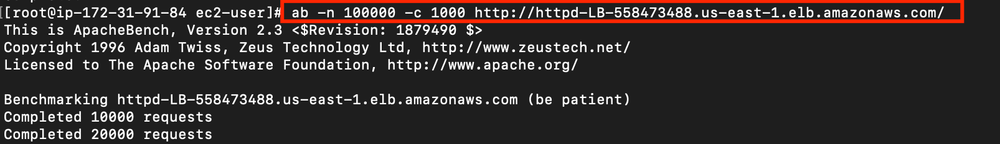

---

### Task 12: Service イベントでスケーリングアクティビティを確認する

1. 左サイドバーの **Amazon ECS** セクションから **Clusters** オプションをクリックします。

2. **whiz** ECS Cluster がリストされます。**whiz** クラスターをクリックします。

3. 実行中のタスクが現在 3 つであることを確認できます。

   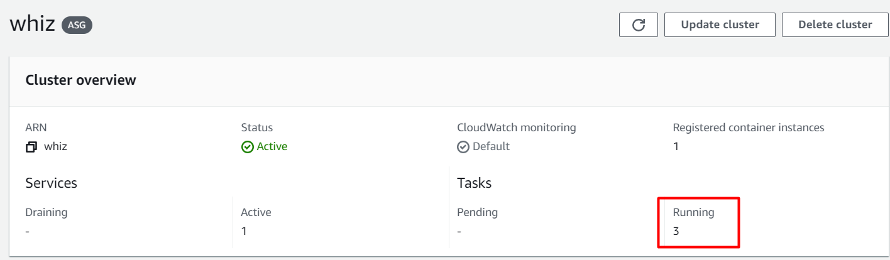

4. 下にスクロールして Service をクリックします。

5. **Events** タブに移動すると、Autoscaling がアラームをトリガーし、desired count が現在 3 になっていることがわかります。

   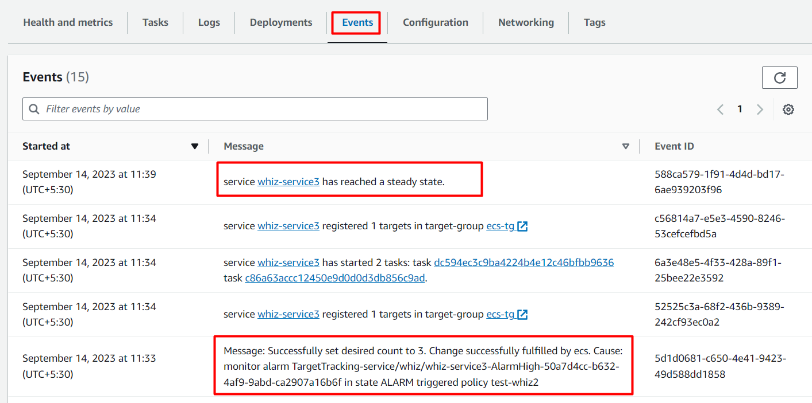

**豆知識:**  
裏側では、ECS Target Tracking ポリシーは CloudWatch アラームを活用して指定されたメトリクスを監視します。メトリクスが定義されたターゲットに違反すると、ECS はそれに応じてスケーリングアクションを実行します。

---

### Task 13: 検証テスト

1. ラボの手順が完了したら、右側パネルの **Validation** ボタンをクリックしてください。

2. これにより AWS アカウント内のリソースが検証され、このラボを正常に完了したかどうかが表示されます。

   

---

### Task 14: AWS リソースを削除する

#### 14.1 ECS Cluster Service を削除する

1. 左サイドバーの **Amazon ECS** セクションから **Clusters** オプションをクリックします。

2. whiz ECS Cluster がリストされます。**whiz** をクリックします。

3. Service を削除するには、以下のタスクを実行します:

   - 現在の Service を選択
   - **Delete service** ボタンをクリックします

   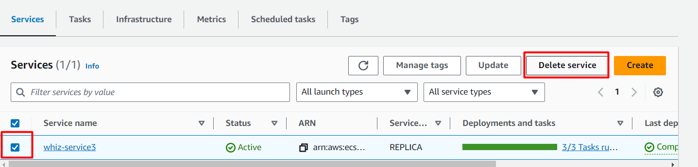

4. **Force delete** チェックボックスをチェックします。必要なフィールドに **delete** というフレーズを入力して削除を確認し、Delete ボタンをクリックします。

   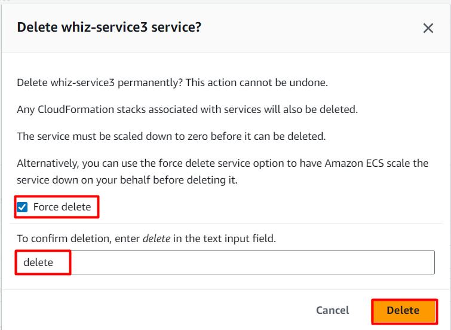

#### 14.2 ECS Cluster を削除する

1. **Delete Cluster** オプションをクリックします。

   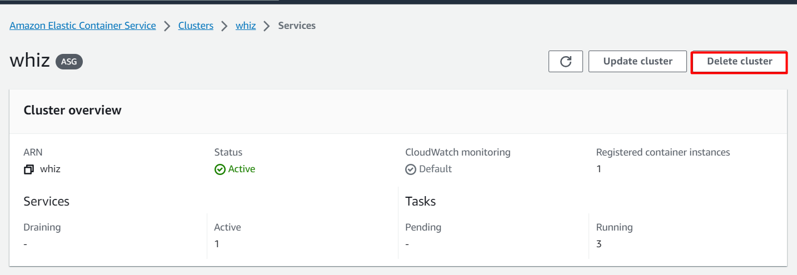

2. ポップアップウィンドウで **delete me** というフレーズを入力して削除を確認します。**Delete** ボタンをクリックします。

   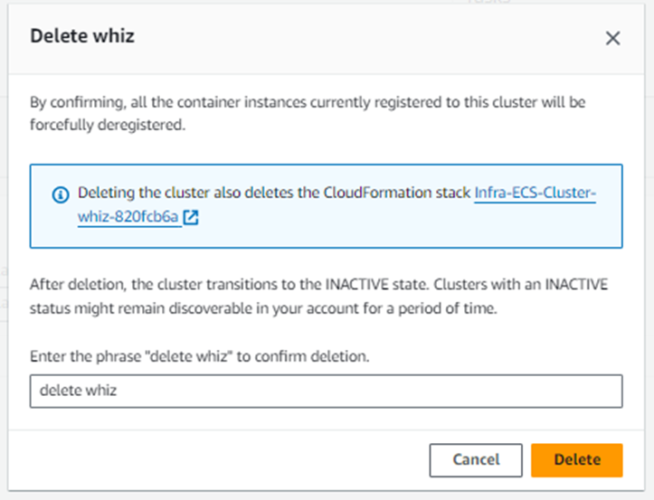

3. 削除には最大 3 分かかります。

#### 14.3 Load Balancer を削除する

1. EC2 コンソールで、左側パネルの **Load Balancer** に移動します。

2. **httpd-LB** がリストされます。

3. Load Balancer を削除するには、以下のアクションを実行します:

   - Load Balancer を選択
   - **Actions** ボタンをクリック
   - **Delete load balancer** オプションを選択

   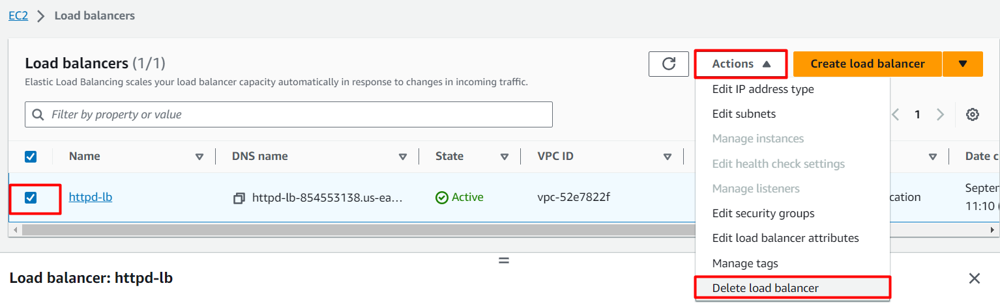

4. **confirm** と入力し、**Delete** ボタンをクリックします。**httpd-LB** が即座に削除されます。

#### 14.4 Target Group を削除する

1. EC2 コンソールで、左側パネルの **Target Groups** に移動します。

2. **ecs-TG** がリストされます。

3. Target Group を削除するには、以下のアクションを実行します:

   - Target Group を選択
   - **Actions** ボタンをクリック
   - **Delete** オプションを選択

4. ポップアップが表示されたら、**Yes, Delete** ボタンをクリックして確認します。

5. Target Group が即座に削除されます。

---

## 完了と結論

1. Amazon ECS Cluster の作成と起動に成功しました。

2. HTTPD コンテナの作成に成功しました。

3. Application Load Balancer と Target Group の作成に成功しました。

4. Auto-Scaling の作成とアクティビティのトリガーに成功しました。

---

## End Lab

1. AWS アカウントからサインアウトします。

2. ラボを正常に完了しました。

3. 手順を完了したら、Whizlabs ラボコンソールから **End Lab** をクリックし、プロセスが完了するまで待ちます。
