# Application Load Balancer を使用した ECS ラボ

## ラボの詳細

1. このラボでは、Application Load Balancer を使用して ECS クラスター上で HTTPD コンテナを起動、設定、管理する手順を学習します。

2. タスク定義とサービスを作成して、Amazon Elastic Container Service (ECS) クラスターを使用する練習を行います。クラスター内でサービスを作成する際に、既存の Application Load Balancer と Target Group を選択します。

3. 所要時間: **90 分**

4. AWS リージョン: **N. Virginia (us-east-1)**

## 概要

1. **タスク定義の作成:** ECS のタスク定義は、タスク内でコンテナをどのように実行するかを定義します。Docker イメージ、リソース要件、ネットワーキング、コンテナ間通信などの重要な情報が含まれます。

2. **サービスの作成:** ECS のサービスでは、指定した数のタスク定義インスタンスを実行および維持できます。サービスを作成する際、実行するタスクの数、使用するタスク定義、ロードバランシングなどの設定を指定します。

3. **ロードバランシングの設定:** サービスを作成する際、Application Load Balancer を使用して受信トラフィックを分散するように指定できます。ALB のリスナールール、ターゲットグループ、ヘルスチェックを設定する必要があります。

4. **ALB へのターゲットグループの登録:** サービスは、ALB に関連付けられた指定されたターゲットグループにタスク(コンテナ)を自動的に登録します。新しいタスクが起動されると自動的に登録され、タスクが終了するとターゲットグループから削除されます。

5. **ロードバランシングとスケーリング:** ALB は登録されたタスクの健全性を継続的に監視し、正常なコンテナにトラフィックをルーティングします。ECS サービスの自動スケーリングを有効にすると、CPU 使用率、メモリ使用量、またはその他の CloudWatch メトリクスに基づいて、実行中のタスク数を動的に調整できます。

6. Amazon ECS で Application Load Balancer を利用することで、コンテナ化されたアプリケーションが回復力があり、高可用性で、一貫したユーザーエクスペリエンスを維持しながら、さまざまなレベルのトラフィックに対応できることを保証できます。ロードバランサーは負荷をインテリジェントに分散し、パフォーマンスのボトルネックのリスクを軽減し、アプリケーションの応答性と信頼性を確保します。

## アーキテクチャ図


## タスクの詳細

1. AWS Management Console にサインインする

2. ECS クラスター用のセキュリティグループを作成する

3. ECS クラスター内の EC2 インスタンス用のキーペアを作成する

4. ロードバランサーを作成する

5. ECS クラスターを起動する

6. タスク定義を作成する

7. サービスを作成し、ECS で HTTPD コンテナを起動する

8. ECS クラスター内の HTTPD コンテナをテストする

9. 基盤となる EC2 インスタンスに SSH 接続し、Docker コマンドを実行する

10. 実行中の Docker コンテナに SSH 接続する

11. ロードバランサーをテストする

12. ラボの検証を行う

13. AWS リソースを削除する

## ラボ環境の起動

1. ラボ環境を起動するには、**Start Lab**ボタンをクリックします。

2. クラウド環境がプロビジョニングされるまでお待ちください。プロビジョニングには 1 分もかかりません。

3. ラボが開始されると、**IAM ユーザー名**、**パスワード**、**アクセスキー**、**シークレットアクセスキー**が提供されます。

> **注意**: 一度に開始できるラボは 1 つだけです

---

## ラボの手順

### タスク 1: AWS Management Console にサインインする

1. **Open Console**ボタンをクリックすると、新しいブラウザタブで AWS コンソールにリダイレクトされます。

2. AWS サインインページで、

   - アカウント ID はデフォルトのままにしてください。AWS コンソールに表示されている 12 桁のアカウント ID を編集/削除しないでください。削除するとラボを続行できません。
   - ラボコンソールの**User Name**と**Password**をコピーして、AWS コンソールの**IAM Username and Password**に貼り付け、**Sign in**ボタンをクリックします。

3. AWS Management Console にサインインしたら、デフォルトの AWS リージョンを**US East (N. Virginia) us-east-1**に設定します。

### タスク 2: ロードバランサー用のセキュリティグループを作成する

1. **N.Virginia**リージョンにいることを確認してください。

2. 左上の**Services**メニューをクリックし、**Compute**セクションの**EC2**をクリックして、EC2 に移動します。

3. 左側のパネルメニューで、**Network & Security**セクションの下にあるセキュリティグループを選択します。

4. **Create Security Group**をクリックします。

5. ECS クラスター用のセキュリティグループを作成します。
   - Security group name: **ALB-SG** と入力
   - Description: **Security group for the load balancer** と入力
   - VPC: **Default VPC** を選択

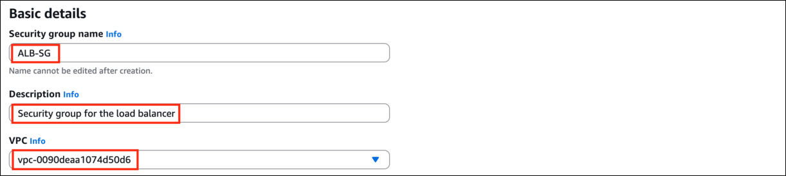

- **Inbound rules**の下にある**Add Rule**をクリックします。
  - Type: **All TCP** を選択
  - Source: **Anywhere-IPv4** を選択
  - テキストボックスに **0.0.0.0/0** を追加

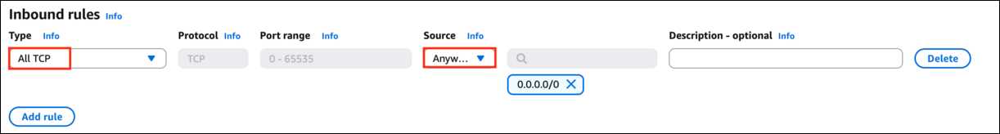

6. その他はデフォルトのままにして、**Create Security group**をクリックします。

### タスク 3: ECS クラスター用のセキュリティグループを作成する

1. 左側のパネルメニューで、**Network & Security**セクションの下にあるセキュリティグループを選択します。

2. **Create Security group**をクリックします。

3. ECS クラスター用のセキュリティグループを作成します。
   - Security group name: **ECS-SG** と入力
   - Description: **Security group for ECS Cluster** と入力
   - VPC: **Default VPC** を選択

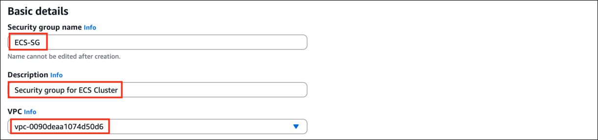

- **Inbound rules**の下にある**Add Rule**をクリックします。
  - Type: **SSH** を選択
  - Source: **Anywhere-IPv4** を選択
  - ロードバランサーのセキュリティグループからの**All TCP**トラフィックを追加するために、**Add Rule**をクリックします
  - Type: **All TCP** を選択
  - Source: **Custom** を選択
  - テキストボックスに **ALB-SG** と入力して**ALB-SG**を選択

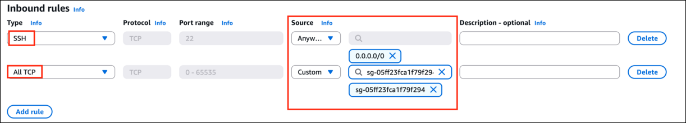

4. その他はデフォルトのままにして、**Create Security group**をクリックします。

### タスク 4: ECS クラスター内の EC2 インスタンス用のキーペアを作成する

1. 左側のナビゲーションペインで(下にスクロール)、**Network & Security**内の**Key Pairs**をクリックします。

2. 新しいキーペアを作成するには、**Create Key pair**をクリックします。

3. 以下の詳細を入力します:
   - Name: **WhizKeyPair** と入力
   - Key Pair Type: **RSA** を選択
   - Private key file format: **pem (Linux & Mac Users)** または **ppk (Windows users)**
   - その他のオプションはデフォルトのままにします。
   - **Create Key pair**をクリックします。


4. Create key pair をクリックすると、キーペアをローカルにダウンロードするためのポップアップが表示されるので、そのファイルを保存します。

5. キーペアが作成されます。

### タスク 5: ロードバランサーを作成する

1. EC2 コンソールで、左側のパネルの"**Load Balancers**"に移動します。

2. 左上の**Create Load balancer**をクリックして、Web サーバー用の新しいロードバランサーを作成します。

3. 次の画面で、Web アプリケーションの高可用性をテストするため、**Application Load Balancer**を選択し、**create**をクリックします。

4. **Configure the load balancer**で以下のように設定します
   - Name: **httpd-LB** と入力
   - Scheme: **Internet-facing** を選択
   - IP address type: **ipv4** を選択

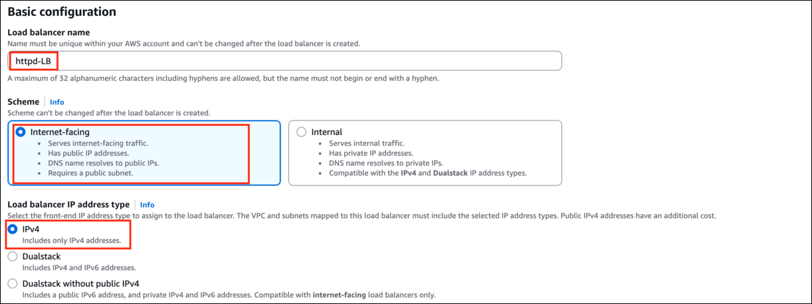

- Availability Zones: **us-east-1a** と **us-east-1b** を選択
- VPC: **Default** を選択

> **注意:** ロードバランサーを有効にするアベイラビリティゾーンを指定する必要があります。これにより、それらのアベイラビリティゾーンで起動されたターゲットにのみトラフィックがルーティングされます。ロードバランサーを**高可用性**にするには、**最低 2 つのアベイラビリティゾーンのサブネット**を含める必要があります。

5. **Security Groups について:** 既存のセキュリティグループを削除し、セキュリティグループ**ALB-SG**を選択します。

6. Listeners and Routing で

   - Protocol: **HTTP**
   - Port: **80**
   - **Default action**の下:
     - Routing action: **Forward to target groups** を選択
     - **create target group**をクリックします。
       - Choose Target Type: **Instances** を選択
       - Name: **ecs-TG** と入力
       - その他はデフォルトのままにします。
       - **注意: ターゲットグループ**は、1 つ以上の登録されたターゲットに**リクエストをルーティング**するために使用されます
       - 注意: ロードバランサーは定期的に ping を送信したり、接続を試みたり、EC2 インスタンスをテストするためのリクエストを送信します。これらのテストはヘルスチェックと呼ばれます。
       - **Next**をクリックします。

7. このページはデフォルトのままにして、**Create target group**ボタンをクリックし、ロードバランサーのタブに戻ります。

8. **Step 7**で作成したターゲットグループを選択します。

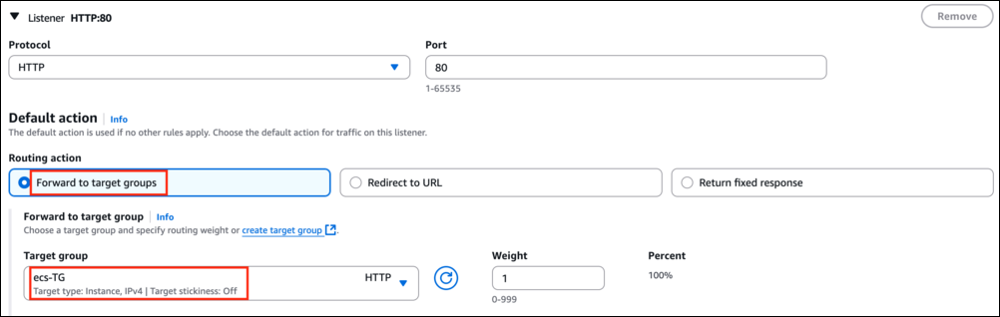

9. **Create Load Balancer**ボタンをクリックします。**Application Load balancer**が**正常に作成**されました。

10. ロードバランサーが**Active**になるまで 2〜3 分待ちます。

### タスク 6: ECS クラスターを起動する

1. 上部の**Services**メニューをクリックして、**Containers**セクションの**Elastic Container Service**をクリックし、Elastic Container Service に移動します。

2. 左側のサイドバーから**Cluster**セクションに移動し、**Create Cluster**ボタンをクリックします。

3. Cluster name: **whiz**

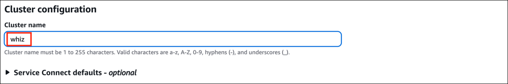

4. **Infrastructure**の下:
   - **Fargate and Self-managed instances** を選択
   - Auto Scaling group: **Create new Auto Scaling group** を選択
   - Provisioning Model: **On-Demand** を選択
   - AMI: **Amazon Linux 2023**
   - EC2 instance type: **t2.micro**
   - EC2 instance role: 既存の **Ecs_role_random_number** を選択

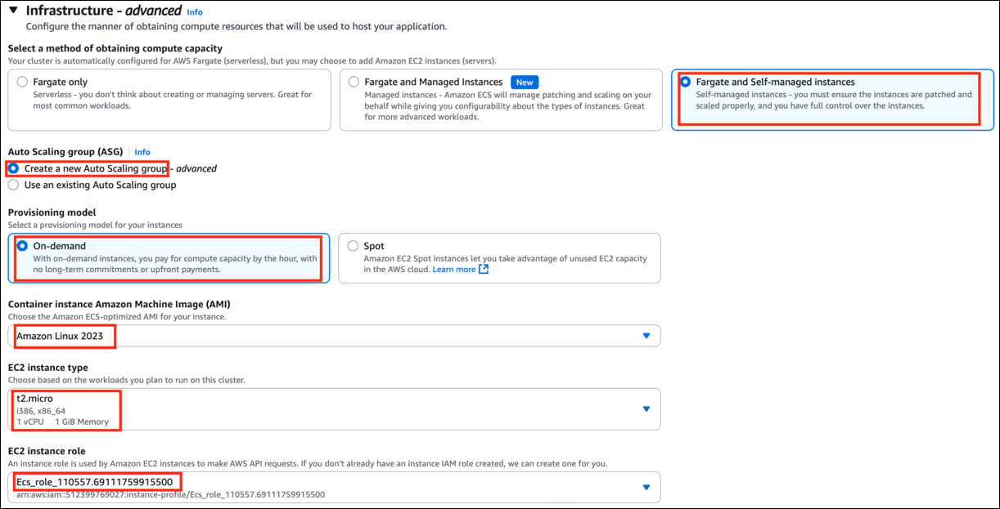

- 希望容量を **Minimum: 1 and Maximum: 1** に設定
- Key pair: **WhizKeyPair** を選択
- Root EBS Volume Size (GiB): **30** と入力(デフォルト)

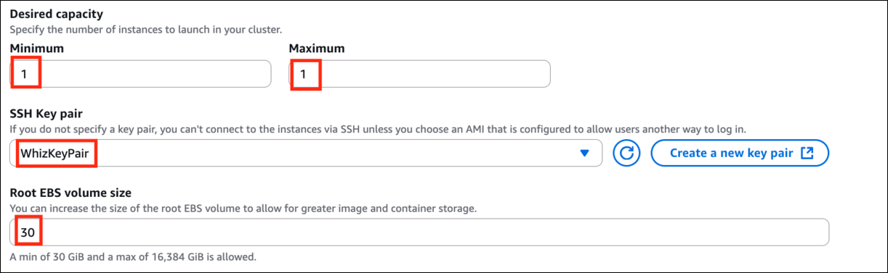

5. **Step 3:** **Network settings**の下
   - VPC: **Default VPC**
   - Subnets: **us-east-1a** と **us-east-1b** を選択
   - Security group: **ECS-SG** セキュリティグループを選択
   - Auto-assign public IP: **Use subnet setting**

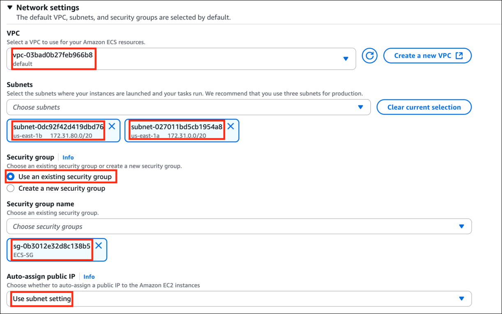

6. その他のオプションはデフォルトのままにします。

7. **Create**ボタンをクリックして、**whiz** ECS クラスターを作成します

8. ECS クラスターは 2 分で作成されます。

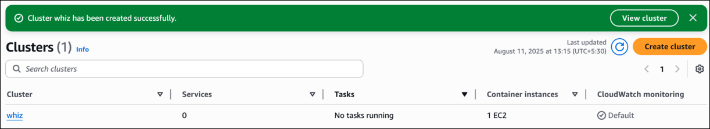

### タスク 7: タスク定義を作成する

1. 左側のサイドバーで、**Amazon ECS**セクションの下にある**Task Definitions**オプションをクリックします。

2. **Create New task definition**をクリックします。

3. タスク定義ファミリー名を入力: **ecs-whiz**

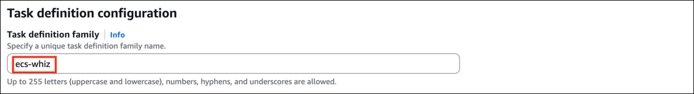

4. **Infrastructure requirements**について
   - Launch type: **AWS Fargate** を削除して **AWS EC2 instances** を選択
   - Network Mode: **bridge** を選択
   - **Task Size について:**
     - CPU: **.256 vCPU**
     - Memory: **.25 GB**
     - Task Role: **None**
     - Task Execution Role: **None**

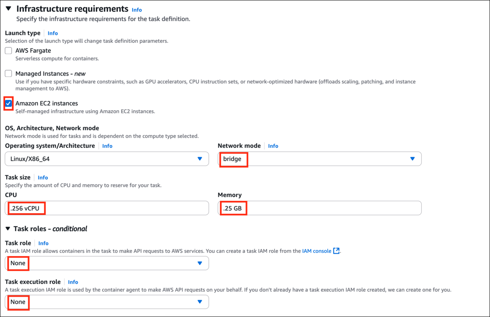

5. **Container - 1**の下
   - Container name: **httpd** と入力
   - Image: **httpd:2.4** と入力(余分なスペースがないことを確認してください)

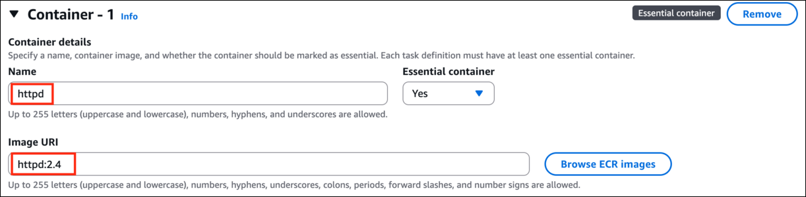

6. その他のオプションはデフォルトのままにして、**Create**ボタンをクリックします。

7. タスク定義 **ecs-whiz** が作成されました。

### タスク 8: サービスを作成し、ECS で HTTPD コンテナを起動する

1. 左側のサイドバーで、**Amazon ECS**セクションの下にある**Clusters**オプションをクリックします。

2. **whiz** ECS クラスターがここにリストされているので、**whiz**をクリックします。

3. サービスを作成するには、サービスタブまでスクロールダウンし、**Create**ボタンをクリックします。

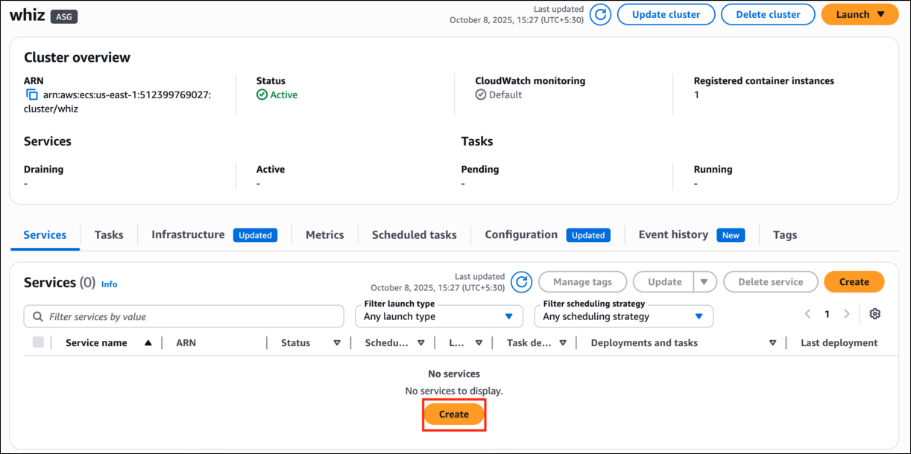

4. サービスの詳細:
   - Task definition family: **ecs-whiz** を選択
   - Task definition revision: デフォルトのままにします
   - Service name: **httpd-ecs**

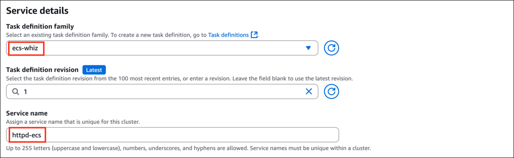

5. **Environment**の下:
   - Compute options: **Launch type** を選択
   - Launch type: **EC2** を選択
   - Scheduling strategy: **Replica** を選択
   - Desired tasks: **3** と入力

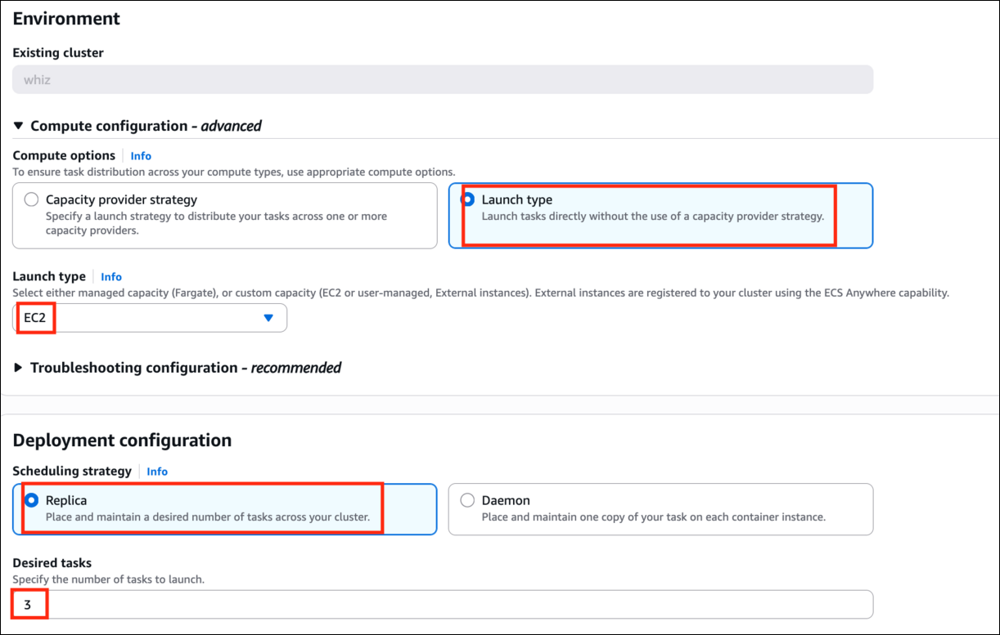

6. **Load Balancing**セクションで:
   - **Use load balancing** にチェック
   - VPC: **default vpc** を選択
   - Load balancer type: **Application Load Balancer** を選択
   - Specify Application Load Balancer: **Use an existing load balancer** を選択
   - Load balancer name: **httpd-LB** を選択

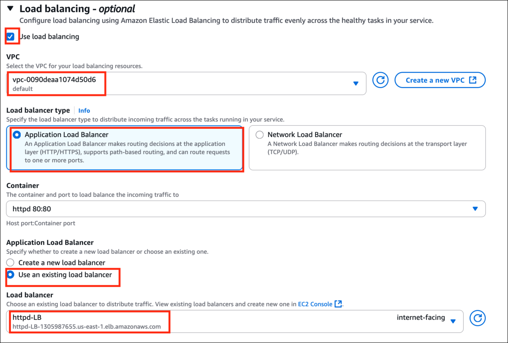

- Listener: **use an existing listener**
- Listener: **80:HTTP** を選択
- Target Group: **use an existing target group**
- Target group name: **ecs-TG** を選択

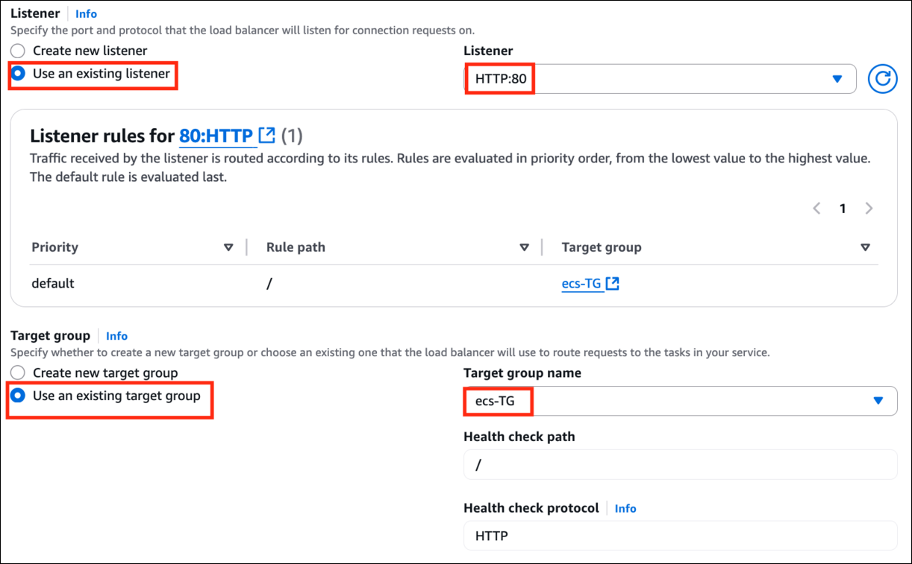

- その他のオプションはデフォルトのままにします。すべてを確認して、**Create service**をクリックします。

7. サービスが作成されます。Deployments と Tasks が**3/3 Tasks running**に変わるまで待ちます。

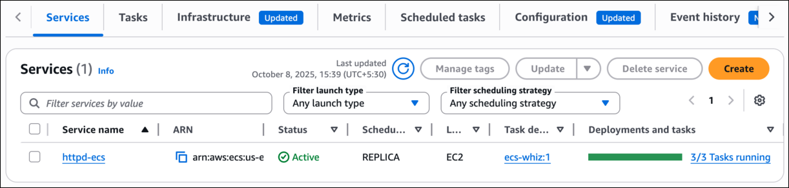

8. タスクが実行されています。**Tasks**タブに切り替えて確認しましょう。

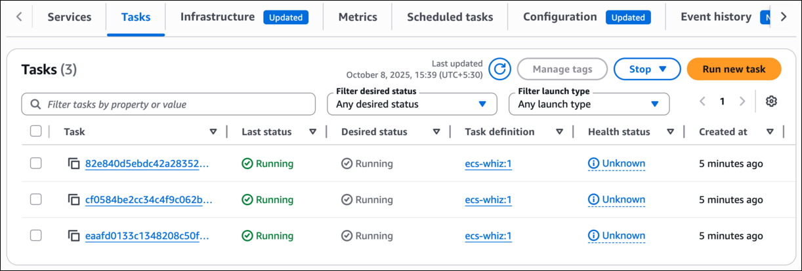

9. **service name** (httpd-ecs)をクリックして、**Events**タブに切り替えて、イベントの履歴を確認します。

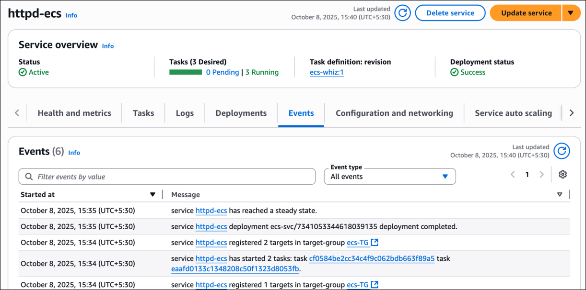

### タスク 9: ECS クラスター内の HTTPD コンテナをテストする

1. 左側のサイドバーで、**Amazon ECS**セクションの下にある**Clusters**オプションをクリックします。

2. **whiz** ECS クラスターがここにリストされているので、**whiz**クラスターをクリックします。

3. ECS インスタンスを表示するには、
   - **Infrastructure**タブに切り替えます
   - **Container Instances**の下
   - そこにある**Instance ID**をクリックします。

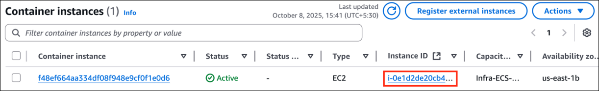

4. インスタンスの概要が表示されます。

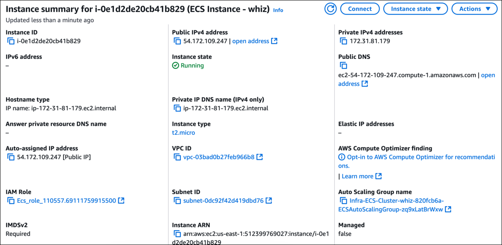

### タスク 10: 基盤となる EC2 インスタンスに SSH 接続し、Docker コマンドを実行する

1. [SSH into EC2 Instance](https://www.whizlabs.com/labs/support-document/ssh-into-ec-instance)の手順に従ってください

> **注意:** EC2 インスタンス接続は ECS インスタンスでは機能しないため、他の SSH 方法を試してください。

2. 次のコマンドを使用して root 権限を取得します:

```bash
sudo su
```

3. 次のコマンドを使用してアップデートを実行します:

```bash
yum -y update
```

4. 次のコマンドを実行して Docker のバージョンを確認します:

```bash
docker version
```

5. ECS クラスターで実行されているすべての Docker プロセスを確認します

```bash
docker ps
```

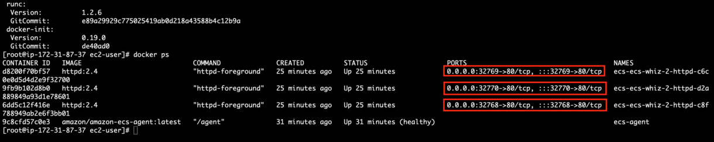

- デフォルトの**ECS エージェントと 3 つの httpd コンテナ**が基盤となる EC2 インスタンスで実行されています。
- **これは動的ポート、つまり 32767、32768、32769 を使用しています。**

### タスク 11: 実行中の Docker コンテナに SSH 接続する

1. Docker コンテナに入る理由は、実行中の 3 つのコンテナすべてが同じ出力を持つためです。実行されているポートに応じてカスタマイズしましょう。

2. 最初の実行中のコンテナに SSH 接続するには、**docker ps**を使用してリストされたコンテナ ID をコピーし、次のコマンドを実行します:

   - **構文:**

   ```bash
   docker exec -it {container-id} /bin/bash
   ```

   - **例: docker exec -it d8200f70bf57 /bin/bash**

3. **htdocs**フォルダにある index.html ファイルに、このポートからのトラフィックが来ていることを追加するには、次のコマンドを実行します:

```bash
echo "Traffic coming from 32769 port" >> htdocs/index.html
```

4. 次のコマンドを使用して、htdocs フォルダにある index.html ファイルを表示します:

```bash
cat htdocs/index.html
```

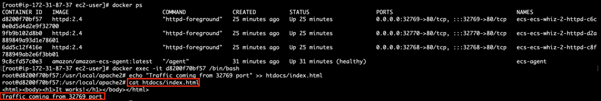

5. このコンテナから抜けるには、**exit**コマンドを入力して Enter キーを押します。

6. 他の 2 つのコンテナに対して Step-2 から同じ手順を繰り返し、ポート番号を変更することを忘れないでください。

### タスク 12: ロードバランサーをテストする

1. 左側のメニューセクションから**Target Groups**をクリックします。

2. **ecs-TG**を選択し、**Targets**メニューに移動します。

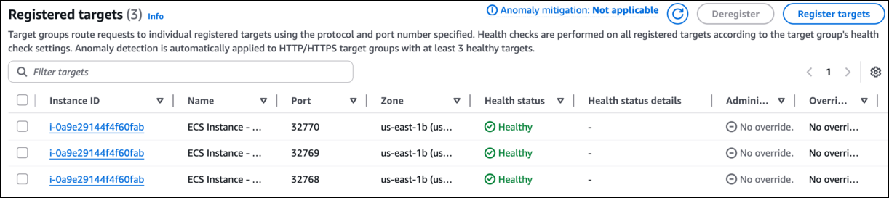

> **注意:** インスタンスの**status**列が**healthy**に変わるまで待ちます(これは、すべてのコンテナが ELB ヘルスチェックに合格したことを意味します)

3. 次に、**Load Balancer**に移動し、ALB の状態が**active**であることを確認します。ALB の**DNS name**をコピーして、**ブラウザ**にアドレスを入力します。

   - **DNS 例:** httpd-LB-1244528727.us-east-1.elb.amazonaws.com

4. 異なるコンテナの**index.html**ページの内容と、**32768、32769、32770 ポート**からのトラフィックが表示されるはずです。

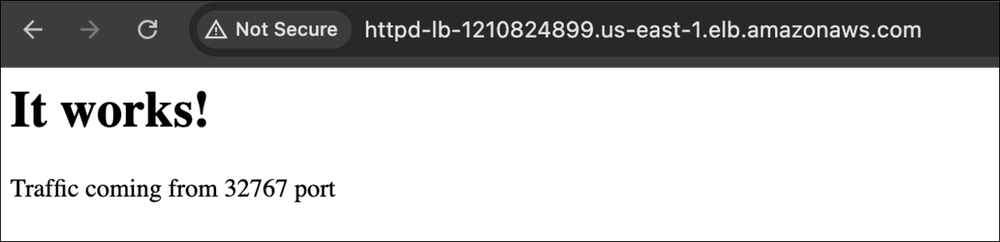

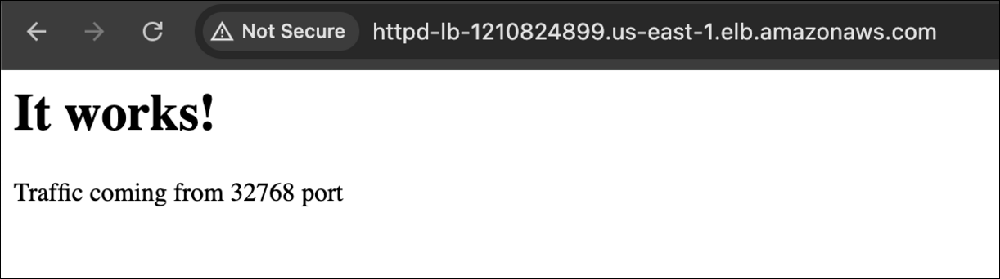

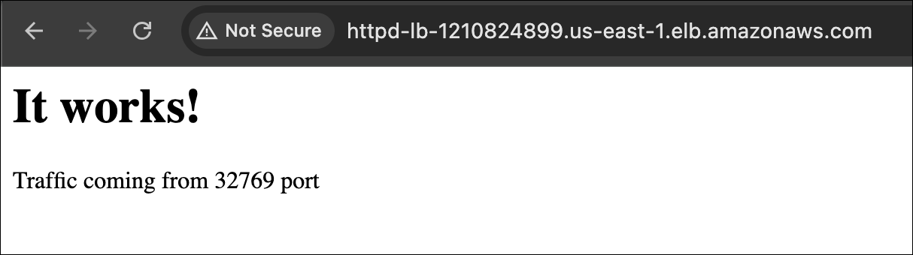

## 完了と結論

1. Amazon ECS クラスターの作成と起動に成功しました。

2. HTTPD コンテナの作成に成功しました。

3. Application Load Balancer と Target Group の作成に成功しました。

## ラボの終了

1. AWS アカウントからサインアウトします。

2. ラボが正常に完了しました。

3. 手順が完了したら、whizlabs ラボコンソールから**End Lab**をクリックし、プロセスが完了するまで待ちます。
