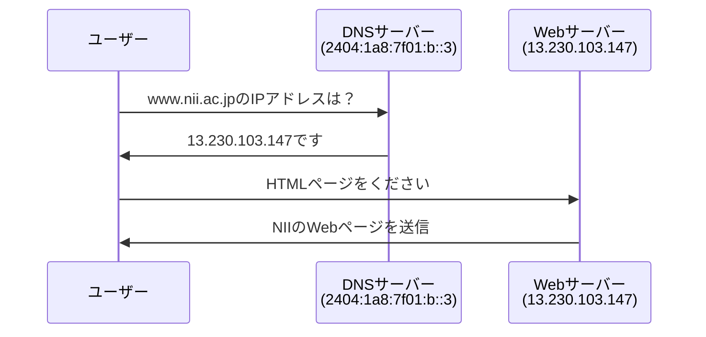

# nslookup コマンドの結果解説

## 実行されたコマンド

```powershell
PS C:\Users\user1> nslookup www.nii.ac.jp
```

## 結果の詳細分析

### DNS サーバー情報

```
サーバー:  UnKnown
Address:  2404:1a8:7f01:b::3
```

- **サーバー名**: UnKnown（DNS サーバーの逆引き名前解決ができない状態）
- **IP アドレス**: `2404:1a8:7f01:b::3`（**IPv6 アドレス** - DNS サーバーのアドレス）
- この DNS サーバーが名前解決の問い合わせに応答している

### 名前解決の結果

#### 実際のホスト名（Canonical Name）

```
名前: lb-nii-ssl-www-333134043.ap-northeast-1.elb.amazonaws.com
```

- これが**実際の正式名称（FQDN: Fully Qualified Domain Name）**
- AWS の Elastic Load Balancer（ELB）のドメイン名
- `ap-northeast-1`は東京リージョンを示す

#### IP アドレス

```
Addresses: 13.230.103.147
          35.78.49.29
```

- **2 つの IPv4 アドレス**が返されている（www.nii.ac.jpのWebサーバーのIPアドレス）
- これはロードバランサーによる冗長化構成を示している

#### エイリアス（別名）

```
Aliases: www.nii.ac.jp
```

- `www.nii.ac.jp`は**エイリアス（CNAME）**
- 実際のサーバー名ではなく、別名設定

## DNS 名前解決の流れ

### 1. エイリアス解決

```
www.nii.ac.jp → lb-nii-ssl-www-333134043.ap-northeast-1.elb.amazonaws.com
```

### 2. IP アドレス解決

```
lb-nii-ssl-www-333134043.ap-northeast-1.elb.amazonaws.com → 13.230.103.147, 35.78.49.29
```

## 技術的な解説

### CNAME レコードとは

- **CNAME（Canonical Name）**: DNS レコードの一種
- ドメイン名の別名を設定する仕組み
- `www.nii.ac.jp`という覚えやすい名前で、実際の AWS リソースにアクセス可能

### AWS の Elastic Load Balancer（ELB）

- **ロードバランサー**: 複数のサーバーに負荷を分散する仕組み
- 高可用性とパフォーマンス向上を実現
- 複数の IP アドレスが返されるのは、冗長化のため

### 現代のクラウドサービスでの活用

- **CDN（Content Delivery Network）技術**と類似
- クラウドサービス（Azure 等）でのプライベート通信でも使用
- スケーラビリティと可用性の向上

## ブラウザでのアクセス時の注意点

### IP アドレス直接アクセス時の警告

- IP アドレスで直接アクセスすると、SSL 証明書の警告が表示される可能性
- 証明書は通常、ドメイン名（`www.nii.ac.jp`）に対して発行されているため
- セキュリティ警告が出ても、実際のサービスは利用可能

## まとめ

この結果は、現代的なクラウドインフラストラクチャの典型例を示しています：

1. **ユーザーフレンドリーなドメイン名**（www.nii.ac.jp）
2. **実際のクラウドリソース**（AWS ELB）
3. **負荷分散と冗長化**（複数 IPv4 アドレス）
4. **高可用性の実現**

## DNS サーバーと Web サーバーの違い

### DNS サーバー（Domain Name System Server）

**役割**: ドメイン名と IP アドレスの変換を行う

```
役割: www.nii.ac.jp → 13.230.103.147 の変換
```

**特徴**:

- **電話帳のような役割**: ドメイン名（人間が覚えやすい名前）を IP アドレス（コンピューターが理解できる数字）に変換
- **常に動作**: インターネット上のあらゆる名前解決に必要
- **階層構造**: ルート DNS → トップレベルドメイン DNS → 権威 DNS サーバー
- **キャッシュ機能**: 一度解決した結果を一定時間保存して高速化

**この例での DNS サーバー**:

- IP アドレス: `2404:1a8:7f01:b::3`
- 私たちが「www.nii.ac.jpのIPアドレスを教えて」と問い合わせたサーバー

### Web サーバー（Web Server）

**役割**: Web ページやコンテンツを提供する

```
役割: HTMLファイル、画像、CSSなどのWebコンテンツを配信
```

**特徴**:

- **実際のサービス提供**: ユーザーが見る Web ページを配信
- **HTTP プロトコル**: ブラウザとの通信に HTTP/HTTPS を使用
- **コンテンツ処理**: 静的ファイルの配信や動的コンテンツの生成
- **アプリケーション実行**: データベース連携、ユーザー認証など

**この例での Web サーバー**:

- IP アドレス: `13.230.103.147`, `35.78.49.29`
- 実際に NII の Web サイトのコンテンツを配信するサーバー

### 具体的な流れ



### 比較表

| 項目               | DNS サーバー              | Web サーバー                    |
| ------------------ | ------------------------- | ------------------------------- |
| **主な役割**       | 名前解決（翻訳）          | コンテンツ配信                  |
| **プロトコル**     | DNS (UDP/TCP 53 番ポート) | HTTP/HTTPS (80/443 番ポート)    |
| **この例の IP**    | `2404:1a8:7f01:b::3`      | `13.230.103.147`, `35.78.49.29` |
| **IPv 版**         | IPv6                      | IPv4                            |
| **動作タイミング** | Web アクセス前            | Web アクセス中                  |
| **返す内容**       | IP アドレス               | HTML ファイル等                 |

## IP アドレスの種類について

**重要なポイント**: この結果には**3 つの IP アドレス**が含まれています：

1. **DNS サーバーの IP アドレス**: `2404:1a8:7f01:b::3`（IPv6）

   - 名前解決を実行した DNS サーバー自体のアドレス

2. **Web サーバーの IP アドレス**: `13.230.103.147`, `35.78.49.29`（IPv4）
   - www.nii.ac.jpにアクセスする際の実際の宛先IPアドレス

このような構成により、サービスの可用性とパフォーマンスが大幅に向上しています。
