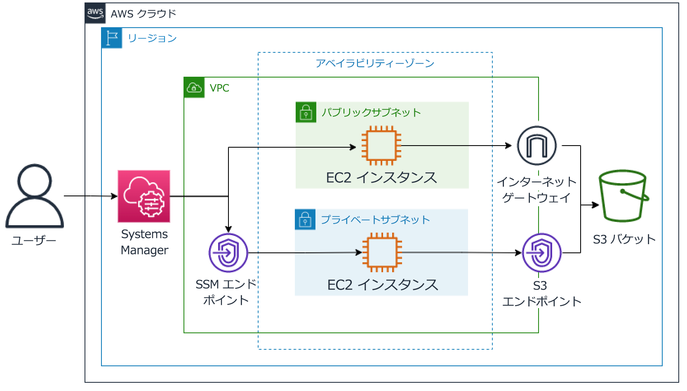
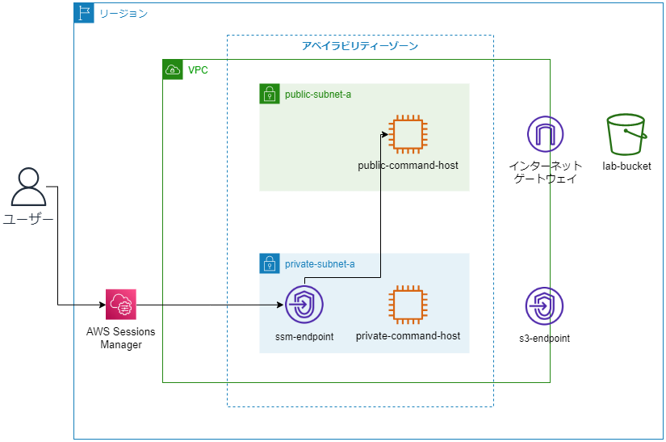
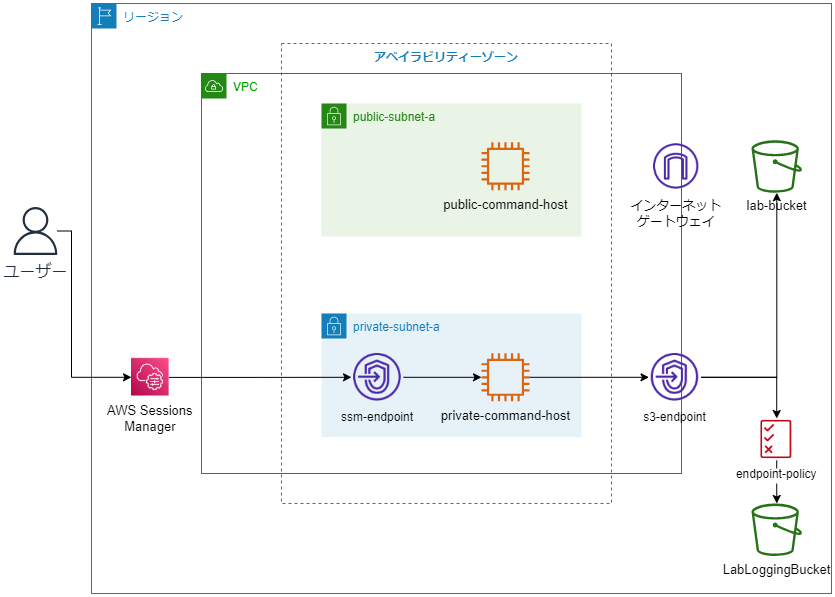

# Amazon S3 VPC エンドポイント学習ノート

## 概要

このノートは「Amazon S3 VPC エンドポイントの通信を保護する」ラボから抜粋した重要な学習ポイントをまとめたものです。

---

## 📚 学習の目的

### このラボで学べること

1. プライベートサブネットとパブリックサブネットの違いと、S3 との通信可否の理由
2. VPC エンドポイントの種類と設定方法（コンソール・CLI 両方）
3. プライベートサブネットから VPC エンドポイント経由で S3 を操作する方法
4. VPC エンドポイントポリシーによるアクセス制御

---

## 🏗️ アーキテクチャと構成要素

### 初期構成



- **VPC**: labVPC
- **サブネット**:
  - `public-subnet-a`: インターネットゲートウェイへのルートあり
  - `private-subnet-a`: インターネットへのルート**なし**
- **EC2 インスタンス**:
  - `PublicCommandHost`: パブリックサブネット内
  - `PrivateCommandHost`: プライベートサブネット内
- **S3 バケット**:
  - `LabBucket`: デモファイル保存用
  - `LabLoggingBucket`: アクセスログ保存用

### セキュリティの考え方

> アプリケーションをインターネットへのルートがないプライベートサブネット内で実行することで、攻撃対象領域が内部トラフィックのみに制限され、データを保護できる。

**問題点**: プライベートサブネットから S3 などの AWS サービスにアクセスできない

**解決策**: VPC エンドポイントの利用

---

## 🔑 重要な概念

### 1. VPC エンドポイントとは

VPC エンドポイントを使用すると、以下を**使用せずに**AWS サービスにプライベート接続できる:

- インターネットゲートウェイ
- NAT ゲートウェイ
- VPN 接続
- AWS Direct Connect 接続

**メリット**:

- VPC 内のリソースにパブリック IP アドレス不要
- トラフィックが Amazon ネットワーク内に留まる
- セキュリティ向上

### 2. VPC エンドポイントの種類

#### インターフェイスエンドポイント

- **用途**: Systems Manager (SSM)などのサービス向け
- **特徴**: ENI（Elastic Network Interface）を作成
- **このラボでの使用例**: Session Manager 接続用

#### ゲートウェイエンドポイント

- **用途**: S3、DynamoDB 向け
- **特徴**: ルートテーブルにルートを追加
- **このラボでの使用例**: S3 アクセス用

---

## 📝 実装の流れ

### タスク 1: 環境の確認と有効化

#### 1.1 VPC リソースの確認

```bash
# フィルタ: labVPC
# 確認項目:
# - サブネット数: 2（public/private）
# - ルートテーブル:
#   - PublicRouteTable: 0.0.0.0/0 → Internet Gateway
#   - PrivateRouteTable: ローカルルートのみ
```

#### 1.2 EC2 リソースの確認

- **セキュリティグループ**: `HTTPS-SSM-ENDPOINT`
  - インバウンド: VPC トラフィック (10.0.0.0/16) → ポート 443
  - 理由: Session Manager 接続に HTTPS (443) が必要

#### 1.3 Session Manager 用 VPC エンドポイント作成

**なぜ必要?**
プライベートインスタンスにインターネット経由せずに接続するため

**作成手順**:

1. サービス名: `com.amazonaws.REGION.ssm`
2. VPC: `labVPC`
3. サブネット: `PrivateSubnetA` (アベイラビリティーゾーン a のみ)
4. セキュリティグループ: `SSMSecurityGroup`

**確認**: PrivateCommandHost に Session Manager で接続可能になる

---

### タスク 2: S3 アクセステスト（エンドポイント作成前）

#### パブリックインスタンスからのアクセス

```bash
# AWS CLI設定
aws configure
# Region: ラボのリージョン
# Output: json

# S3バケット一覧表示 → ✅ 成功
aws s3 ls

# ファイル一覧 → ✅ 成功
aws s3 ls s3://<LabBucket>

# ファイルダウンロード → ✅ 成功
aws s3 cp s3://<LabBucket>/demo.txt ~/

# ファイル編集とアップロード → ✅ 成功
echo "追加テキスト" >> demo.txt
aws s3 cp demo.txt s3://<LabBucket>/
```

**理由**: インターネットゲートウェイ経由で S3 のパブリックエンドポイントにアクセス可能

#### プライベートインスタンスからのアクセス

```bash
# S3バケット一覧表示 → ❌ タイムアウト
aws s3 ls
```

**理由**: インターネットへのルートがなく、S3 にアクセス不可

---

### タスク 3: S3 用 VPC エンドポイント作成



#### AWS CLI での作成手順

```bash
# 1. VPC IDの取得
VPC=$(aws ec2 describe-vpcs \
  --query 'Vpcs[*].VpcId' \
  --filters 'Name=tag:Name, Values=labVPC' \
  | jq -r '.[0]')
echo $VPC

# 2. プライベートルートテーブルIDの取得
RTB=$(aws ec2 describe-route-tables \
  --query 'RouteTables[*].RouteTableId' \
  --filters 'Name=tag:Name, Values=PrivateRouteTable' \
  | jq -r '.[0]')
echo $RTB

# 3. リージョン情報の取得
TOKEN=`curl -X PUT "http://169.254.169.254/latest/api/token" \
  -H "X-aws-ec2-metadata-token-ttl-seconds: 21600"`
export AWS_REGION=$(curl \
  -H "X-aws-ec2-metadata-token: $TOKEN" \
  -s http://169.254.169.254/latest/dynamic/instance-identity/document \
  | jq -r '.region')

# 4. S3 VPCエンドポイントの作成
aws ec2 create-vpc-endpoint \
    --vpc-id $VPC \
    --service-name com.amazonaws.$AWS_REGION.s3 \
    --route-table-ids $RTB

# 5. 作成確認
aws ec2 describe-vpc-endpoints --query 'VpcEndpoints[*].ServiceName'
```

**ポイント**:

- ゲートウェイエンドポイントはルートテーブルと関連付ける
- サービス名形式: `com.amazonaws.<region>.s3`

---

### タスク 4: プライベートインスタンスから S3 操作

エンドポイント作成後、プライベートインスタンスから再テスト:

```bash
# S3バケット一覧表示 → ✅ 成功!
aws s3 ls

# ファイル一覧 → ✅ 成功!
aws s3 ls s3://<LabBucket>

# ファイルダウンロード → ✅ 成功!
aws s3 cp s3://<LabBucket>/demo.txt ~/
less demo.txt
```



**通信経路**: プライベートインスタンス → VPC エンドポイント → S3 (Amazon ネットワーク内)

---

### 課題: VPC エンドポイントポリシーの追加

#### 目的

特定の S3 バケットへのアクセスのみを許可し、他のバケットへのアクセスを制限

#### ポリシー例

```json
{
  "Version": "2012-10-17",
  "Statement": [
    {
      "Effect": "Allow",
      "Principal": "*",
      "Action": "s3:List*",
      "Resource": "arn:aws:s3:::*"
    },
    {
      "Effect": "Allow",
      "Principal": "*",
      "Action": "s3:*",
      "Resource": ["arn:aws:s3:::<LabBucket>", "arn:aws:s3:::<LabBucket>/*"]
    },
    {
      "Effect": "Deny",
      "Principal": "*",
      "Action": "s3:*",
      "Resource": [
        "arn:aws:s3:::<LabLoggingBucket>",
        "arn:aws:s3:::<LabLoggingBucket>/*"
      ]
    }
  ]
}
```

**ポリシーの意味**:

1. すべてのバケットの一覧表示を許可（`s3:List*`）
2. `LabBucket`への全操作を許可
3. `LabLoggingBucket`への全操作を**拒否**

**適用方法**:

- コンソール: VPC エンドポイント → ポリシータブ → 編集
- CLI: `aws ec2 modify-vpc-endpoint --vpc-endpoint-id <id> --policy-document file://policy.json`

---

## 🛠️ ラボ環境なしでの代替学習方法

### 方法 1: AWS Free Tier での実践（推奨）

#### 必要なリソース

```
- VPC: 無料
- サブネット: 無料
- VPCエンドポイント:
  - インターフェイスエンドポイント: 時間課金あり（約$0.01/時間）
  - ゲートウェイエンドポイント: 無料
- EC2 t2.micro: 750時間/月無料（Free Tier）
- S3: 5GB無料（Free Tier）
```

#### 環境構築手順

1. **VPC の作成**

   ```bash
   aws ec2 create-vpc --cidr-block 10.0.0.0/16
   ```

2. **サブネットの作成**

   ```bash
   # パブリックサブネット
   aws ec2 create-subnet --vpc-id <vpc-id> --cidr-block 10.0.1.0/24

   # プライベートサブネット
   aws ec2 create-subnet --vpc-id <vpc-id> --cidr-block 10.0.2.0/24
   ```

3. **インターネットゲートウェイの作成とアタッチ**

   ```bash
   aws ec2 create-internet-gateway
   aws ec2 attach-internet-gateway --vpc-id <vpc-id> --internet-gateway-id <igw-id>
   ```

4. **ルートテーブルの設定**

   ```bash
   # パブリックルートテーブル
   aws ec2 create-route --route-table-id <rtb-id> --destination-cidr-block 0.0.0.0/0 --gateway-id <igw-id>
   ```

5. **EC2 インスタンスの起動**

   - Systems Manager 用 IAM ロール作成
   - セキュリティグループ設定

6. **VPC エンドポイントの作成**
   - Session Manager 用（インターフェイス）
   - S3 用（ゲートウェイ）

### 方法 2: CloudFormation/Terraform テンプレート作成

#### メリット

- コード化により理解が深まる
- 繰り返し環境構築可能
- バージョン管理可能

#### CloudFormation テンプレート例（抜粋）

```yaml
Resources:
  VPC:
    Type: AWS::EC2::VPC
    Properties:
      CidrBlock: 10.0.0.0/16

  PrivateSubnet:
    Type: AWS::EC2::Subnet
    Properties:
      VpcId: !Ref VPC
      CidrBlock: 10.0.2.0/24

  S3Endpoint:
    Type: AWS::EC2::VPCEndpoint
    Properties:
      VpcId: !Ref VPC
      ServiceName: !Sub "com.amazonaws.${AWS::Region}.s3"
      RouteTableIds:
        - !Ref PrivateRouteTable
      PolicyDocument:
        Statement:
          - Effect: Allow
            Principal: "*"
            Action: "s3:*"
            Resource: "*"
```

### 方法 3: LocalStack でのローカル開発（学習目的）

#### セットアップ

```bash
# Dockerでの実行
docker run -d \
  -p 4566:4566 \
  -e SERVICES=ec2,s3,vpc \
  localstack/localstack

# AWS CLI設定
export AWS_ENDPOINT_URL=http://localhost:4566
```

#### 注意点

- VPC エンドポイントの完全な動作は保証されない
- 基本的なコマンド練習には有効

### 方法 4: ドキュメントとコードレビュー

#### 確認すべきポイント

1. **ルートテーブルの設定**
   - プライベートサブネットに S3 エンドポイントルートが追加されているか
2. **セキュリティグループ**
   - HTTPS (443) が開放されているか
3. **IAM ロール**

   - EC2 インスタンスに S3 アクセス権限があるか
   - Systems Manager 用の権限があるか

4. **エンドポイントポリシー**
   - 最小権限の原則に従っているか

---

## 📊 学習チェックリスト

### 理解度確認

- [ ] パブリックサブネットとプライベートサブネットの違いを説明できる
- [ ] インターネットゲートウェイと NAT ゲートウェイの違いを理解している
- [ ] VPC エンドポイントの 2 つの種類を説明できる
- [ ] ゲートウェイエンドポイントがルートテーブルに追加されることを理解している
- [ ] Session Manager の仕組みを理解している
- [ ] エンドポイントポリシーでアクセス制御できることを理解している

### 実践スキル

- [ ] AWS CLI で VPC エンドポイントを作成できる
- [ ] ルートテーブルとエンドポイントを関連付けられる
- [ ] エンドポイントポリシーを作成できる
- [ ] JQ を使って JSON 出力を処理できる
- [ ] IMDSv2 を使ってメタデータを取得できる

---

## 🔍 重要な AWS CLI コマンド

```bash
# VPC一覧
aws ec2 describe-vpcs

# サブネット一覧
aws ec2 describe-subnets --filters "Name=vpc-id,Values=<vpc-id>"

# ルートテーブル一覧
aws ec2 describe-route-tables

# VPCエンドポイント一覧
aws ec2 describe-vpc-endpoints

# VPCエンドポイント作成（S3）
aws ec2 create-vpc-endpoint \
    --vpc-id <vpc-id> \
    --service-name com.amazonaws.<region>.s3 \
    --route-table-ids <rtb-id>

# VPCエンドポイントポリシー更新
aws ec2 modify-vpc-endpoint \
    --vpc-endpoint-id <vpce-id> \
    --policy-document file://policy.json

# S3操作
aws s3 ls
aws s3 ls s3://<bucket-name>
aws s3 cp <local-file> s3://<bucket-name>/
aws s3 cp s3://<bucket-name>/<file> <local-path>
```

---

## 💡 セキュリティのベストプラクティス

1. **最小権限の原則**

   - エンドポイントポリシーで必要最小限のアクセスのみ許可

2. **プライベートサブネットの活用**

   - データ処理層はプライベートサブネットに配置

3. **VPC エンドポイントの使用**

   - パブリックインターネット経由のトラフィックを削減

4. **セキュリティグループの適切な設定**

   - 必要なポートのみ開放

5. **ログの有効化**
   - S3 アクセスログ、VPC フローログを有効化

---

## 📚 追加学習リソース

### AWS 公式ドキュメント

- [VPC Endpoints](https://docs.aws.amazon.com/vpc/latest/privatelink/vpc-endpoints.html)
- [Gateway Endpoints](https://docs.aws.amazon.com/vpc/latest/privatelink/vpce-gateway.html)
- [Interface Endpoints](https://docs.aws.amazon.com/vpc/latest/privatelink/vpce-interface.html)
- [Endpoint Policies](https://docs.aws.amazon.com/vpc/latest/privatelink/vpc-endpoints-access.html)

### 関連サービス

- AWS PrivateLink
- AWS Systems Manager Session Manager
- Amazon S3 Block Public Access
- VPC Flow Logs

---

## ❓ よくある質問

**Q1: VPC エンドポイント経由の S3 アクセスに追加料金はかかる?**
A: ゲートウェイエンドポイント（S3/DynamoDB）は**無料**。インターフェイスエンドポイントは時間課金とデータ転送料金がかかる。

**Q2: NAT ゲートウェイと VPC エンドポイントの使い分けは?**
A:

- VPC エンドポイント: 対応 AWS サービスへのアクセス（コスト削減、セキュリティ向上）
- NAT ゲートウェイ: インターネット上の任意のリソースへのアクセス

**Q3: 1 つの VPC エンドポイントを複数のサブネットで共有できる?**
A: ゲートウェイエンドポイントは複数のルートテーブルに関連付け可能。インターフェイスエンドポイントは複数のサブネットに配置可能。

**Q4: エンドポイントポリシーとバケットポリシーの違いは?**
A:

- エンドポイントポリシー: エンドポイント経由でアクセスできるリソースを制限
- バケットポリシー: バケット自体へのアクセス制御

---

## 🎯 まとめ

### 重要ポイント

1. **VPC エンドポイント**により、プライベートサブネットからインターネットを経由せずに AWS サービスにアクセス可能
2. **ゲートウェイエンドポイント**（S3/DynamoDB）は無料で使用でき、ルートテーブルで管理
3. **インターフェイスエンドポイント**（Systems Manager 等）は ENI を使用し、セキュリティグループで管理
4. **エンドポイントポリシー**で詳細なアクセス制御が可能
5. **セキュリティ向上**とコスト削減を同時に実現

### 実務での活用

- データベースサーバーなどのバックエンドリソースはプライベートサブネットに配置
- VPC エンドポイント経由で S3 へログやバックアップを保存
- NAT ゲートウェイのコストを削減
- コンプライアンス要件を満たすネットワーク設計

---

**作成日**: 2025 年 12 月 11 日  
**基づく研修**: ラボ 1: Amazon S3 VPC エンドポイントの通信を保護する  
**学習レベル**: 中級  
**推定学習時間**: 2-3 時間（実践含む）
